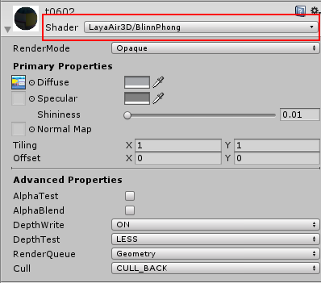

##Layair 3D Blinphong 소재

###Blinphong 소재 개요.

앞서 Layaiair 3D 엔진 버전에서(1.7.12 버전 전), 모델 소재는 전통을 지지하는 Standardmaterial 표준 소재로 유니티에서 모형 소재를 비롯한 Shader, 플러그인 모두 표준 소재(입자 소재 제외)다.

유닛의 기준과 기타 재질과 레이어 표준 소재의 차이가 있기 때문에 개발자가 내보내는 3D 자원을 사용하면 유닛 중 다른 효과를 발견할 수 있다. 코드에서 다양한 소재 인자를 수정하거나 조명을 조절하는 데 필요한 효과가 있어 개발자들에게 불편을 끼칠 수 있다.

Layaiair 엔진에서 실행 효과와 유니티의 미술 효과를 일치시키기 위해 레이야아 공식 유닛 내보내기 플러그인 중과 엔진 중 블리닝메이트 소재를 늘리기 위해 개발자들의 취득, 코드 수정 효과를 줄이고 작업률을 높일 수 있다.그래서 앞으로 개발에 최대한 이 소재를 사용할 것을 건의합니다.


###Blinphong 소재 만들기

부호 코드 창건은 블리닉 소재와 표준 소재를 합쳐 직접 생성할 수 있는 실례나 블리닝마크를 통해 관련 소재 자원을 재적해 모형에 부여할 수 있다.빛의 속성 수정과 부가치 방식도 표준 소재와 마찬가지로 소재 유형만 다르다.


```java

//创建盒子模型
var box=new Laya.MeshSprite3D(new Laya.BoxMesh());
scene.addChild(box);

//创建BlinnPhong材质
var mat=new Laya.BlinnPhongMaterial();
mat.albedoColor=new Laya.Vector4(0.5,0.3,0.3,1);
mat.albedoTexture=Laya.Texture2D.load("res/layabox.png");

//加载材质资源方法创建
//var mat=Laya.BlinnPhongMaterial.load("truck/Assets/Materials/t0200.lmat");

//为模型赋材质
box.meshRender.material=mat;
```


###유닛에서 블리닝 소재를 사용합니다.

Layaiair 엔진은 1.7.12판, Untiy 내출 플러그인 1.7.0판부터 BlinPhong 소재의 창설을 지지하기 때문에 개발자들은 새로운 엔진과 플러그인을 다운로드해야 한다.프로젝트에 1.7.0 플러그인을 설치하는 것은 이전 버전 설치 방법과 완전히 일치한다.

####세트를 블리닉 소재로 바꾸기.

새 플러그인을 설치한 후 Untiy Layair 3D 메뉴에서 버라이너 소재를 BlinPhong 소재로 변경, 메뉴 Layair Tool 클릭 - - - - - - Switch Shader to Layablinphong 옵션이 선택된 후 자원 인터페이스 모델이 보라색으로 변하는 효과를 볼 수 있다.

< br > (그림 1)

마우스가 장면을 선택하는 임의 모형을 선택하면 오른쪽 인스타그램에 새로운 소재 Shader 종류가 나타난다.소재 속성은 유닛에서 Standard 표준 소재와 다르며, 레이야아가 지원하지 않는 속성을 제거했다.우리는 이러한 속성을 수정하여 모형 디스플레이를 바꿀 수 있다.

< br > (그림 2)


####Blinphong 소재로 수동적으로 수정

일반적인 경우 메뉴 중 하나인 버라이너 소재로 바뀐 것을 추천합니다. 이러한 장면의 모든 재질은 수정되지 않습니다. 어떤 소재는 찾을 수 없거나 소홀해서 수정되지 않은 상황이 발생할 수 없습니다.

물론 새로운 소재를 생성할 때 기본 재질이 표준 소재로 생성되었을 때 개발자가 수동적으로 재질을 수정해야 하는 Shader 타입은 블리닉Phong입니다.플러그인을 설치한 후 재질 패널의 Shader 유형에 레이야아아3D 옵션이 수정될 수 있습니다.(그림 3)

< br > (그림 3)


###Blinphong 소재 렌더링 모드

소재의 렌더모드 는 주로 소재의 효과를 표현해 다른 투명 반투명 효과 등 Standardmaterial에서 총 10여 가지 유형으로 선택되지만 복잡하지만 코드로 수정하기가 불편하다.

플러그인을 내보내는 플러그인은 블리닉 소재 변경 인터페이스를 직접 수정할 수 있으며, 블리닉 재질에서 감화되어 상용 여러 종류를 종합적으로 종합적으로 종합했다.그 수정을 통해 개발자들의 재질 조절 효과를 가볍게 조절할 수 있다.

다른 장르를 선택하면 블리닉 소재 패널에 있는 Advanced Properties 옵션도 다르다.

형식 설명 다음과 같습니다:

**Opaque 소재 불투명**.투명 효과도 없고, 스티커에 반투명해도 모델은 반투명하지 않습니다.

**컷 아웃 소재 투명 재단**.사진 속 투명한 픽셀의 alpha 값에 따라 투명한 재단을 진행하고 투명 alpha 값도 유티에 따라 조정할 수 있으며 일정한 alpha 수치 부분 투명 투명 (그림 4)

Tips: 이 투명, 가장자리에는 픽셀 톱니가 있지만, 성능이 높으면 톱니를 제거하려면 Transparrent 타입을 선택하십시오. 성능이 낮습니다.

< br > (그림 4)

**Transparrent 소재 반투명**.사진 속 화소 alpha 수치에 따라 반투명 렌더를 진행해 투명 효과 와 화소의 투명도 효과 를 일치 해 톱니 효과 가 좋다.

**Addtive 소재 투명 가색 혼합**.주로 투명하고 색상이 높은 소재에 사용되며, 스티커 화소의 밝이에 따라 컬러를 섞어 모형 정면과 뒷면과 겹친 모형의 모형 스티커 컬러가 서로 겹쳐져 밝고 반투명 효과를 형성한다.

< br > (그림 5)


**Custom 소재 사용자 정의 효과**.이들 4가지 보카시 모델은 기본적으로 게임 개발에서 대부분의 효과를 포함해 개발자들의 미술 수요 효과를 만족시키지 못하면 Custom 의 자정의 보카시 설정을 진행할 수 있다.

상술한 네 가지 유형 모드에서 Advanced Properties 옵션은 기본적으로 고정된 설정으로 수정할 수 없습니다.Custom 의 사용자 정의 중 개발자들은 그 인자 수치를 수동적으로 수정할 수 있으며 효과는 더욱 풍부하고 수정 중 개발자들에게 필요한 미술 효과를 반복적으로 설정하고 있다.

< br > (그림 6)


###Blinphong 소재 광색 스티커 속성

BlinPhong 소재의 광색 스티커 속성 기본과 표준 소재의 기본 일치, 유닛 소재 패널에서 다음 속성 조절 가능:

**diffuse 만반사 색상과 스티커**.

**specular 하이라이트와 스티커.**하이라이터 조절이 늘고 하이라이트 스티커를 사용하지 않아도 하이라이트 범위의 조절이 가능하다.

**normal 법선 스티커.**

이상의 빛깔 스티커는 Untiy 에 설치된 후 바로 불러올 수 있으며, 내보내기 플러그인에서 Layair Run 단추를 누르십시오.브라우저에서 미술 효과는 유니티의 카메라 보기 효과가 일치하는 것을 알 수 있다.

그럼 Blinphong 소재는 반사 스티커와 반사 색상을 지지하는 건가요?물론 그 방식은 StandardMaterial 과 일치하고, 수요 코드 수정, 코드:


```java

//创建盒子模型
var box=new Laya.MeshSprite3D(new Laya.BoxMesh());
scene.addChild(box);
//创建BlinnPhong材质
var mat=new Laya.BlinnPhongMaterial();
//增加反射贴图（与StandardMaterial一致）
mat.reflectTexture = Laya.TextureCube.load("skyBox/skyCube.ltc");
mat.reflectColor=new Laya.Vector3(1,1,1);
//为模型赋材质
box.meshRender.material=mat;
```

