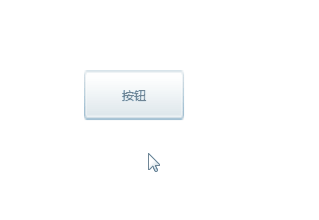
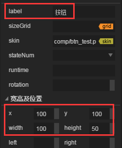
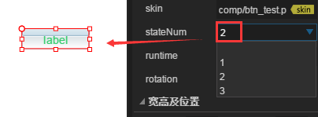

#Button 구성 요소 설명

##1, Button 구성 요소 만들기

버튼 (Button) 구성 요소는 가장 자주 사용하는 구성 요소 중 하나로 텍스트 탭, 아이콘, 양자를 동시에 표시할 수 있습니다.LayaiairIDE에 있는 단추 그림 자원 (단추 피부) 는 보통 btn 을 접두두로 이름하여 그림 1을 보여 준다.

(그림 1)

###1.1 엔진으로 바로 Button 구성 요소 만들기

Layaiair 엔진을 사용하여 Button 구성 요소를 만드는 것은 간단하지만, 일반적으로 몇 단계, 자원을 불러오기, Button 실례를 생성하고, Button 을 무대에 추가하여 Button 구성의 속성을 설정합니다.구체적으로 참고 아래 코드 및 주석을 실현하다.

**입구 종류 GameMain.js 만들기, 다음 코드 작성:**


```javascript

//初始化引擎，设置宽高并开启WebGL渲染模式
Laya.init(600, 400,Laya.WebGL);
//设置舞台背景颜色
Laya.stage.bgColor = "#ffffff";
//按钮资源路径
var skin = "./res/img/btn_test.png";
//加载资源成功后，执行onLoaded回调方法
Laya.loader.load(skin,Laya.Handler.create(this,onLoaded));
function onLoaded(){
    //创建一个Button实例
    var btn = new Laya.Button(skin);
    //将Button添加到舞台上
    Laya.stage.addChild(btn);
    //设置Button相关属性
    btn.width = 100;
    btn.height = 50;
    btn.pos(100,100);
    btn.label = "按钮";
}
```


상술한 부호 실행 효과는 동영상 2개 시사됨:

< br / > (동영상 2)

**Tips:**Button 구성 요소의 속성 인터페이스 소개 참고해주세요.[Button API](http://layaair.ldc.layabox.com/api/index.html?category=Core&class=laya.ui.Button).


###1.2. LayairIDE 사용으로 Button 만들기

LayaiairIDE를 사용하여 Button 을 만들기는 더욱 간단하고 IDE 의 가시화 조작을 통해 프로그램의 기초가 필요치 않아 구성 요소의 창건과 레이아웃을 실현할 수 있는 것도 추천하는 구성 방식이다.LayairierIDE로 동영상 1을 생성하는 효과입니다.

첫 단계: ui 의 DEMO 페이지를 생성하고, 자원 관리자에서 단추 요소 구성 요소를 화면에 끌어들여 편집기, 그림 3으로 보여 줍니다.

< br / > (그림 3)

2단계: 구성 요소 속성 설정

< br / > (그림 4)

위 2단계 설정을 마친 후 아이디에서 동영상 2의 효과를 직접 볼 수 있다.이 과정에서 프로그램 부호도 필요 없이 미술이나 계획에 맡길 수 있다.엔지니어와의 소통 원가를 줄이고 게임의 개발 효율을 가속화시켰다.


##2, Button 구성 요소 속성 소개

다음 문서는 Button 구성 요소의 기초 상용 속성 및 문자를 통해 이해하기 어려운 속성을 강조합니다.쉽게 이해할 수 있는 속성에 대해서는 언급하지 않을 것이며 개발자는 IDE 속성 관리자의 속성 이름에 마우스를 올려 속성이름에 머물게 되며 속성 Tips 중국어 설명을 할 수 있습니다.

###2.1 버튼 피부 (skin)

버튼의 피부는 절단방식에 따라 세 형태로 나뉘어 두 형태, 싱글 형태로 나뉜다.이 상태는 버튼 피부(skin)의 상태를 말한다.

3태는 스킨 이미지를 세로로 등비분할하는 형식으로 3부분으로 나누고, 그림1개처럼,**위에서 아래까지**순서대로 하다`弹起或离开状态`피부`经过状态`피부`按下和选中`(*상태를 유지하고 있는 피부, 3은 PC 브라우저에 자주 사용됩니다.

이동 장치에서는 일반적으로 두 가지 형태만 채택하고, 그림은 세로 방향을 등비로 잘라 두 부분으로, 위쪽의 부분에 해당한다`弹起或离开状态状态`피부, 밑 부분`经过和按下以及选中状态`(*) 피부 유지.

싱글 버튼은 그림을 자르지 않고 어떤 상태든 버튼의 피부는 하나뿐입니다.

###2.2 지정 버튼 피부의 절단 상태 (statteNum)

statteNu의 속성값은 피부 자원 사진의 절단방식을 결정한다.기본값은 3이고, 기본값은 3가지 버튼을 누르고 절단하는 것이며, 등비는 3부분이다.두 가지 버튼이라면, statteNum의 속성치를 2, 등비는 2부분으로 잘라야 한다.싱글 단추는 1로 설정되어 절단하지 않습니다.

여기에 주의해야 할 것은 지정 단추 상태로 버튼과 피부에 대응해야 한다는 것이다.3가지 버튼 피부라면 statteNum이 2로 설정해 잘라낸 후 5개처럼 제시한 것은 잘못된 것이다.

< br / > (그림 5)


###2.3 지정 단추 선택 (selected)

selected 속성이 선택되지 않은 false 상태입니다.일단 selected 속성을 true 로 설정합니다.그 단추는 선택된 상태를 유지할 것이며, 다른 상태에 변화하지 않을 것이다.

###2.4 버튼 전환 상태 (togle)

기본적으로 선택되지 않은 false 상태입니다.만약 우리가 togle 속성을 true 로 설정한다면.단추 구성 요소를 누르면 버튼이 선택된 상태를 유지합니다.다시 클릭하면 복원 가능합니다.

###2.5 상태 에 따라 Button 의 카탈로그 색상 (Stroke Color)

labelstroke Color는 Button 의 텍스트에 통일된 색상을 설정할 수 있다.Stroke Color 속성은 다른 상태에 따라 Button 의 테두리 텍스트를 설정할 수 있다.

Sroke Color 색상의 선후 설정 순서는 형식: upColor (탄기 또는 상태 상태의 색상), overColor (상태의 색상), downColor (누르고 선택한 상태의 색상) 을 설정합니다. disableColor (사용할 때 색을 금지합니다.6 시에 제시하는 대로.

< br / > (그림 6)

*Tips:더 또렷한 느낌의 변화를 원한다면 너비 labelSroke 속성치를 설정할 수 있습니다.*


