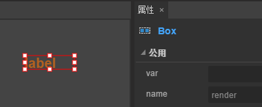
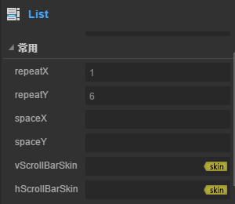

#List 구성 요소 참조


##하나, LayairIDE 로 List 구성 요소 만들기

List 구성 요소는 프로젝트 목록을 표시할 수 있습니다.기본 수직 방향 목록입니다.UI 편집기를 통해 사용자 정의 목록을 찾을 수 있습니다.List 목록의 모든 목록은 일반적으로 같은 것이며 편집기 사용자가 다른 스타일의 목록을 사용자 정의 할 수 있습니다.
List 는 보통 두 부분으로 구성되어 있습니다: 목록 렌더링 항목 (단원격), 스크롤
List 구성 요소의 스크립트 인터페이스 참고해주세요.[List API](http://layaair.ldc.layabox.com/api/index.html?category=Core&class=laya.ui.List).


 


###1.1 List 구성 요소 만들기

####1. 목록 항목 편집.

목록 항목은 Box 대상이나 View (페이지) 또는 다른 사용자 정의 페이지 대상이다.여기에는 박스 대상을 예로 한다.
​**a.**자원 판넬에서 Label 구성 요소를 끌어들이고 편집구의 인터페이스에 Label 속성 name 값을 m u label 설정합니다.또 Label 디스플레이 관련 속성을 설정해 더욱 보기 좋게 한다.
​**b.**Label 대상, 단축키 Ctrl + B 또는 선택**메뉴 표시줄 -> 편집-> 용기로 변환**옵션, 용기 설정 판넬로 전환하고 용기 종류를 박스로 선택하고, 확인 단추를 누르면 박스 용기의 추가를 추가합니다.

​< br >>
(그림 1)


 ####2. List 용기로 전환한다.

목록 렌더링 대상 선택, 단축키 Ctrl + B 또는 선택**메뉴 표시줄 -> 편집-> 용기로 변환**옵션, 용기 설정 패널 설정으로 전환하고, 용기 형식을 List 형식으로 바꾸고, 확인 단추를 누르면 용기 List 의 추가를 클릭합니다.

   ​        < br >>
(2)
####3. List 의 목록을 지정합니다.
방법 1: List 대상을 쌍으로 누르고 List 내부에 들어가서 List 목록 렌더를 설정하는 속성 name 값은 render 입니다.**주의: 이 목록 렌더의 속성 name 값은 render 입니다.**

방법 2: List 대상, List 내부에 들어가서 List 목록 렌더를 설정하는 속성 renderType 의 값은 render 입니다.


​< br >>
(그림 3)

####4. List 에 롤러 구성 요소를 추가합니다.
방법 1: 자원 판넬에서 VScrollbar 구성 요소를 끌어 List 구성 요소로 구성된 내부에 VScrollbar 구성 요소를 설정하고 있는 속성 name 의 값은 scrollbar 입니다.***주의: 활성 줄기의 속성name 값은 scrollbar 입니다.***

방법 2: list 구성 요소 선택, 오른쪽 속성 패널 상용으로 vScroll BarSkin, 자원 패널에서 VScroll Barrr 구성 요소에서 이 skin 속성으로 즉시 스크롤러를 생성할 수 있습니다

​< br >>
(그림 4)

####5. 레벨 설정 List 의 넓이
속성 repetX 값을 1 으로 설정합니다. repety의 값은 6입니다.List 대상을 설정하는 전역 인용 이름입니다. 속성 var 의 값을 mulist 입니다.
​<br/>

(그림 5)

####6. 코드에서 List 대상 부과를 준다.


```javascript

  var data = [];

   for(var m =0;m<20;m++){

        data.push({m_label:"No."+m});
}
m_list.array = data;
```


####7. 프로그램에서 모니터링을 실행합니다.
​< br >>
(그림 6)

####8. 코드에 스크립트를 추가하고 롤러를 숨기고 슬라이드를 설치하는 고무줄 효과입니다.

```javascript

 m_list.scrollBar.hide = true;//隐藏列表的滚动条。
 m_list.scrollBar.elasticBackTime = 200;//设置橡皮筋回弹时间。单位为毫秒。
 m_list.scrollBar.elasticDistance = 50;//设置橡皮筋极限距离。
```


####9. 프로그램에서 모니터링을 실행합니다.
​< br >>
(그림 7)


###1.2 List 구성 속성

​< br >>
(그림 8)

124대**속성**124대**기능 설명**124대
------------------------------------------------------------------------------------------------------------------------------------------------------------------------------------------------------------
124대 리페atX 124테로 나타난 단원격 수량.124대
1244로 표시된 단원격자 수직 방향으로 표시됩니다.124대
일원격 사이의 간격 (픽셀 단위 단위) 을 가리키는 테두리 (픽셀 단위) 를 가리킨다.124대
일렉트로닉 사이의 간격 (픽셀 단위 단위) 가 124테오 (픽셀 단위) 를 가리킨다.124대
124대 백스크롤바스킨124대
124대 스클롤바스킨 (ScrollbarSkin) 가 스윙 스킨을 움직인다.124대


  


###1.3 Tips:

1. List 에 스크롤바를 추가하는 방식은 2가지 방식: List 내부에서 드라이브를 직접 끌어내며 스크롤바를 설치하는 이름으로 scrollbar, 다른 방식은 List 속성 vScrollbarSkin, hcroll BarSkin, hcroll BarSkin의 값으로 스크롤 주소입니다.

2. List 의 리스트 렌더가 보스 대상이자 페이지 대상이다.

​


##2, 코드 로 List 구성 요소 만들기

우리가 작성 코드를 쓸 때, 코드 제어 UI, UI List 종류를 만들지 않고, 코드 설정을 통해 List 관련 속성을 설정할 수 없습니다.

**실행 실례 효과:**
​< br >>
(그림 9) 코드 로 List 만들기

List 의 다른 속성도 코드 를 통해 설정할 수 있으며, 이 같은 사례 코드 코드 를 통해 다른 피부(스타일)를 만들 수 있는 List, 흥미가 있는 독자들은 코드 설정을 통해 List 를 만들 수 있으며, 자신에 맞는 목록을 만들 수 있다.

**예시 코드:**


```javascript

// 这段代码需要在setupDemo之前执行。
(function()
{
	// 项渲染器
	var Box   = Laya.Box;
	var Image = Laya.Image;

	var WID = 373,
		HEI = 85;

	function Item()
	{
		Item.__super.call(this);
		this.size(WID, HEI);
		this.img = new Image();
		this.addChild(this.img);

		this.setImg = function(src)
		{
			this.img.skin = src;
		}
	}
	Laya.class(Item, "Item", Box);

	// 主要逻辑代码
	var Stage   = Laya.Stage;
	var List    = Laya.List;
	var Handler = Laya.Handler;
	var WebGL   = Laya.WebGL;
	

	(function()
	{
		// 不支持WebGL时自动切换至Canvas
		Laya.init(800, 600, WebGL);

		Laya.stage.alignV = Stage.ALIGN_MIDDLE;
		Laya.stage.alignH = Stage.ALIGN_CENTER;

		Laya.stage.scaleMode = Stage.SCALE_SHOWALL;
		Laya.stage.bgColor = "#232628";

		setup();
	})();

	function setup()
	{
		var list = new List();

		list.itemRender = Item;

		list.repeatX = 1;
		list.repeatY = 4;

		list.x = (Laya.stage.width - WID) / 2;
		list.y = (Laya.stage.height - HEI * list.repeatY) / 2;

		// 使用但隐藏滚动条
		list.vScrollBarSkin = "";

		list.selectEnable = true;
		list.selectHandler = new Handler(this, onSelect);

		list.renderHandler = new Handler(this, updateItem);
		Laya.stage.addChild(list);

		// 设置数据项为对应图片的路径
		var data = [];
		for (var i = 0; i < 10; ++i)
		{
			data.push("res/ui/listskins/1.jpg");
			data.push("res/ui/listskins/2.jpg");
			data.push("res/ui/listskins/3.jpg");
			data.push("res/ui/listskins/4.jpg");
			data.push("res/ui/listskins/5.jpg");
		}
		list.array = data;
	}

	function updateItem(cell, index)
	{
		cell.setImg(cell.dataSource);
	}

	function onSelect(index)
	{
		console.log("当前选择的索引：" + index);
	}
})();
```


