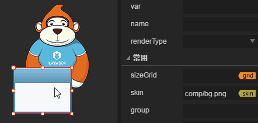
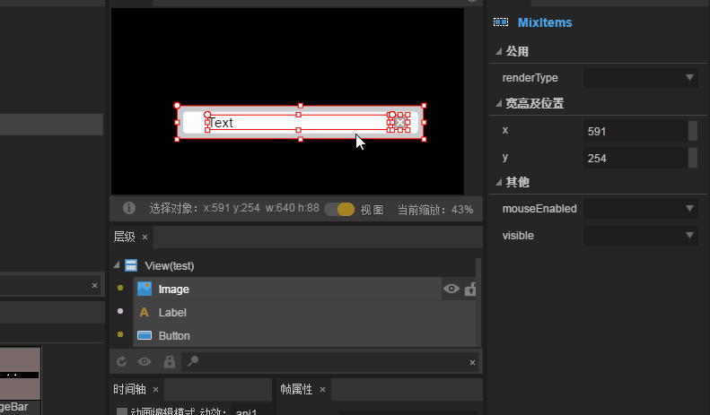
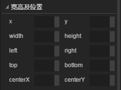
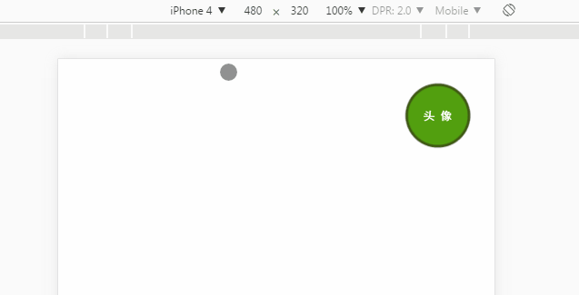
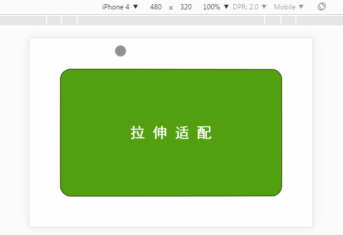

#속성 설정 장치

속성 설정기는 현재 선택한 구성 요소 속성을 편집하고 있습니다.장면 편집기나 층급 관리자에 있는 구성 요소를 선택하면 속성 설정기에 속성 설정기에 대한 속성을 표시합니다.

속성 설정 장치 패널은 그림 1의 보여, 위에서 아래로, 일반적으로 구성 요소나 노드 이름,...**공용**속성**상용**속성**넓고 높이**、**회전 및 축소**、**기타**등등

 < br >>
(그림 1) 속성 패널 그룹

##1.`公用`속성 소개

공통 속성`var`、`name`、`renderType`.그림 2-1

< br / > (2-1)

###1.1 전역 변수 이름 설정

`Var`이름의 유일한 전역 변수 명칭은 프로젝트 코드에 따라 이 구성 요소를 호출합니다.

###1.2 구성 요소 표시 이름

`name`구성 요소의 표시 이름입니다. 보통 계급 관리자에게 다른 구성 요소를 구분하고, 그의 아버지 용기도 이 이름으로 이 구성 요소를 찾을 수 있습니다.

###1.3 구성 요소의 노드 기능 종류

`renderType`노드 기능 종류는 mask, hit, unHit, render, instance 5가지가 있다.

####1.3.1 커버 설정

구성 요소 설정`mask`이 구성은 커버**부급 구성 요소**mask 커버 영역만 보이기 때문에 효과는 동영상 2-2의 보여 준다.

　　< br / > (동영상 2-2)

####1.3.2 설정 영역과 비클릭 영역

구성 요소 설정`hit`이 구성 요소가 있는 부급 구성 영역은 클릭할 수 있다.구성 요소 설정`unHit`이 구성 요소가 있는 부급 구성 영역은 비클릭 영역입니다.**지역 hit 구성 요소와 비클릭 영역 unHit 의 구성 요소가 겹칠 때**비클릭 지역 unHit 우선순위가 더 높습니다.그림 2-3이 제시한 녹색 동그란 비클릭 영역(unHit)을 포함해 겹친 입 영역을 클릭하면 안 된다.머리의 빨간색 반달 지역만이 클릭할 수 있다.

　　< br / > (2-3)

####1.3.3 List render 설정

이 구성 요소가 설정되었습니다`render`이 구성 요소는 스펙트럼을 반복해서 리스트 List 제작에 사용된다.목록을 작성하는 사고로에서 여러 구성 요소를 모두 선택한 후 crl + B 를 box 용기로 설정해야 합니다.이 용기의 renderType 속성을 render 로 설정합니다.그리고 다시 crl+B 를 사용하여 이 박스를 List 로 설정합니다.동도 2-4가 제시한 것처럼.

  (动图2-4)

####1.3.4 설정

이 구성 요소가 설정되었습니다`instance`이 구성 요소는 단례 구성 요소로, 여러 군데 중복할 때 단례 구성 요소는 실례화될 뿐이다.성능 절약.

　　

##2.`常用`속성 소개

상용 속성에서 일부 조작은 통용적이다.여기 우리 각자 소개합시다.

###2.1 구궁격 조작 (sizegrid)

구궁격은 4개의 직선으로 UI 를 9원으로 구분하고, UI에 대한 스트레칭 작업이 나타날 경우 중간 구역을 계산하기 위해 기존 설계를 유지할 수 있으며 UI 아무리 당겨도 변함없이 유지된다.게임 개발에서 자주 사용하는 기능입니다.

상용 속성`sizeGrid`속성은 구궁격 설정으로 속성 입력 표시줄 오른쪽 클릭`grid`단추를 누르면 구궁 칸 설정에 들어갈 수 있는 가시화 조작판.3-1의 지시대로.

   (图3-1)

구궁 칸을 열 때, 왼쪽은 효과 미리보기 구역, 오른쪽은 구궁 칸 가시화 조작구이다.마우스를 끌어당기는 방식으로 구궁칸 충전 영역을 바꾸고, 즉시 미리 보기 효과를 얻어 클릭을 누르면 된다.조작은 동영상 3-2의 시사와 같다.

< br / > (동영상 3-2)

###2.2 피부 설정 (skin)

`skin`속성은 구성 요소를 바꾸는 피부를 설정할 수 있다.속성 난간에 피부의 경로를 수동적으로 입력하는 것 외에 자원 관리자에게 직접 자원 자원을 끌어들일 수 있다`skin`속성 입력 표시줄, 피부의 전환을 빠르게 실현합니다.또 속성 입력 표시줄 오른쪽 클릭`skin按钮`많은 자원에서 현재 자원으로 빠르게 위치할 수 있다.동작은 동도 3-3의 시사와 같다.

< br / > (동영상 3-3)

###2.3 피부 상태 절단 (statteNum)

Button, checkBox 등 구성 요소 사용 중 구성 요소의 피부 자원은 다태 세로 배열되어 있으며, 그림 3-4가 제시한 것이다.

   (图3-4)

####피부의 절단 방식:

3태는 스킨 이미지를 세로로 등비분할하는 형식으로 3-4로 나누는 것이며,**위에서 아래까지**순서대로 하다`弹起或离开状态`피부`经过状态`피부`按下和选中`(*상태를 유지하고 있는 피부, 3은 PC 브라우저에 자주 사용됩니다.

이동 장치에서는 일반적으로 두 가지 형태만 채택하고, 그림은 세로 방향을 등비로 잘라 두 부분으로, 위쪽의 부분에 해당한다`弹起或离开状态状态`피부, 밑 부분`经过和按下以及选中状态`(*) 피부 유지.

한 형태로 그림을 자르지 않고, 어떤 상태든 피부는 한 가지만 변함없이 유지한다.

####statteNum 피부로 몇 가지 형태로 잘라내기:

존재 상태를 구분하는 구성 요소에 대해 statteNum의 속성치가 피부 자원 그림의 절단방식을 결정한다.기본값의 statteNu의 속성값은 3. 기본적으로 3가지 버튼을 누르고 절단하는 것은 3부분이다.두 가지 버튼이라면, statteNum의 속성치를 2, 등비는 2부분으로 잘라야 한다.싱글 단추는 1로 설정되어 절단하지 않습니다.

여기에 주의해야 할 것은 지정 단추 상태로 버튼과 피부에 대응해야 한다는 것이다.3형태의 버튼이라면, statteNum은 2, 잘라낸 후 3-5에 제시한 것이 잘못된 것이다.

< br > (그림 3-5)

###2.4 강한 runtime 속성

`runtime`속성 관리자 중 매우 강력한 구성 요소 확장 기능이다.runtime 속성에서 논리적 종류를 설정할 때 구성 요소가 아닌 runtime 속성에서 지정한 논리류를 생성합니다.이 속성 중 논리적 종류를 지정하는 모든 경로가 필요합니다. 예를 들어 game.user.player.

###2.5 색상 설정

color 속성 설정에서 색상 값을 수동적으로 입력할 수 있으며, 오른쪽 색상 설정 단추를 누르고, 색 패널에 색을 지정한 다음 패널 밖의 임의의 영역을 클릭하면 가시화 색상 설정을 완성할 수 있습니다.

< br / > (동영상 3-6)

###2.6 숫자의 트랙 조절

속성 수치가 숫자라면 입력 상자에 테두리 조절 패널이 있습니다.많은 개발자들은 이 작은 기교를 주의하지 않고 마우스의 왼쪽 단추를 누르고 패널 조절을 하고, 위에서 끌어올리거나 아래로 끌어올리면 숫자를 마이크로조로 진행하고, 장면 편집기의 대응 요소도 즉시적인 가시화 변화가 발생할 수 있다.동도 3-7이 제시한 것처럼.

   (动图3-7)

### 

##3. 넓고 위치 속성

넓고 위치 속성은 UI 제작에서 중요한 역할을 한다.주요 위치 및 UI 화면 조정 (그림 4).

 （图4）

###3.1 x, y 속성

x 와 y 속성은 구성 요소가 장면 편집기에 있는 x 와 y 축 좌표다.

장면 편집기 왼쪽 좌각 좌표 원점`（0, 0）`.원점을 중심으로 x 축이 오른쪽으로 뻗어 있는 좌표로 늘고, y 축은 아래로 정좌표로 늘어났다.

… 에`场景编辑器`선택한 구성 요소를 누르면 X와 y 축 위치를 이동할 수 있으며 속성 입력 상자에 고정 값을 설정할 수 있습니다.

###3.2 width, height 폭 높은 속성

구성 요소 크기를 바꾸지 않는 상황에서 구성 요소의 폭이 자동으로 계산되지만 속성 판넬에서 나오지 않습니다.제한 상자나 고정 값 설정을 통해 구성 요소를 조정한 후, 높은 속성이 나타날 수 있으며, 숫자의 트랙 조절도 가능하다.

임의의 구성 요소를 선택하지 않을 때, 현재 폭은 페이지 폭이 높습니다.

*Tips: 일부 구성 요소는 단속틀 크기만 바꾸고 실제 구성 요소는 확대되지 않지만 마우스 클릭 영역은 제한 상자의 크기로 줄일 수 있습니다. 예를 들어 Ceckbox.*

###3.3 UI 적용 속성

`left、right、top、bottom`네 개의 속성은 주로 구성 요소와 페이지 사이드 위치에 적용된다.

`centerX、centerY`두 속성은 주로 구성 요소와 페이지 중심 위치에 적용된다.

게임 개발에서 모든 화면 해상도를 모두 고려할 수 없습니다. 어떤 해상도가 높고 어떤 해상도가 낮습니다.게임 항목 코드에서 전체 화면 적용을 사용하면, 구성 요소가 또 고정되어 있으며, 다른 해상도 화면 아래에서 UI 구성 오류가 발생할 수 있습니다.우리는 아래의 방식에 따라 조정해야 한다.

####3.3.1 사이드 위치 적절

**설계 목표**게임 오른쪽 모서리에 화면의 가장자리와 오른쪽 변두리 50px.

**잘못된 실현 효과**：

만약 어떤 화면 해상도를 구성하는 x 와 y 의 고정액을 설정한다면 동영상 5-1의 효과가 나타날 것이다.설계 목표와 맞지 않다.

< br />
(동영상 5-1)구성 요소를 위한 x 와 y 가 고정 값을 설정할 때 화면별 해상도 효과가 있다.

**정확한 실현 효과**：

`left、right、top、bottom`네 개의 속성은 아버지 용기의 왼쪽 가장자리, 오른쪽 가장자리, 위 가장자리, 아래 가장자리.따라서 스크린해상도 아래 같은 오른쪽 효과를 실현하려면 right 및 top 속성치를 설정해야 합니다. 우리는 그것을 50화소로 설정합니다.설정 후 실행 효과는 동영상 5-2의 보여 준다.

< br / > (동영상 5-2)

**화면 변경 거리 설정에 대한 영향을 맞추기**：

여기에 특히 주의해야 할 것은`left、right、top、bottom`스크린의 각 변두리가 아닌 크기의 크기의 크기아버지 용기 (페이지) 의 해상률은 반드시 항목에서 Laya.init () 설치된 해상률이 같은 경우에는 동영상 5-2의 실행 효과를 실현할 수 없습니다.

####3.3.2 사이드 스트레칭

어느 가장자리의 적절한 배합 작용을 제외하고는 left, right, top, bottom 의 속성치를 설정할 수 있으며, 스크린에 따라 구성 요소에 따라 맞춤할 수 있다.예를 들어 우리는 left, right, top, bottom 의 속성치를 100, 실행 후 동영상 5-3으로 제시했다.

< br > (동영상 5-3)

*Tips: 스트레칭이 적당한 사이드 설정 방식은 일반적으로 구궁격의 결합을 이루어야 한다.*

####3.3.3 센터가 잘 어울린다

중심에는 스크린에 기반된 게임이 로고, 스포일러 상자 등을 사용한다.centerX, centery를 통해 위치를 설정할 수 있습니다. 예를 들면 6-1, 6-2가 제시할 수 있습니다.

< br / > (그림 6-1)

< br / > (그림 6-2)

##4. 회전 및 축소 속성

회전 및 축소 속성은 게임 UI 중 특히 IDE 애니메이션 제작에 자주 사용된다.

####4.1 축 포인트

"축심점": 구성 요소의 회전이나 축소 중심점, 기본 구성 요소 원점`（0,0）`위치를 점검하다.

pivotX, pivotY, anchorX, anchory 네 가지 속성은 모두 축심점 위치를 수정하는 데 사용된다.

pivotX, pivotY (축심점) 은 구성 요소 축심점 XY 좌표의 고정 수치를 통해 축자점을 수정하는 것이다.

anchorX, anchory (닻점) 은 X 와 Y 축의 구성 요소가 넓거나 높은 퍼센트를 통해 축심점 좌표 위치를 계산하는 것과 같이 그림 7개에 따라 넓고 높은 50% 가 계산된 좌표 위치가 바로 중심점 좌표 위치이다.

 （图7）

**Tips**：*닻점을 통과하는 것은 매우 편리한 축심점 설정 방식이다.그러나 닻점 방식은 UI 구성 축심점을 설정할 수 있으며, Graphics 구성 요소와 Sprite 등 2D 기초 구성 요소의 축심점은 설정을 통해 설정할 수 있다`pivotX与pivotY`방식이 실현되다.*

####4.2 경사 각도 수정

skewX, skewy는 축심점을 중심으로 수평, 수직 각도를 기울여 속성값 수정 효과가 동영상 8시와 같다.

 （动图8） 

####4.3 수정 구성 요소 크기 조정

scaleX, scaley는 축심점을 중심으로 수평, 수직 크기 조정합니다.

기본값은 1, 크기가 높을수록 크기가 커진다.

0 으로 크기 조정

`-1`되다**거울상**효과는 동도 9 소와 같다.마이너스 수치가 커질수록 렌즈 크기가 줄어들게 된다.

< br / > (동영상 9)

**Tips**：*만약 축심점이 센터에 있다면, 원래의 거울은 캐릭터 두 방향으로 동일한 자원을 사용할 수 있다.*

##5, 기타 통용 속성 소개

LayaiairiDE는 대량의 구성 요소를 제공하고 있으며, 그것들은 대체로 Compont 구성 요소를 계승하기 때문이다.여기에서는 다른 속성 중 통용 부분을 주로 소개하고 구성 요소 자체의 특수 속성을 하나하나 소개할 것입니다.

일반 속성은 이하 몇 종류를 포함한다

관련 속성 보이기: alpha, visible

캐시 관련 속성: cacheAs, staticacche

마우스 조작 속성: disabled, gray, htTestPrior, mousenabled, mouseTrough

label 관련 속성: labelAlign, labelColors, labelbold, labelfont, labelPadding, labelsize, labelSroke, labelstroke Color, stroke Color

###5.1 관련 속성 보이기

해당 속성은 상대적으로 이해하기 쉽고, 디스플레이 대상은 모두 alpha, visible 속성을 가지고 있다.

`alpha`디스플레이 대상의 투명도를 조정하고, 수치는 0-1 사이로, 0 은 모두 투명하고, 1은 불투명하고, 구간 내에서 반투명에 속한다.

**Tips**대상 alpha 수치는 얼마든지 마우스 감청을 넣으면 마우스 이벤트를 지원합니다. alpha 가 0이 되더라도 마우스가 발생할 수 있습니다.

`visible`구성 요소의 표시 여부는 이 속성이 불 값으로, 기본값은 true, 일반 표시입니다.false 때 구성 요소가 나타나지 않고 마우스 이벤트가 효과가 없습니다.

*Tips:visible 은 false 때 브라우저에서 실행할 때 표시되지 않고 IDE 에서 false 를 설정할 때 숨기지 않습니다.*

###5.2 캐시 관련 속성

캐시 최적화에 대한 속성, cacheAs, staticache 단일 구성 요소를 사용하지 않기, 자주 변하지 않는 복잡한 페이지를 사용합니다.

**게임 중 많은 UI, 그리고 한 개의 노드 변화 시간, 캐치어스(대부분 UI)를 사용합니다.**

예를 들어 우리가 사용하는 LayaiarIDE 소프트웨어, 소프트웨어의 많은 패널, 예를 들어 속성 설치기, 자원관리기, 프로젝트 관리자 등과 같은 노드 대상은 많지만, 빈번한 변경은 아니기 때문에 카치아스를 사용해 캐치어스를 캐시 효과를 높였다.

**자주 변하는 복잡한 UI, UI 를 2층으로 나눌 수 있고, 변함없는 1층은 카치아를 사용하여 자주 변화하는 층은 사용하지 않는다.**예를 들어'카운트다운'이 나타난 UI, 카운트다운 부분과 다른 부분으로 나눌 수 있으며, 카운트다운 부분은 CcheAs, 카운트다운 부분은 CcheAs를 진행할 수 있다.

개발할 때 캐치어스를 활용해 이해를 열심히 해야 하며 잘못된 이해와 캐시 메커니즘을 사용하면 오히려 성능을 낮출 수 있다.다음은 두 주요 속성의 상세한 설명:

**cacheAs:**

캐시 구성 요소는 정적 이미지, 합리적인 작용으로 성능을 높일 수 있다.그것은'none','normal'과'bitmap'3개의 가치가 있습니다.

**"none 옵션":**캐시를 하지 않는다는 뜻이다.

**"normal 옵션":**

canvas 모드에서 화보 캐시: 많은 키의 대상으로 구성된 UI 캐시를 한 장의 비디오로 저장하고, 게임 프레임 마다 캐시피를 보거나, 모든 대상을 모두 한 번 과장하는 것이 아니라, 보카시 판매를 절약하여 성능을 높였다.

webgl 모드에서 명령 캐시: 캐시 프로세스 및 프로그램 명령 조직에 비활성화되지 않고, 게임 프레임 마다 프레임마다 프레임 보강 대상을 사용하지 않고, 직접적인 클래스 대상을 직접 파악하는 계열에 따라 drawcall 을 줄이지 않으며, 메모리 손실을 증가하지 않고, 성능 중등에 포함되지 않습니다.

**Tips**:*cacheAsbitmap 속성 기능과 같은 cacheAs 속성의 normal 모드, cacheAsbitmap 속성은 오래된 버전 ID를 호환해 보류하고 있으며, 현재 관련 수요가 있다면 cacheAs normal 사용을 권장합니다.*

**"bitmap 옵션".**：

canvas 모드로 여전히 화보 캐시.

webgl 모드에서 renderTarget 캐시: 키가 많은 사람을 구성한 UI 캐시 한 장의 비디오로 만들고, 카드마다 프레임 보카를 보내며 drawcall 을 줄이고, 보카가 가장 높았다.캐시 비트맵은 일부 메모리 지출을 추가하여 캐시 비트맵이 커질수록 메모리 지출이 커진다.캐시 비트맵 크기는 2048을 넘으면 안 된다.이런 패턴은 반복적으로 그려질 때 CPU 지출을 늘릴 수 있다.

**Tips*** cacheAs 가'normal'과'bitmap'을 선택할 때, 자발적으로 캐시 를 자동으로 재생할 수 있으며, reCache 방법으로 캐시를 업데이트할 수 있습니다.*

**staticcache:**

CcheAs가 'none' 을 설정할 때 이 값은 유효합니다. statcCache = true = 타자 대상이 자동으로 업데이트되지 않을 때 reCache 방법으로 경신할 수 있습니다.

예를 들어 몇몇 데이터가 많은 UI, UI 읽는 데이터를 열 때 계속 업데이트 UI 디스플레이를 할 수 있으며, 이때 statticCacche 를 true, 데이터를 다 읽은 후, reCache 방법으로 데이터를 한 번에 읽으며 새로 고칠 수 있다.

구체적인 실례와 데이터 분석은 "기술 문서 — 2D 진단 편 — cacheAs 성능 최적화" 를 참고하십시오.

###5.3 마우스 조작 관련 속성

마우스 조작 관련 속성 설명 및 효과 다음과 같습니다

124대**기타 속성**124대**기능 설명**124대
----------------------------------------------------------------------------------------------------------------------------------------------------------------------------------------------------------------------------------------
마우스 마우스 (Mousenabled) 124타 (Mousenabled) 가 마우스를 받아들일지 여부입니다.기본 false, 마우스를 감청한다면, 이 대상과 아버지의 노드를 자동으로 설정할 수 있는 속성 mousenable 값은 true (아버지의 노드를 false 로 설정하면 변경되지 않습니다.124대
1, 124대 disabled (124타) 가 사용되지 않거나 마우스 이벤트를 받지 않습니다.124대
회로 변한 뒤 마우스를 받아들일 수 있다.124대

< br / > (동영상 10)

**mouseThrough:**

구성 요소 mouseenabled = true 마우스 사용 가능할 때 사용할 수 있습니다.기본값은 false, true 설정을 하면 공백 영역을 누를 수 있으며, 자신의 유효함을 겨냥합니다.

**hitTestPrior:**

자신을 우선적으로 점검할지 여부.기본 false, 마우스 충돌 검사는 우선검사자 대상으로 부친 상대에 물집이 생기면 hitTestPrior = true 마우스 충돌 우선검사본 대상이 적중되었을 때, 이 대상이 격중된 후에야 더 검사자 대상이 된다.알 수 있는 크기의 용기 (특히 근 용기) 에 대해 기본적으로 false, 이 값을 true, 노드 충돌을 줄이고 성능을 높일 수 있습니다.

예를 들어 복잡한 박스, 내부에 키가 얼마나 되는지 보이스 자체에 마우스 감청을 해야 하기 때문에 hitTestPrior 가 true, 마우스 클릭을 설정할 때, 종목 대상이 Box 과정을 생성하고 마우스 사건을 직접 건드려 성능을 높였다.

*Tips:UI View 구성 요소 hitTestPrior 기본 속성값은 true.*

###5.4 label 관련 속성

많은 구성 요소의 내부에는 레이블이 포함되어 있으며, 예를 들면 Button, Checkbox, Tab 등이 포함되어 있다.그것들의 다른 속성 중에도 같은 label 속성 설정이 있으며, 기능은 시계를 보시기 바랍니다

124대**속성 이름**124대**기능 설명**124대
------------------------------------------------------------------------------------------------------------------------------------------------------------------------------------------------------------------------------------------------
124대 라벨Align (124타) 라벨벳 태그 모드, 기본적으로 정렬되어 있습니다.주: Checkbox 중 무효
1244 labelColors  124타 상태 아래의 텍스트 색상을 표시합니다.형식: upColor, overColor, downColor, disableColor.기본'블루, 그린'이라고 합니다.124대
라벨볼드124테는 라벨볼드의 라벨이 굵은 글꼴인지 여부를 표시했다.124대
텍스트 태그 서명 문자열 이름으로 문자열 형식으로 표시합니다.IDE 중 선택 가능합니다.124대
124대 라벨파딩은 텍스트 탭의 변두리를 표시했다.격식: “ 위쪽 거리, 오른쪽 거리, 밑 거리, 왼쪽 거리 ”124대
텍스트 탭 글꼴 크기를 표시합니다.124대
124대 라벨스트로크 텍스트의 넓이 (픽셀 단위) 입니다.기본 값 0 은 변경 을 표시합니다.124대

| labelStrokeColor | 文字描边颜色，以字符串表示。 默认值为 "#00,000 "(블랙);124테오
124스트로키콜로르 (stroke Color) 는 각 상태의 네모난 색상을 나타낸다.형식: upColor, overColor, downColor, disableColor.124대

*Tips: 이상 양식의 속성은 label 구성 요소 중 label 함유되지 않지만, 작용은 완전히 일치한다`labelAlign`속성과 label 구성 요소의`align`속성이 완전히 일치하다.*