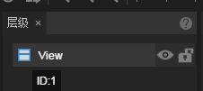
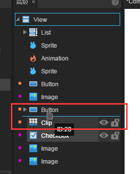
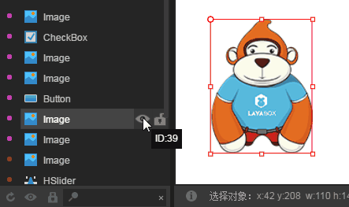
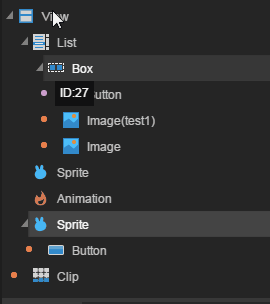
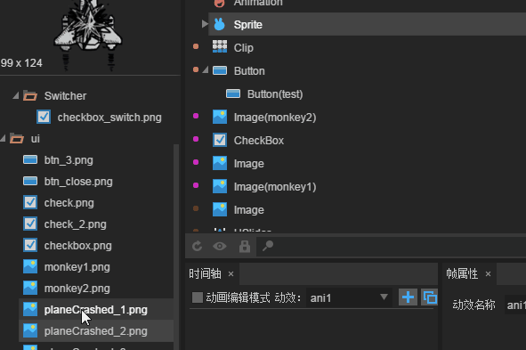

#계층 관리자

층급 관리자는 설계 모드 중 핵심 구성 부분 중 하나이며 모든 것이 있다`场景编辑器`구성 요소`层级管理器`중간 계급 구조로 연출.

###1, 등급 구조

####1.1근 급

UI 페이지를 만들 때 Dialog 을 선택하지 않으면 UI, 애니메이션, 뿌리급은 View, ID 는 1이다.그림 하나 그대로.

< br / > (그림 1)

####1.2 다층세트

층급 관리자 중 다층상쇄를 허용하고, 각 부급층은 회색 삼각 표시를 사용하여 삼각 표지를 클릭하면 층층을 넓힐 수 있으며, 그림 2개에 따라 제시된다.

< br / > (그림 2)

####1.3 층 구조 최적화

계층 관리자 중 구성 아이콘 앞에는 색다른 도트 점이 있다.같은 색상은 같은 도화의 노드를 대표하고 색상이 다르면 3개에 따라 최적화되어야 한다.

< br / > (그림 3) 다른 색상의 도트 교차 배열 시 최적화

최적화된 방식은 간단하고 같은 등급 아래의 동일한 색상을 동점으로 배열하면 된다. 여기에 작은 테크닉이 있으니 주의해야 한다. 구성 요소 아래로 끌 때 같은 단계에서 순서를 바꾼다.구성 요소를 견인할 때 상자를 표시하면, 목표 구성 요소를 끌어당길 수 있습니다.또한 단축키를 통해 계층 순서를 바꿀 수 있다.`ctrl + 方向键向上`위로 층을 옮기기 위해`ctrl+方向键向下`단계를 아래로 옮기다.

< br / > (그림 4)

층급 디스플레이 순서를 변경한 후 도트 색상이 같은 시기에 최적화된 목표입니다.제시한 대로.

< br / > (그림 5)

###2, 등급 관리자 패널 기능

####2.1 보이기 숨기기 구성 요소

당첨되다`层级管理器`구성 요소 오른쪽 클릭`眼睛图标`모임**숨기다**`场景编辑器`중**대응 구성 요소**다시 클릭하면 숨길 수 있습니다.효과는 동도 6 시와 같다.

< br / > (동영상 6)

####2.2 잠금 구성 요소와 해제

뽑다`层级管理器`구성 요소 오른쪽 클릭`锁形图标`모임**잠그다**`场景编辑器`응답 구성 요소를 다시 누르면 잠금 해제됩니다.효과는 동도 7소와 같다.

  (动图7)

####2.3 밑바닥 기능 버튼

계급 관리자의 밑부분 기능 버튼은 전체 층급 목록을 겨냥하여 조작한다.

클릭`刷新`단추를 누르면 전체 등급 관리자 목록을 새로 고칠 것입니다.

클릭`眼睛`단추를 누르면 전체 등급 관리자의 구성 요소를 숨기거나 표시합니다.

클릭`锁形`단추를 누르면 전체 등급 관리자의 구성 요소를 모두 잠그거나 해제할 수 있습니다.

구체적인 효과는 동도 8소와 같다.

< br > (동영상 8)

####2.4 구성 요소 찾기 필터

구성 요소는 층급 관리자에서 찾을 수 있으며, 구성 요소의 원본 이름의 키워드 필터를 통과할 수 있으며, 구성 요소의 별명을 통해 필터를 사용할 수 있으며, 효과는 그림 9과 같다.

   （图9）

**Tips: 구성 요소의 별명, 속성 설정기로 설정합니다.별명을 설정한 후 구성 요소의 찾기와 위치를 설정합니다.**

###3, 등급 관리자 오른쪽 키 메뉴 조작

####3.1 복사, 붙여넣기, 삭제 구성 요소

계층 관리자 중 구성 요소를 선택하면 오른쪽 키는 복사, 삭제, 붙여넣기 등 상용 동작을 할 수 있습니다.그림 10개처럼 보이다.

< br / > (그림 10)

**Tips:**단축키도 사용할 수 있어요.`ctrl+c`복제를 진행하다`ctrl+v`붙이다`Delete`삭제합니다.

####3.2 변환 및 분산 용기

하나 또는 여러 구성 요소 선택 후 오른쪽 단추`转换为容器`마치 11시에 제시한 것처럼.

  （图11）

**Tips:**단축키도 사용할 수 있어요.`ctrl+B`구성 요소`转换为容器`.

용기 구성 요소 선택`打散容器`용기 계급 관계를 해제할 수 있다. 동영상 12개 시사하듯.

   (动图12)

**Tips:**단축키도 사용할 수 있어요.`ctrl+U`용기를 흩뜨리다.

####3.3 모두 걷고 전개

아이콘 앞 삼각 표시를 누르면 현재 용기 아래에 있는 구성 요소, 오른쪽 단추를 접수할 수 있습니다.`全部收起`과`全部展开`전체 뿌리 아래의 구성 요소를 전개하거나 압축할 수 있으며 효과는 동영상 13개와 같다.

   (动图13)

####3.4 구성 요소 노드 만들기

선택한 구성 요소를 선택하면 오른쪽 키 메뉴 단축으로 상용 구성 요소, 오른쪽 단추 메뉴 중`创建2D`2D 기초 구성 요소를 직접 만들 수 있다.`创建Graphics`벡터 도형 구성 요소를 만들 수 있습니다.`创建UI组件`UI 상용 구성 요소를 만들 수 있으며, 이 구성 요소의 구성 요소를 만들 수 있습니다.

< br / > (그림 14)

**Tips**：*오른쪽 단추를 누르는 구성 요소와 구성 요소 라이브러리와 완전히 대응하기 때문에 구성 요소를 통해 구성 요소를 만들 수 있습니다.*

###4, 기타 조작

####4.1 다선 조작

Shift 를 누르면 같은 단계의 여러 인접 구성 요소를 동시에 선택할 수 있습니다.

Ctrl 을 누르면 동일한 층의 여러 개의 이웃과 서로 다른 구성 요소를 선택할 수 있습니다.

####4.2 구성 요소 추가 작업

오른쪽 단추 메뉴 중 바로 구성 요소 만들기 외에`组件库`그리고`资源管理器`끌어당기는 방식으로 구성 요소를 만들기, 장면 편집기 중 여러 구성 요소가 겹치는 복잡한 장면 설계를 통해 직접 통과`层级管理器`창건과 관리 구성 요소는 효율적인 개발 방식이다.구성 요소 추가 동작

< br / > (동영상 15)

