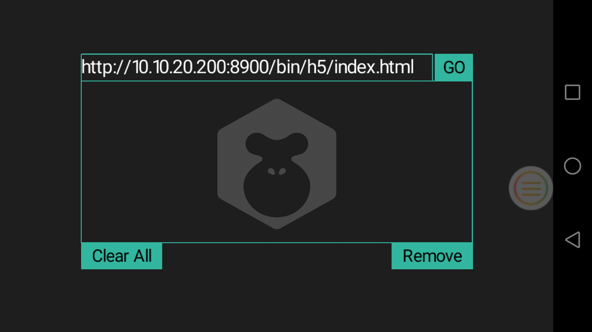
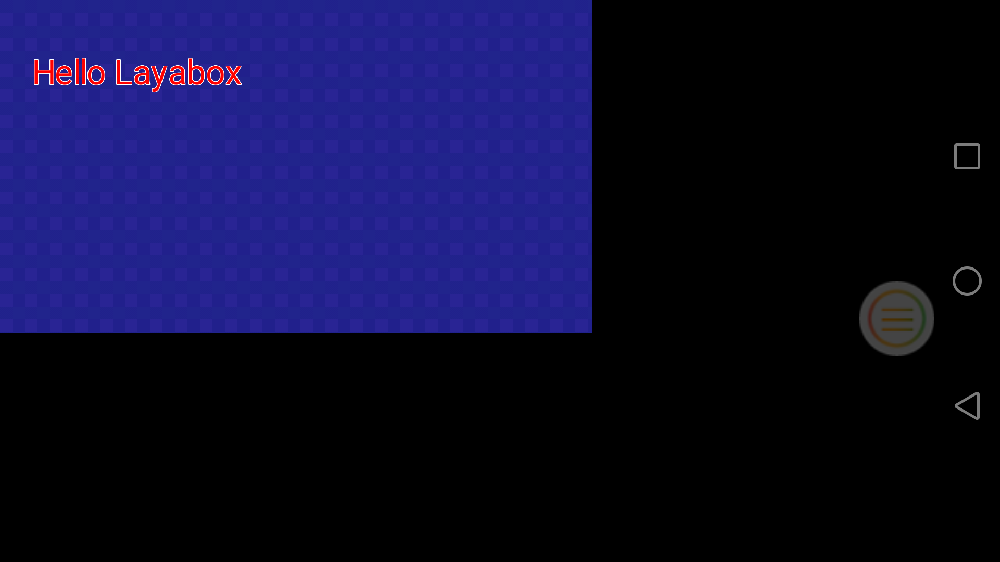

#  使用LayaNative运行LayaAir项目

당신이 이 문서를 볼 때, Layaiaiair나 Layaiair에 대해 잘 알고 있습니다. Layaiaiair의 문서에서 Layair를 어떻게 사용할지 상세하게 소개했습니다. "Hello Layayabox"

** Tips: 항목 주소를 입력한 후 화면에 화면이 나타나지 않았다면 항목이 가로세로 화면을 설치하지 않았을 수도 있습니다. 문서를 참고하십시오: htttps://github.com/layabox/layair-doc/tree/master/Chinese/LayaNative/screen

절차: 현재 Hello Layabox 의 간단한 항목을 세웠습니다.

실행 효과는 그림 2의 시사와 같다:

단계 2: LayaIDE 오른쪽 오른쪽 '2차원 코드' 메뉴 단추를 누르면 2차원 부호 인터페이스 인터페이스 아래에 http 주소를 표시합니다. 예를 들어 있는 주소를 표시합니다.`http://10.10.20.200:8900/bin/h5/index.html`그림 3의 제시:

단계 3: 2차원 부호 인터페이스를 클릭한 '브라우저 열기' 단추를 누르면 브라우저에서`http://10.10.20.200:8900/bin/h5/index.html`방식 열기, 켜진 후 화면 4개 표시:

단계 4: 핸드폰에 설치된 LayaBox 테스트 App 을 켜면 그림 5개처럼 보여 줍니다:

단계 5: 입력 주소 표시줄 입력`http://10.10.20.200:8900/bin/h5/index.html`그림 여섯 개 시사하듯:

절차 6: GO '단추를 누르면 그림 7개처럼:

단계 7: LayaNative 이 Hello Layabox 프로젝트를 적용할 수 있는 항목

