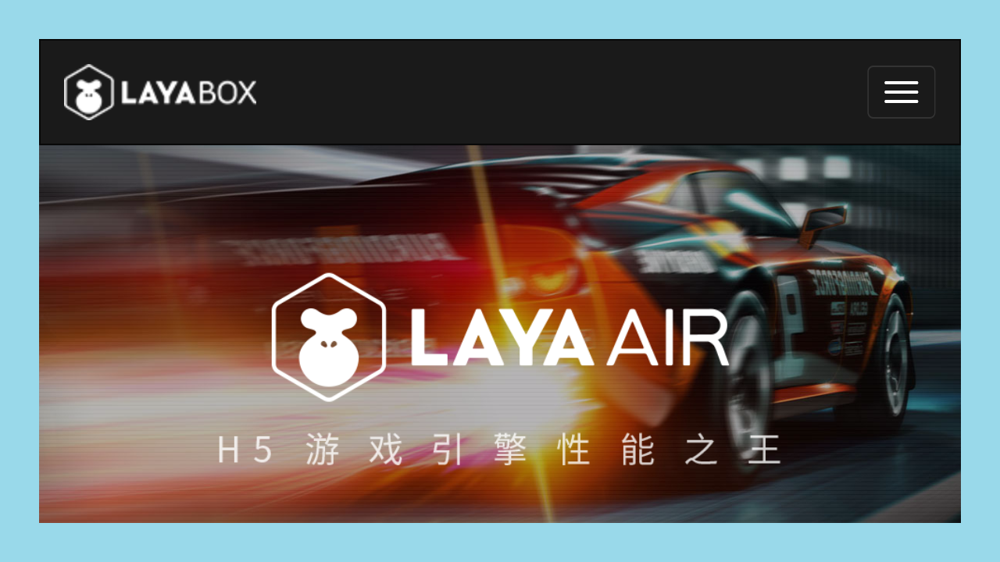

#webview
Layaplayer가 표준을 지원하지 않는 html 때문에 어떤 항목은 완전한 html 페이지를 표시할 때 Layaplayer 를 통해 제공하는 웹view 인터페이스를 나타내는 인터페이스를 보여줍니다.
**인터페이스 정의**  

```typescript

    /**
     * 显示一个webview
     * @param url {string} 要显示的url地址。
     * @param posx {number} weview的左上角位置
     * @param posy {number} webivew的左上角位置
     * @param width {number} webview的宽度
     * @param height {number} webview的高度
     * @param canclose {boolean} webview是否可以被关掉。
     */ 
    setExternalLinkEx(url:string,posx:number,posy:number,width:number,height:number,canclose:boolean):void;
```


이 함수는 화포의 최상층에 새로운 view 를 나타내며, 그 중 url 내용을 표시합니다.
canclose 인자가 이 webview 를 제어할 수 있는지 여부:
`false`이 webview 가 켜지기만 하면 꺼지지 않는다.
`true`ios 아래 작은 닫기 단추를 누르고 이 단추를 누르면 웹view(모니터 1)를 닫을 수 있습니다. android 에서 닫지 않고 후퇴키를 통해 webview(2)를 닫기 때문에 페이지를 덮어 보일 수 있기 때문에 가능한 한 표시가 되지 않습니다.


**제한**
1. 현재 webview 는 app 과 대화할 수 없습니다.
2. webview 의 실현은 시스템에 의존하고, 저버전의 android 는 보일 수 없습니다.

**Tips**  
*1, conch, LayaPlayer 환경에서만 호출됩니다. 웹 버전에서는 conch 가 정의되지 않습니다. 존재 여부를 판단해야 합니다.*
*2. as 언어를 사용하면 통과할 수 있다`Browser.window['conch'] `이런 방식은 conch 대상을 받는다.*


##실질 효과
  

도
webview 왼쪽의 x, 바로 canclose 가 true 설정할 때, 응답 단추를 닫습니다.만약 canclose = false 이 단추가 없습니다.

  

도2

##사례 코드

```javascript

//@ts-check

conch && conch.showAssistantTouch(false);
var ctx = document.createElement('canvas').getContext('2d');
function render(){
    ctx.fillStyle='#99d9ea';
    ctx.fillRect(0,0,window.innerWidth,window.innerHeight);
    window.requestAnimationFrame(render);
}
window.requestAnimationFrame(render);

document.addEventListener('touchstart',()=>{
    if(conch){
        var l = 50;
        var t = 50;
        var w = window.innerWidth-l*2;
        var h = window.innerHeight-t*2;
        conch.setExternalLinkEx('http://www.layabox.com',l,t,w,h,true);
        //conch.setExternalLink('http://www.baidu.com');
    }
});
```


##어떻게 코드 중 동적 닫기 webview 페이지


```javascript

conch.closeExternalLink();
```
