## 如何使用及参与维护LayaAir引擎Github开源项目

> Author : charley         Date : 2019-12-5

引擎项目开源的核心价值，一方面是源代码的开放，可以让大家免费使用，避免重复造轮子。另一方面可以吸引有能力维护源码的开发者共同参与维护，让项目加速前进与成熟。

LayaAir引擎从2.2.0 release版本开始，Layabox团队开始在Github中实时维护。自此，开发者完全不用等官网中每月一次的zip包版本。直接从Github可以随时拉取最新的版本。

自从微信的引擎插件推出以来，共同维护公共版本引擎的需求越来越高。开发者对引擎的私自修改，即不利于修改者升级新版本引擎，也会造成微信中引擎插件无法使用，更是对引擎开源生态资源的浪费。

本篇文档的推出，通过对引擎源码结构及使用的介绍以及开源项目维护流程的介绍，希望能帮助开发者更好的使用Github上实时维护的引擎源码，帮助有维护引擎源码能力但不熟悉github维护流程的开发者，顺利加入到LayaAir引擎公开版本的维护，比如，发现BUG与修复BUG。这是利已利他，让全体引擎使用者受益的善事。

Layabox官方团队，对于参与维护Github，贡献度较多的开发者，会免费提供引擎技术答疑服务。对于突出贡献者会邀请加入LayaAir引擎开源小组，参与引擎技术决策。

### 一、与LayaAir开源项目相关的GitHub功能

Layabox旗下的项目，LayaAir引擎是开源的，LayaAirIDE与LayaNative等是闭源的。LayaAir引擎的开源代码地址为：

[https://github.com/layabox/LayaAir](https://github.com/layabox/LayaAir ) 

#### 1.1 关注和参与LayaAir开源项目

直接在浏览器里打开Github的LayaAir地址，顶部我们可以看到 Watch、Star、Fork，这几个按钮。

##### Watch

点开`Watch`之后，可以选择关注的模式。选择 `Watching`后，如下图所示。表示你会关注这个LayaAir开源项目的所有动态，比如，被发起了Issue（社区问题）、被提交了 Pull request（修改合并的拉取请求）等等情况，都会在个人通知中心收到通知消息，和收到邮件（需要设置）。大家对LayaAir引擎选择了`Watching`后，LayaAir引擎的一切变化都会通知到。

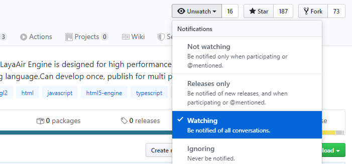 

如果开发者不想了解太多日常的更新，只想关注Releases版本的发布等，也可以选择`Releases only`，这样只有出现新的releases版本、 参与或被提及（被@）时才会被通知。 

##### Star

星标Star，类似点赞功能，Star越多的项目说明在开源圈越火。而且Star之后的项目，也比较容易查找。

 

希望开发者多多星标点赞支持，我们从最近的LayaAir2.3版才开始在Github开源维护，所以当前赞还不多，这里顺便求个赞。

##### Fork

Fork是派生分叉版本，对于没有官方项目提交权限的开发者，开发者可以在Github中，先Fork一个分叉版本，


然后提交给自己的Fork版本，再Pull Request给官方，官方项目的管理者一旦通过，就可以合并到官方版本里了。 

所以，Fork的数量越多，说明潜在的开源项目维护者基数越大。这里希望有更多的开发者参与到LayaAir开源项目的维护中来。

#### 1.2 引擎release版下载与开源协议

##### releases

在code标签下，下图中的 releases文本之前是release版的数量，点击releases可以进入LayaAir引擎release版下载页面，如果不参与引擎的修改维护，从这里下载和从官网下载都是一样的。对于使用Watch关注了LayaAir引擎项目的开发者，每次发布releases版本后，还会收到releases发布通知。

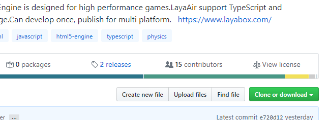 

> 提示：
>
> 1、github中是从2.2.0 release版开始。更早的历史版本还需Layabox官网下载。
>
> 2、github中的releases功能中，仅提供LayaAir引擎release版本下载。引擎beta版、LayaAirIDE、LayaNative只能通过Layabox官网下载。
>
> 所以，github中主要用户群体还是针对有源码维护能力的开发者，本篇文档也是面向有意于参与LayaAir引擎维护的开发者。

##### View license

点击View license打开，可以查看LayaAir引擎的使用协议。这里重点提示一下，LayaAir引擎并没有使用国际通用的开源协议，采用的是引擎私有协议。这里简要提及一下，所有使用了包含LayaAir引擎的产品，必须在产品页任意可见位置增加 “Powered by LayaAir Engine” 字样，否则LayaAir引擎官方有权要求该产品停止引擎的使用，有权要求未遵守引擎使用协议的产品从所有运营平台中下架该产品。

#### 1.3   问题社区（Issues）

除了官方网站的社区外，我们还在GitHub中开启了Issues功能，可以用于LayaAir引擎BUG的反馈，以及引擎版本相关的意见和建议交流。LayaAir引擎维护者会不定期进行关注和给予响应回复。


### 二、了解LayaAir分支与Clone

#### 2.1 LayaAir引擎的分支结构

LayaAir引擎在Github中包括众多的分支，要使用LayaAir引擎开源项目，则需要先了解其分支的结构。

在Github网站的LayaAir开源项目中，打开`branches`页面或者`Branch`选项框，可以查看和搜索各个分支版本，如下图所示。

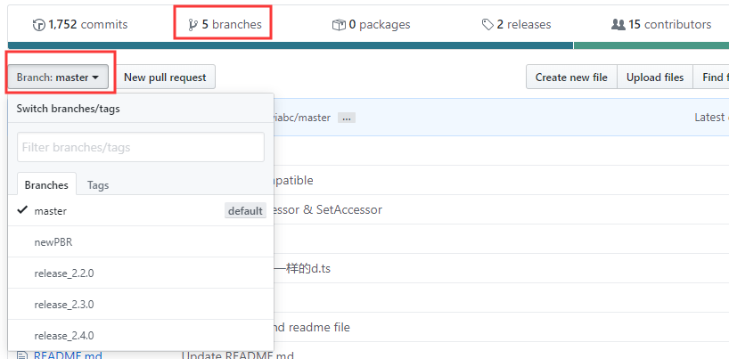     

##### 2.1.1 主分支

默认的主分支是`master`，这是一个始终处于最新开发状态的引擎主干分支，版本分支来自于主分支。

##### 2.1.2 版本分支

另外的重要系列分支是带着版本号的分支，如上图中的XX_2.20，XX_2.3.0等。

每次官网中要推出beta版，github中就会建立一个新的版本分支。同时上一个分支版本也会更新为release版并停止后续更新。比如，写本文的时候，官网最新版本是LayaAir 2.4.0 beta版，其它版本都是release版，所以上图中的release_2.2.0与release_2.3.0与官网中的release版是同步的，都不再继续更新，如果更新，也会产生新的版本分支，而不会在已经发布了release版本的旧分支（如2.2.0和2.30）上进行维护。

但是这里特别说明一下的是，当前github上最新的分支版本release_2.4.0并不是release版，而是对应官网上的LayaAir 2.4.0 beta。我们可以这样理解，github上的版本分支，只是官网中已发布的版本对应的引擎源码项目而已。真正的日常开发与更新提交全在主干分支master中进行。

> 对于想在已发布的公开版本分支上修改维护的开发者，可以去clone（克隆）使用分支版本。如果想使用最新版本或者想与官方团队一起维护最新版本，则使用默认的master主分支即可。

为了避免开发者误会github中最新的版本分支（如当前的release_2.4.0）对官网中发布的release版，后续的版本分支名称将会更改为LayaAir_2.x.x。

##### 2.1.3 其它分支

开发者需要关注的只有主干分支与版本分支，其它名称的分支，如无特别说明，通常为LayaAir引擎团队内部使用的测试分支，开发者不要拉取使用。


#### 2.2  Fork 一个LayaAir的分支

作为一个想参与LayaAir开源项目维护的开发者，Fork一个LayaAir引擎分支，这是必须要做的事。

Fork之后，自己的Github帐号下就会多出一个LayaAir的仓库（repositories）。我们可以看到仓库项目名左侧的图标是一个分叉图标，其下有fork来源的英文描述 `forked from layabox/LayaAir` （译：分叉版本来自layabox帐号下的LayaAir项目），如下图所示。

 


#### 2.3 克隆与下载（Clone or download）

Fork之后，要在自己的仓库克隆LayaAir项目，而不是克隆LayaAir引擎官方项目。因为pull（拉取）官方的仓库，开发者只能使用而没有修改提交的权限。

至于如何克隆和拉取LayaAir引擎，这种比较基础的Git操作，本篇就不展开介绍了，大家如有疑惑可以百度查询。

推荐使用来克隆LayaAir引擎的开源项目，关于Github帐号的创建以及Git工具的基础使用，本篇就不展开介绍了，大家如有疑惑可以百度查询。

> 本地Git工具推荐 [TortoiseGit](https://tortoisegit.org/download/)
>
> Git文档的推荐网站： [https://git-scm.com/book/zh/v2]( https://git-scm.com/book/zh/v2 ) 


### 三、概述LayaAir源码结构

#### 3.1 Github的LayaAir源码作用

在Layabox官网的引擎下载共有四个版本，分别为AS、TS、JS、TsNew，对应IDE创建项目的编程语言为ActionScript3、TypeScript、JavaScript、TypeScript实验版。

其中只有TypeScript实验版是源码版本，AS、TS、JS这三个版本的引擎其实是引擎源码编译生成的JS库。JS库引擎代码的可读性相对于源码较差。

如果我们想修改引擎的BUG或者新增功能，我们的建议是在Github的LayaAir源码版本上修改，然后生成引擎JS库来替换。而不是直接在JS库里修改。

另外就是希望更多的开发者通过Github平台参与LayaAir引擎开源项目，共同维护，成为LayaAir引擎的贡献者。

#### 3.2 本地开发环境提醒

尽管很多开发者已安装了TS的全局开发环境，但本篇，仍建议开发者在VSCode的shell命令行下，再次执行npm的本地环境安装命令 `npm install`，以保障引擎编译的正常运行。

>  Gulp全局环境也需要安装，LayaAir开发者基本上都会安装，不会的可以查看Layabox官方文档，这里就不讲了。

#### 3.3 LayaAir源码项目结构说明

用VSCode打开clone下来的LayaAir引擎目录。安装好本地开发环境后，根目录结构如下图所示。

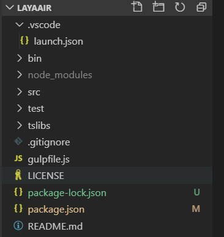 

##### 3.3.1 `bin`目录

bin目录是将TS引擎源码编译为JS库后的目标目录，用于引擎示例的快捷切换与调试，包括了两种编译方式的js库调试方式，tsc与rollUp。通过查看与调试这里的测试示例DEMO，验证引擎是否存在影响运行的BUG。

通用的资源目录`res`与3D物理js这里就不详细说明了，大家需要了解tsc与rollup示例的入口。

##### tsc调试相关

tsc调试模式是LayaAir开源项目默认配置好的调试模式，在VSCode中使用F5调试的时候，会自动采用tsc模式编译，发布的js就在`bin/tsc`目录下。`indexTSC.html`是tsc模式的示例入口文件。如下图所示。

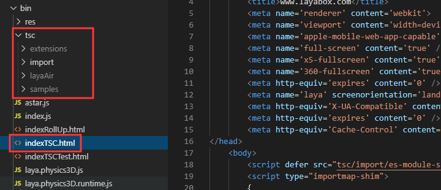 

##### rollUp调试相关

相对于tsc的单文件编译，rollUp编译会形成一个完整的js库。

如果要使用rollup编译，需要先安装好rollup全局环境，命令为 `npm i rollup -g`。

准备好rollup环境，在VSCode的shell命令行下进入`src/samples`目录，执行 `rollup -c`，即可编译生成rollup的js引擎与示例库。

要注意的是，如果首次采用rollup编译，编译四五分钟，甚至十几分钟，也是正常的，因电脑性能差异会有所不同，卡住了就多等会，不要直接终止。首次编译缓存后，以后编译就会快起来。如下图所示。

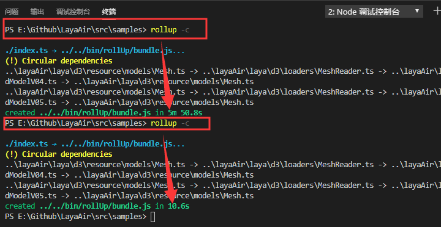 

编译结束后，我们看到bin目录下的rollup示例相关的结构如下图所示。

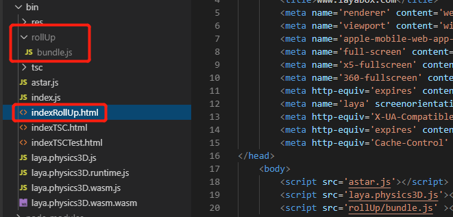 

`bundle.js`是整合了引擎与示例的js库，`indexRollUp.html`是rollup调试模式的示例入口文件。

##### 运行入口文件

无论是tsc编译模式，还是rollup编译模式，开发者任选其一即可。

编译之后的运行，推荐采用anywhere启动一个本地的web服务。命令 `anywhere 端口号`，端口号自己定义，不冲突就行，参照如下图所示。

  

> 如果本地装没有anywhere，可以安装下，命令： `npm i anywhere -g` 

web服务运行起来之后。按命令行中的网址在chrome浏览器中访问，点开tsc编译模式或者rollup编译模式对应的html入口文件即可。

##### 3.3.2  `src`目录

src目录内包括了引擎源码、引擎测试用例源码、插件源码等。目录结构如下图所示。

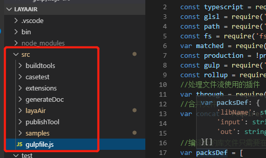 

##### buildtools

引擎团队测试使用的内部rollup插件工具，当前，**开发者无需关注。**

##### casetest

引擎团队用于搭建引擎自动测试的工程，当前仍在开发调整中，**开发者无需关注。**

##### extensions

引擎插件源码目录，当前只有`debugtool`插件。

##### generateDoc

用于生成引擎API文档的项目源码。拖拽该目录下的 `run.bat` 到命令行直接执行即可生成API文档。doc下为生成好的API文档。

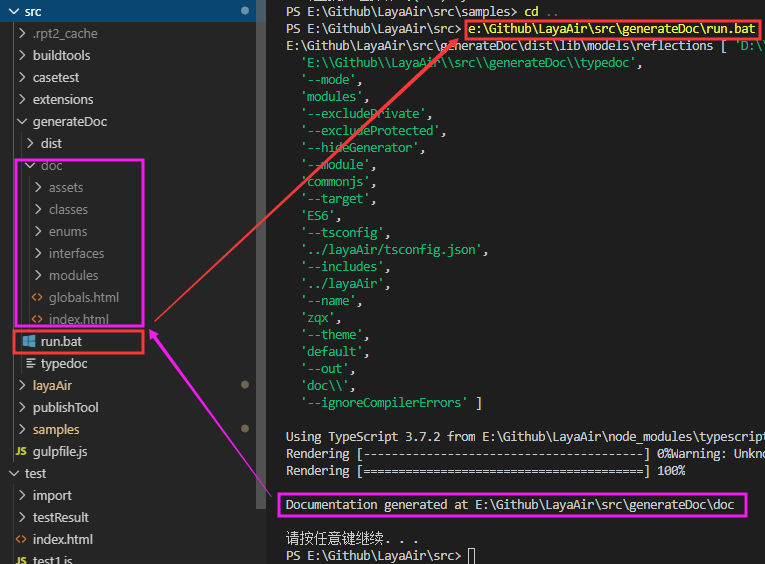 

##### layaAir

LayaAir引擎源码目录。对于引擎的BUG修改，功能增加，都在这里完成。最终通过编译工具，生成js库来使用。

##### publishTool

存放AS编译工具，以及生成引擎JS壳（用于代码提示的d.ts）的目录。

命令行下进入`publish.bat`同级目录，运行该目录下的`publish.bat` 即可发布生成。

 

##### samples

引擎测试用例的源码项目目录，bin目录下的测试DEMO来源于此处项目源码的编译。

##### 根目录下的文件

###### gulpfile.js 文件

发布js用的gulp任务文件。

###### LICENSE 文件

Layabox引擎软件使用的声明

###### package.json 文件

npm的package.json配置，这里有LayaAir源码项目的描述信息，描述了项目的git仓库地址，社区地址， shell命令入口，引擎作者，项目依赖环境的最小版本等等。

重点介绍一下package.json 当前内置的三个脚本命令，分别为publishTool与generateDoc目录内的bat执行和引擎源码的编译。

之前我们知道了进入到目录内执行`XX.bat`的方法，通过package.json配置的shell命令入口，还可以在根目录来执行`npm run 脚本名称`，来调用相关的脚本。

比如，`npm run build` 会执行publish.bat，`npm run buildDoc`会执行文档的run.bat，`npm run compile`会编译引擎源码。如下图所示。

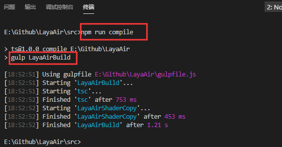 


### 四、关于LayaAir引擎源码编译

在上一小节，我们已经简单的提及编译相关的命令。本小节会重点针对引擎编译成js库的方式进行介绍。

日常开发时，开发者可以使用F5进行引擎编译。因为我们将F5调试配置文件（ `launch.json`）已默认设置为node模式，并设置了`LayaAirBuild`的gulp任务。如下图所示。

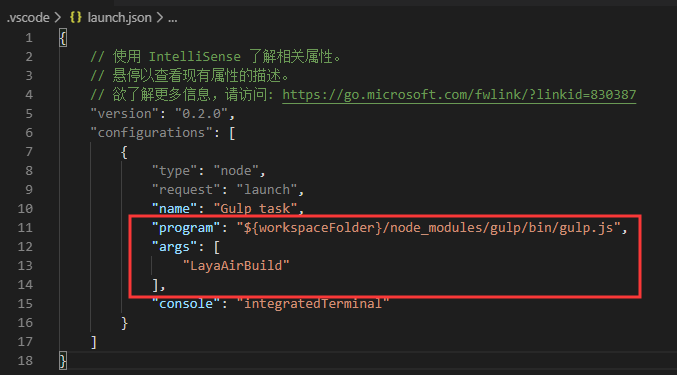   

这与我们之前提到的shell命令`npm run compile`实际上是一样的。打开`package.json`配置文件，可以看到`compile`指向的gulp任务也是 `LayaAirBuild`。如下图所示。

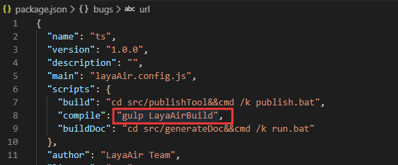  

为了进一步了解LayaAirBuild这个gulp任务，我们直接打开根目录的`gulpfile.js`。

这时，可以看到LayaAirBuild任务中又执行了`tsc`与`LayaAirShaderCopy`这两个gulp任务。如下图所示。

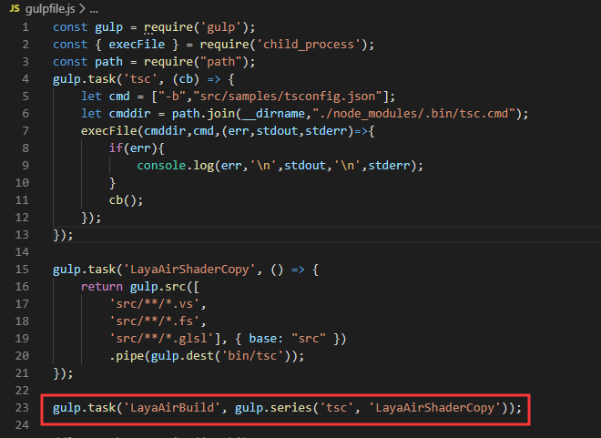 

通过查看`gulpfile.js`中的`tsc`与`LayaAirShaderCopy`任务。我们可以看出，名称为`tsc`的gulp任务是通过调用`tsc.cmd`来编译引擎及示例。名称为`LayaAirShaderCopy`的gulp任务是用来复制shader相关文件的。

除非是第一次编译，必须要执行`LayaAirBuild`这个gulp任务，也就是说`tsc`与`LayaAirShaderCopy`任务都要执行。在后续的日常编译中，shader没有改变的话，只执行示例及引擎的gulp编译任务(`tsc`)就行了。如果是rollup编译模式，则是在`src/samples`目录，执行shell命令 `rollup -c`，也可以编译示例及引擎。

假如，示例也没有改变，那我们也可以只编译引擎，在vscode中使用快捷键 `Ctrl` + `Shift` + `B` 打开任务面板，选择`tsc:构建 - src/layaAir/tsconfig.json`  进行编译即可。如下图所示。

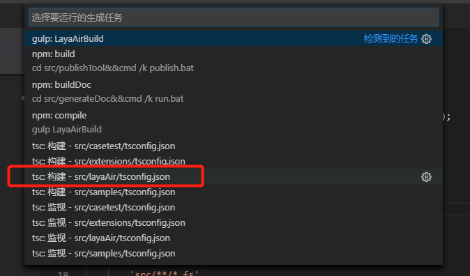 


### 五、同步LayaAir引擎官方项目及提交

#### 5.1 同步LayaAir引擎官方项目 

之前我们介绍了将LayaAir引擎源码项目Fork到自己的github帐号下，那如果LayaAir引擎源码更新了，如何同步，本小节将进行介绍。

##### 5.1.1 创建一个layaAir远程分支

我们先在本地Git Bash命令行中，使用git命令创建一个layaAir官方的远程分支，命令全文如下:

```powershell
 git remote add layaAir https://github.com/layabox/LayaAir.git
```

创建完远程分支，我们可以使用查看远程分支的命令（`git remote -v` ）看到已添加成功的远程分支。效果如下图所示。

 

##### 5.1.2  获取layaAir官方分支的最新版本

layaAir远程分支添加成功后，可以使用 `git fetch layaAir` 命令获取layaAir官方的分支到本地。

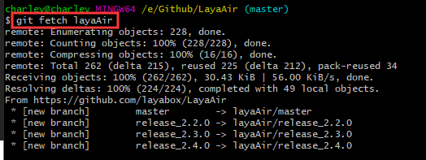 

##### 5.1.3  合并分支

当本地已存在layaAir官方的分支后，再通过 `git merge layaAir/master` 命令，合并到本地的分支版本中。如下图所示。

 

##### 5.1.4 提交到自己的git仓库

合并到本地的版本后，自己github上的版本仍是未同步的，如果要同步，还需要再提交到自己的github仓库中。

这时就用日常的push命令就可以了。效果如下图所示。

 

#### 5.2 提交给LayaAir官方项目

当我们对本地的引擎项目进行开发并测试无BUG后，可以将修改提交给LayaAir官方。

提交前要先确认已将本地的修改push到自己的仓库，然后打开自己的github仓库首页（fork了LayaAir那个），点击`New pull request` 按钮。如下图所示。

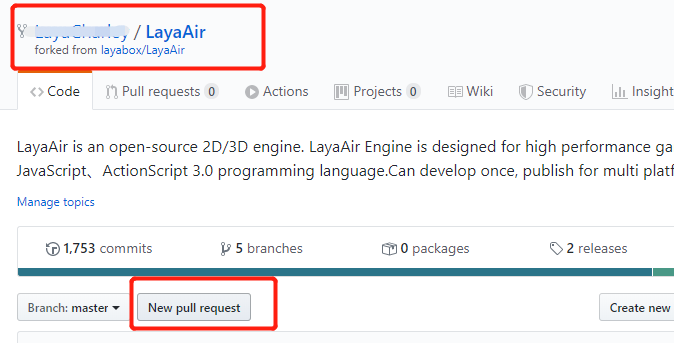 

点击之后，会跳转到LayaAir官方仓库的提交请求页面。如下图所示。

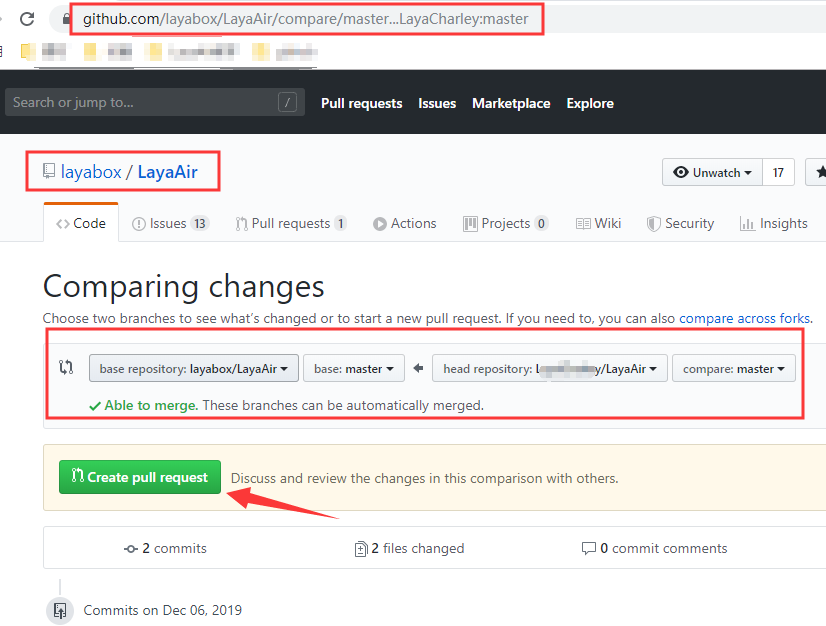

如果是绿色文字提示`Albe to merge`，说明是可以合并的状态。如果是红色文字提示`Can’t automatically merge.` 那说明有冲突，要先解决好冲突再来提交。

可以合并的状态下，直接点`Create pull request`按钮，输入提交理由即可。点击后，如下图所示。

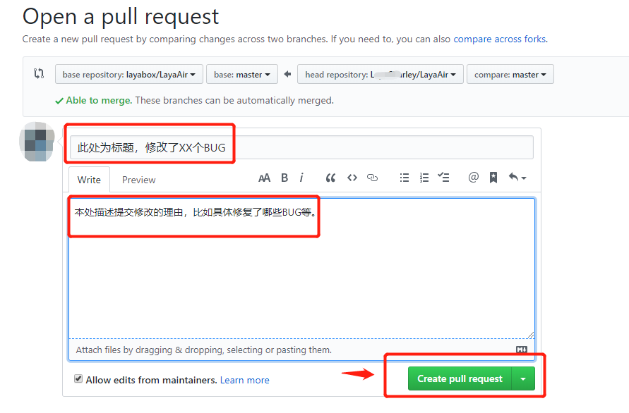  

> 建议认真和仔细填写，有助于引擎团队更有效率的审核。

填写完本次提交的说明信息，再次点`Create pull request`按钮，会跳转到已提交的pull requests内容页面，如下图所示。

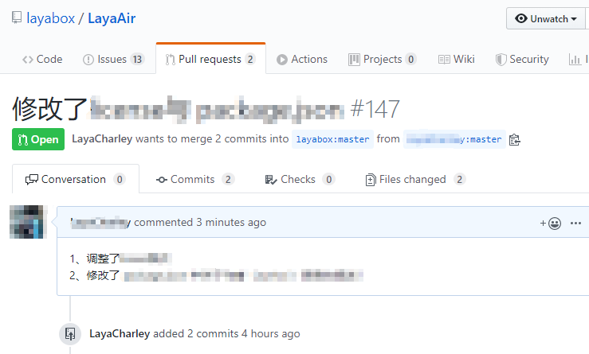 

看到这个页面，就说明，已完成了本次的源码提交请求，等待引擎团队成员审核即可。

提交成功之后的内容，所有人都可以在LayaAir官方仓库的`pull requests`页面里查看状态。

至此，开发者应该可以学会LayaAir开源维护的完整流程了，如果有疑问，可以加入Layabox贡献者的QQ交流群(`群号948868172`)。有意参与LayaAir引擎维护的开发者加入这个群后，可以对于如何使用Git，以及在github的LayaAir源码修改和贡献的过程中遇到的问题，进行答疑解惑。另外，对于layaAir引擎开源社区的积极贡献者，可以免费获得引擎官方的技术答疑服务。


### 写在最后

引擎官网在发布beta版后，有时会听到开发者反馈新版引擎不稳定。希望这些开发者能理解beta版本的含义，从名称上可以看出beta版是测试版。beta版的推出是让有能力参与维护源码的开发者，以及购买了企业技术服务的开发者来尝鲜，优先体验新的引擎功能和特性，以及参与深度的测试。毕竟引擎测试用例可能覆盖的场景复杂度还不够。

而除了beta版之外的release版本，最少也是经过了一个多月的问题收集后，修复了已知BUG的稳定版本，所以建议没有源码维护能力的开发者使用release版来开发产品。

写这篇文档，自然是希望更多的人来参与到LayaAir开源生态的建设中来，如果您有源码的维护能力，希望积极参与beta版本的体验，一起发现BUG与修复BUG，然后提交到github中，让更多的人受益。引擎源码是的成熟与稳定是大家共同的财富。

一个良性的开源引擎生态，除了对于源代码的贡献外，自然也离不开商业模式的支撑。作为LayaAir开源项目的主要维护者layabox团队，也提供引擎技术服务的商业合作模式，为没有源码维护能力的开发者，也可以率先体验引擎的新特性，优先且即时的处理引擎中存在的BUG。

无论是参与源码维护的开发者，还是引擎技术服务的购买者，都是引擎开源生态的贡献者，有了你们的支持，引擎生态才会良性发展下去。感谢大家。


## 本文赞赏

如果您觉得本文对您有帮助，欢迎扫码赞赏作者，您的激励是我们写出更多优质文档的动力。

