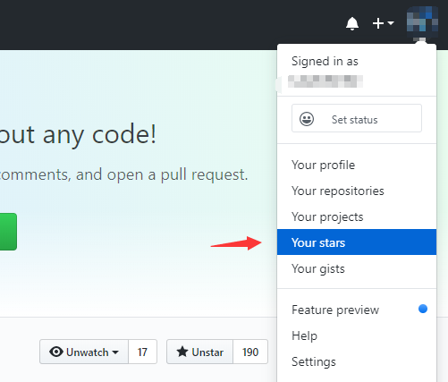

## 如何使用及参与维护LayaAir引擎Github开源项目

> *Author : charley         Date : 2019-12-6*

引擎项目开源的核心价值，一方面是源代码的开放，可以让大家免费使用，避免重复造轮子。另一方面可以吸引有能力维护源码的开发者共同参与维护，让项目加速前进与成熟。

LayaAir引擎从2.2.0 release版本开始，Layabox团队开始在Github中实时维护。自此，开发者完全不用等官网中每月一次的zip包版本。直接从Github可以随时拉取最新的版本。

自从微信的引擎插件推出以来，共同维护公共版本引擎的需求越来越高。开发者对引擎的私自修改，即不利于修改者升级新版本引擎，也会造成微信中引擎插件无法使用，更是对引擎开源生态资源的浪费。

本篇文档的推出，通过对引擎源码结构及使用的介绍以及开源项目维护流程的介绍，希望能帮助开发者更好的使用Github上实时维护的引擎源码，帮助有维护引擎源码能力但不熟悉github维护流程的开发者，顺利加入到LayaAir引擎公开版本的维护，比如，发现BUG与修复BUG。这是利已利他，让全体引擎使用者受益的善事。

Layabox官方团队，对于参与维护Github，贡献度较多的开发者，会免费提供引擎技术答疑服务。对于突出贡献者会邀请加入LayaAir引擎开源小组，参与引擎技术决策。

### 一、与LayaAir开源项目相关的GitHub功能

Layabox旗下的项目，LayaAir引擎是开源的，LayaAirIDE与LayaNative等是闭源的。LayaAir引擎的开源代码地址为：

[https://github.com/layabox/LayaAir](https://github.com/layabox/LayaAir ) 

#### 1.1 关注和参与LayaAir开源项目

直接在浏览器里打开Github的LayaAir地址，顶部我们可以看到 Watch、Star、Fork，这几个按钮。

##### Watch

点开`Watch`之后，可以选择关注的模式。选择 `Watching`后，如下图所示。表示你会关注这个LayaAir开源项目的所有动态，比如，被发起了Issue（社区问题）、被提交了 Pull request（修改合并的拉取请求）等等情况，都会在个人通知中心收到通知消息，和收到邮件（需要设置）。大家对LayaAir引擎选择了`Watching`后，LayaAir引擎的一切变化都会通知到。

 

如果开发者不想了解太多日常的更新，只想关注Releases版本的发布等，也可以选择`Releases only`，这样只有出现新的releases版本、 参与或被提及（被@）时才会被通知。 

##### Star

星标Star，类似点赞功能，Star越多的项目说明在开源圈越火。而且Star之后的项目，也比较容易查找。

 

希望开发者多多星标点赞支持，我们从最近的LayaAir2.3版才开始在Github开源维护，所以当前赞还不多，这里顺便求个赞。

##### Fork

Fork是派生分叉版本，对于没有官方项目提交权限的开发者，开发者可以在Github中，先Fork一个分叉版本，

然后提交给自己的Fork版本，再Pull Request给官方，官方项目的管理者一旦通过，就可以合并到官方版本里了。 

所以，Fork的数量越多，说明潜在的开源项目维护者基数越大。这里希望有更多的开发者参与到LayaAir开源项目的维护中来。

#### 1.2 引擎release版下载与开源协议

##### releases

在code标签下，下图中的 releases文本之前是release版的数量，点击releases可以进入LayaAir引擎release版下载页面，如果不参与引擎的修改维护，从这里下载和从官网下载都是一样的。对于使用Watch关注了LayaAir引擎项目的开发者，每次发布releases版本后，还会收到releases发布通知。

 

> 提示：
>
> 1、github中是从2.2.0 release版开始。更早的历史版本还需Layabox官网下载。
>
> 2、github中的releases功能中，仅提供LayaAir引擎release版本下载。引擎beta版、LayaAirIDE、LayaNative只能通过Layabox官网下载。
>
> 所以，github中主要用户群体还是针对有源码维护能力的开发者，本篇文档也是面向有意于参与LayaAir引擎维护的开发者。

##### View license

点击View license打开，可以查看LayaAir引擎的使用协议。这里重点提示一下，LayaAir引擎并没有使用国际通用的开源协议，采用的是引擎私有协议。这里简要提及一下，所有使用了包含LayaAir引擎的产品，必须在产品页任意可见位置增加 “Powered by LayaAir Engine” 字样，否则LayaAir引擎官方有权要求该产品停止引擎的使用，有权要求未遵守引擎使用协议的产品从所有运营平台中下架该产品。

#### 1.3   问题社区（Issues）

除了官方网站的社区外，我们还在GitHub中开启了Issues功能，可以用于LayaAir引擎BUG的反馈，以及引擎版本相关的意见和建议交流。LayaAir引擎维护者会不定期进行关注和给予响应回复。

### 二、了解LayaAir分支与Clone

#### 2.1 LayaAir引擎的分支结构

LayaAir引擎在Github中包括众多的分支，要使用LayaAir引擎开源项目，则需要先了解其分支的结构。

在Github网站的LayaAir开源项目中，打开`branches`页面或者`Branch`选项框，可以查看和搜索各个分支版本，如下图所示。

     

##### 2.1.1 主分支

默认的主分支是`master`，这是一个始终处于最新开发状态的引擎主干分支，版本分支来自于主分支。

##### 2.1.2 版本分支

另外的重要系列分支是带着版本号的分支，如上图中的XX_2.20，XX_2.3.0等。

这里需要重点说一下的是，版本命名我们后续会有所调整，一是，从LayaAir 2.5开始由`release_版本号`这种版本分支的命名方式会改为`LayaAir_版本号`，因为最新的版本在官方要推出beta版的时候，分支就必须要产生，此时版本并未稳定，所以直接叫release可能会让开发者误解。二是，后续版本号只保留一位小数点，比如LayaAir_2.5，LayaAir_2.6……。原因是，如果使用LayaAir_2.5.0，可能会让开发者误解为，Github的LayaAir_2.5.0分支与官网发布的LayaAir 2.5.0是对应关系，实际上，我们会持续维护版本分支，每一个大版本分支上，如果发现有BUG，仍然会保持维护下去，这样可以保障开发者在不升级版本的情况下，可以更加稳定。哪怕是官网出现LayaAir 2.5.3了，github上的LayaAir源码版本分支仍然只会是LayaAir_2.5。

##### 2.1.3 其它分支

开发者需要关注的只有主干分支与版本分支，其它名称的分支，如无特别说明，通常为LayaAir引擎团队内部使用的测试分支，开发者不要拉取使用。

#### 2.2  Fork 一个LayaAir的分支

作为一个想参与LayaAir开源项目维护的开发者，Fork一个LayaAir引擎分支，这是必须要做的事。

Fork之后，自己的Github帐号下就会多出一个LayaAir的仓库（repositories）。我们可以看到仓库项目名左侧的图标是一个分叉图标，其下有fork来源的英文描述 `forked from layabox/LayaAir` （译：分叉版本来自layabox帐号下的LayaAir项目），如下图所示。

 

#### 2.3 克隆与下载（Clone or download）

Fork之后，要在自己的仓库克隆LayaAir项目，而不是克隆LayaAir引擎官方项目。因为pull（拉取）官方的仓库，开发者只能使用而没有修改提交的权限。