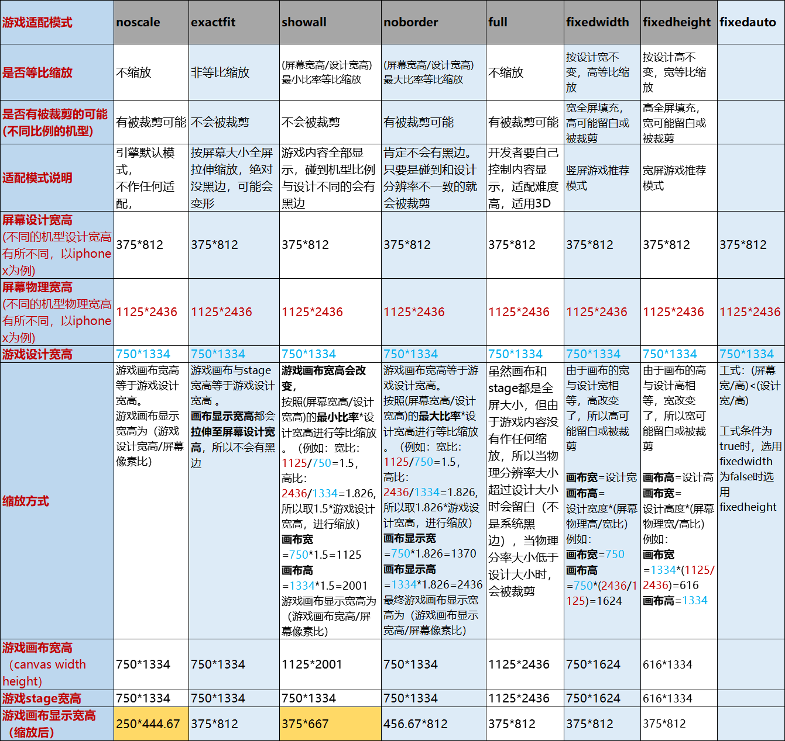

# 屏幕适配的缩放模式详解

​         缩放模式是屏幕适配的重点内容，本篇从基础概念到参数说明，并结合代码实例帮助大家理解LayaAir引擎的屏幕缩放模式。在 API文档中，我们搜索laya.display.Stage，可以看到关于缩放模式的方法scaleMode共有七种参数，用于实现各种屏幕适配的缩放需求，参数说明如图1所示：

<br/>
​        （图1）LayaAir引擎关于缩放模式scaleMode的参数说明


**简单概览一下参数说明，我们先了解一些本篇涉及的基础概念：**

**1、设计宽高：** 

​        在项目代码中项目代码中初始化舞台Laya.init()中定义的宽高即为设计宽高。

**2、Stage宽高：**

​        stage宽高为游戏舞台实际大小的宽高。

**3、适配宽高：**

​       通过引擎的适配模式对设计宽高进行缩放改变后的宽高，为了便于区分理解，我们称为适配宽高。

**4、画布宽高：**

​        画布宽高是指HTML5中canvas节点的宽高，游戏中所有可见的内容都在画布区域内。

**5、屏幕宽高：**

​        屏幕宽高是指手机浏览器屏幕的宽高，例如iphone6竖屏时的屏幕宽高为`375*667`。LayaAir引擎可以通过laya.utils.Browser.clientWidth和laya.utils.Browser.clientHeight来获取屏幕的宽与高。

**6、物理宽高：**

​        关于设备屏幕的物理宽高，我们需要先了解像素密度的概念。在PC电脑上，通常一个像素位置上就是一个物理像素。在移动设备高速发展的今天，手机的屏幕上通常是一个像素位置上拥有2个或3个像素。例iphone6竖屏时的物理宽高为`750*1334`。LayaAir引擎可以通过laya.utils.Browser.width和laya.utils.Browser.height来获取设备屏幕屏幕的物理宽高。


### 示例代码中所用的背景图片：

[loadingBg.jpg](http://ldc.layabox.com/uploadfile/file/20170223/1487816895380055.jpg)(点击打开或另存`1136×640`像素背景原图)


### 一、exactfit模式

​        exactfit模式是一种不考虑内容的原始比例，直接**通过非等比缩放填满整个浏览器屏幕**的模式。在这种模式下，画布宽高与stage宽高都等于设计宽高，且不会发生改变。但是当物理宽高与设计宽高不等时，这种非等比的缩放模式**可能会导致原有设计明显变形**。效果如图2、图3所示。

​        <br/>
​        （图2）设计宽高为`1136*640`，物理宽高为`1334*750`的exactfix模式运行效果

​        <br/>
​        （图3）设计宽高为`1136*640`，物理宽高为`750*1334`的exactfit模式运行效果


**exactfit模式示例代码：**

```javascript
package  {
    import laya.display.Stage;
    import laya.display.Text;
    import laya.ui.Image;
      
    public class SmartScale_T {
          
        //全局文本信息
        private var txt:Text;
          
        public function SmartScale_T() 
        {
        //初始化舞台大小
        Laya.init(1136, 640);
          
        //设置适配模式为"exactfit"
        Laya.stage.scaleMode = Stage.SCALE_EXACTFIT;
        //设置舞台背景色
        Laya.stage.bgColor  = "#ffff99";
  
  
        //实例一个背景
        var bg:Image = new Image();
        bg.skin = "res/img/loadingBg.jpg";
        Laya.stage.addChild(bg);
  
        //实例一个文本
        txt = new Text();
        txt.text = "适配模式("+Stage.SCALE_EXACTFIT+") ";
        txt.bold = true;
        txt.pos(10, 350);
        txt.fontSize = 60;
        txt.color   = "#fff000";
        Laya.stage.addChild(txt);
        }
      
    }
}
```


### 二、fixedheight模式

​        fixedheight 模式下，画布与stage的高保持设计高度不变，画布与stage的宽等于适配宽度（适配宽度=设计高度*屏幕宽高比），最后按屏幕宽高进行全屏缩放适配，该模式是主流的适配模式之一。

​           例如：iPhone6横屏时，屏幕宽高为`667*375`，设计高度为640，那么采用fixedheight模式后，`适配宽度=(667/375)*640`，适配宽度计算结果取整后的1138即为画布的宽度。示例拉伸适配全屏效果如图4所示：

​         <br/>
​        （图4）画布宽高为`1067*640`，物理宽高为`1334*750`的fixedheight模式运行效果

​        同理，iPhone6竖屏时`适配宽度=(375/667)*640`，适配宽度计算结果取整后的360即为画布的宽度。如果我们是按横屏设计的，那需要在使用该模式的时候，设置为自动横屏，否则画布之外的部分是不被显示的。fixedheight模式示例拉伸适配全屏效果如图5所示：

​        <br/>
​        （图5）画布宽高为`360*640`，物理宽高为`750*1334`的fixedheight模式运行效果

**fixedheight模式示例代码：**

```javascript
package  {
    import laya.display.Stage;
    import laya.display.Text;
    import laya.ui.Image;
      
    public class SmartScale_T {
          
           
        //全局文本信息
        private var txt:Text;
          
        public function SmartScale_T() 
        {
        //初始化舞台大小
        Laya.init(0, 640);
          
        //设置适配模式为"fixedheight"
        Laya.stage.scaleMode = Stage.SCALE_FIXED_HEIGHT;
        //设置舞台背景色
        Laya.stage.bgColor  = "#ffff99";
  
  
        //实例一个背景
        var bg:Image = new Image();
        bg.skin = "res/img/loadingBg.jpg";
        Laya.stage.addChild(bg);
  
        //实例一个文本
        txt = new Text();
        txt.text = "适配模式("+Stage.SCALE_FIXED_HEIGHT+") ";
        txt.bold = true;
        txt.pos(10, 350);
        txt.fontSize = 60;
        txt.color   = "#fff000";
        Laya.stage.addChild(txt);
        }
      
    }
}
```


### 三、fixedwidth模式

​        fixedwidth模式下，画布与stage的宽保持设计宽度不变，画布与stage的高等于适配高度（`适配高度=设计宽度*屏幕高宽比`），最后按屏幕宽高进行全屏缩放适配，该模式是主流的适配模式之一。

​        例如：iPhone6横屏时，屏幕宽高为`667*375`，设计宽度为1136，那么采用fixedwidth模式后，`适配高度=(375/667)*1136`，适配高度计算结果取整后的639即为画布的高度。示例拉伸适配全屏效果如图6所示：

​        <br/>
​        （图6）画布宽高为`1136*639`，物理宽高为`1334*750`的fixedwidth模式运行效果

​        同理，iPhone6竖屏时适配高度=(667/375)*1136，适配高度计算结果取整后的2021即为画布的高度。如果我们是按横屏设计的，那需要在使用该模式的时候，设置为自动横屏，否则适配宽高超出屏幕宽高，再等比缩放至屏幕宽高进行全屏显示时，通常不是我们想要的效果。fixedwidth模式示例拉伸适配全屏效果如图6所示：

​        <br/>
​        （图7）画布宽高为`1136*2021`，物理宽高为`1334*750`的fixedwidth模式运行效果


**fixedwidth模式示例代码：**

```javascript
package  {
    import laya.display.Stage;
    import laya.display.Text;
    import laya.ui.Image;
      
    public class SmartScale_T {
          
        //全局文本信息
        private var txt:Text;
          
        public function SmartScale_T() 
        {
        //初始化舞台大小
        Laya.init(1136, 0);
          
        //设置适配模式为"fixedwidth"
        Laya.stage.scaleMode = Stage.SCALE_FIXED_WIDTH;
        //设置舞台背景色
        Laya.stage.bgColor  = "#ffff99";
  
  
        //实例一个背景
        var bg:Image = new Image();
        bg.skin = "res/img/loadingBg.jpg";
        Laya.stage.addChild(bg);
  
        //实例一个文本
        txt = new Text();
        txt.text = "适配模式("+Stage.SCALE_FIXED_WIDTH+") ";
        txt.bold = true;
        txt.pos(10, 350);
        txt.fontSize = 60;
        txt.color   = "#fff000";
        Laya.stage.addChild(txt);
        }
      
    }
}
```


### 四、fixedauto模式

​        fixedauto模式下，stage与画布的宽高等于缩放后的适配宽高，而等比缩放按照全屏显示全部内容，根据屏幕长宽比，自动计算SCALE_FIXED_WIDTH和SCALE_FIXED_HEIGHT两种模式，选择屏幕宽高比更接近设计宽高比的模式。

​        例如：iPhone6横屏时，屏幕宽高为`667*375`，设计宽度为1136，那么采用fixedauto模式后，根据宽高比会自动选择SCALE_FIXED_WIDTH方式进行拉伸适配。`适配高度=(375/667)*1136`，适配高度计算结果取整后的639即为画布的高度。示例拉伸适配全屏效果如图8所示：

​        <br/>
​        （图8）画布宽高为`1136*639`，物理宽高为`1334*750`的fixedauto模式运行效果

​        同理，iPhone6竖屏时适配高度=(667/375)*1136，配高度计算结果取整后的2021即为画布的高度。根据宽高比，自动选择了更接近屏幕宽高比的SCALE_FIXED_HEIGHT适配模式。

​	如果我们是按横屏设计的，那需要在使用该模式的时候，设置为自动横屏，否则适配宽高超出屏幕宽高，再以设计的高度为准，对横向进行裁剪，这通常不是我们想要的效果。fixedauto模式示例拉伸适配全屏效果如图9所示：

​        <br/>
​        （图9）画布宽高为`1136*2021`，物理宽高为`1334*750`的fixedauto模式运行效果


**fixedauto模式示例代码如下：**

```javascript
package  {
    import laya.display.Stage;
    import laya.display.Text;
    import laya.ui.Image;
      
    public class SmartScale_T {

        //全局文本信息
        private var txt:Text;
          
        public function SmartScale_T() 
        {
        //初始化舞台大小
        Laya.init(1136, 640);
          
        //设置适配模式为"fixedauto"
        Laya.stage.scaleMode = Stage.SCALE_FIXED_AUTO;
        //设置舞台背景色
        Laya.stage.bgColor  = "#ffff99";
  
  
        //实例一个背景
        var bg:Image = new Image();
        bg.skin = "res/img/loadingBg.jpg";
        Laya.stage.addChild(bg);
  
        //实例一个文本
        txt = new Text();
        txt.text = "适配模式("+Stage.SCALE_FIXED_AUTO+") ";
        txt.bold = true;
        txt.pos(10, 350);
        txt.fontSize = 60;
        txt.color   = "#fff000";
        Laya.stage.addChild(txt);
        }
      
    }
}
```


### 五、full模式

​        full模式下，stage与画布的宽高会无视设计宽高，直接等于物理宽高，因此这也是游戏画质精度最高的主流缩放模式。在该模式下，设计内容不会被缩放，保持1：1原始比例的基础上，将舞台与浏览器屏幕左上角对齐，原设计内容超出屏幕的部分会被裁切。示例效果如图10、图11所示。
​        
​        （图10）设计宽高与物理宽高同为`1136*640`的full模式横屏运行效果

​        
​        （图11）设计宽高为`1136*640`，物理宽高为`960*640`的full模式横屏运行效果


**ful模式示例代码：**

```javascript
package  {
    import laya.display.Stage;
    import laya.display.Text;
    import laya.ui.Image;
      
    public class SmartScale_T {

        //全局文本信息
        private var txt:Text;
          
        public function SmartScale_T() 
        {
        //初始化舞台大小
        Laya.init(0, 0);
          
        //设置适配模式为"full"
        Laya.stage.scaleMode = Stage.SCALE_FULL;
        //设置舞台背景色
        Laya.stage.bgColor  = "#ffff99";
  
  
        //实例一个背景
        var bg:Image = new Image();
        bg.skin = "res/img/loadingBg.jpg";
        Laya.stage.addChild(bg);
  
        //实例一个文本
        txt = new Text();
        txt.text = "适配模式("+Stage.SCALE_FULL+") ";
        txt.bold = true;
        txt.pos(10, 350);
        txt.fontSize = 60;
        txt.color   = "#fff000";
        Laya.stage.addChild(txt);
        }
      
    }
}
```

**Tips：**

​        1、尽管该模式是一种高精度适配模式，但是对游戏性能的压力也比其它模式要高，是否选择该模式要结合游戏整体情考量。

​        2、由于画布和stage的宽高是直接取自于屏幕的物理宽高，Laya.init()时的宽高值可以直接设为0。


### 六、noscale模式

​        noscale模式是不缩放模式，画布与stage的宽高等于设计宽高。保持1：1原始设计比例的基础上，将舞台与浏览器屏幕左上角对齐。当屏幕宽高小于内容时将进行裁切，当屏幕宽高大于内容时会出现黑边。该模式运行效果如图12、图13所示。

​        <br/>
​        （图12）屏幕宽高都大于设计宽高时效果

​        <br/>
​        （图13）设计内容超出屏幕宽度，屏幕高度大于设计高度的效果


**noscale模式示例代码如下：**

```javascript
package  {
    import laya.display.Stage;
    import laya.display.Text;
    import laya.ui.Image;
      
    public class SmartScale_T {

        //全局文本信息
        private var txt:Text;
          
        public function SmartScale_T() 
        {
        //初始化舞台大小
        Laya.init(1136, 640);
          
        //设置适配模式为"noscale"
        Laya.stage.scaleMode = Stage.SCALE_NOSCALE;
        //设置舞台背景色
        Laya.stage.bgColor  = "#ffff99";
  
  
        //实例一个背景
        var bg:Image = new Image();
        bg.skin = "res/img/loadingBg.jpg";
        Laya.stage.addChild(bg);
  
        //实例一个文本
        txt = new Text();
        txt.text = "适配模式("+Stage.SCALE_NOSCALE+") ";
        txt.bold = true;
        txt.pos(10, 350);
        txt.fontSize = 60;
        txt.color   = "#fff000";
        Laya.stage.addChild(txt);
        }
      
    }
}
```


### 七、noborder模式

​         noborder模式下，画布宽高等于设计宽高。缩放时，按照屏幕宽高与设计宽高最大比率的一方进行缩放，比如设计尺寸为`1136*640`，屏幕的物理宽高为`750*1334`。计算得到宽的比率`（750/1136）`为0.66，高的比率`（1334/640）`为2.08。那么采用noborder模式缩放时，按最大的比率一方（高），将适配高度拉伸至物理高度的1334，适配宽度等比拉伸（`1334/640*1136`）为2368。当然，超过屏幕宽度的部分会被裁切掉。效果如图14所示。

​        <br/>
​        （图12）画布宽高保持设计尺寸`1136*640`时，适配宽高以最大比率一方拉伸至全屏


**noborder模式示例代码如下：**

```javascript
package  {
    import laya.display.Stage;
    import laya.display.Text;
    import laya.ui.Image;
      
    public class SmartScale_T {

        //全局文本信息
        private var txt:Text;
          
        public function SmartScale_T() 
        {
        //初始化舞台大小
        Laya.init(1136, 640);
          
        //设置适配模式为"noborder"
        Laya.stage.scaleMode = Stage.SCALE_NOBORDER;
        //设置舞台背景色
        Laya.stage.bgColor  = "#ffff99";
  
  
        //实例一个背景
        var bg:Image = new Image();
        bg.skin = "res/img/loadingBg.jpg";
        Laya.stage.addChild(bg);
  
        //实例一个文本
        txt = new Text();
        txt.text = "适配模式("+Stage.SCALE_NOBORDER+") ";
        txt.bold = true;
        txt.pos(10, 350);
        txt.fontSize = 60;
        txt.color   = "#fff000";
        Laya.stage.addChild(txt);
        }
      
    }
}
```


### 八、showall模式

​        showall模式下，stage与画布的宽高等于缩放后的适配宽高，而缩放按照屏幕宽高与设计宽高最小比率的一方进行等比缩放。

​         比如设计尺寸为`1136*640`，屏幕的物理宽高为`750*1334`。计算得到宽的比率（`750/1136`）为0.66，高的比率（`1334/640`）为2.08。那么采用showall模式缩放时，按最小的比率一方（宽），画布宽度会被缩放为屏幕的物理宽度750，适配高度等比缩放（`750/1136*640`）为423。此时由于423远小于屏幕物理高度1334，因此会出现大量留黑的空屏。效果如图15所示。

​        <br/>
​        （图15）画布宽高被缩放至`750*423`，在物理宽高为`750*423`的屏幕上出现大量留黑空屏


**showall模式示例代码如下：**

```javascript
package  {
    import laya.display.Stage;
    import laya.display.Text;
    import laya.ui.Image;
      
    public class SmartScale_T {

        //全局文本信息
        private var txt:Text;
          
        public function SmartScale_T() 
        {
        //初始化舞台大小
        Laya.init(1136, 640);
          
        //设置适配模式为"showall"
        Laya.stage.scaleMode = Stage.SCALE_SHOWALL;
        //设置舞台背景色
        Laya.stage.bgColor  = "#ffff99";
  
  
        //实例一个背景
        var bg:Image = new Image();
        bg.skin = "res/img/loadingBg.jpg";
        Laya.stage.addChild(bg);
  
        //实例一个文本
        txt = new Text();
        txt.text = "适配模式("+Stage.SCALE_SHOWALL+") ";
        txt.bold = true;
        txt.pos(10, 350);
        txt.fontSize = 60;
        txt.color   = "#fff000";
        Laya.stage.addChild(txt);
        }
      
    }
}
```


**结束总结：**

​        full模式完全按物理像素渲染，屏幕有多大，适配的画面就有多大，是高画质常用的适配模式，但是在不同尺寸的屏幕里，显示内容的大小会有所不同，同时对于HTML5游戏的性能压力要高于其它适配模式。

​        showall和noborder是等比缩放模式，会保持画面不变形。showall按照屏幕与设计宽高最小比率缩放，保证画面能完全显示出来，但会导致有空屏黑边。noborder刚好相反，按照屏幕与设计宽高最大比率缩放，不会出现空屏黑边，但会导致宽或高的部分内容无法显示出来。

​        fixedwidth与fixedheight更像showall和noborder的变种，同样也是等比缩放模式，但是指定了一边不动，另外一边进行缩放，是当前HTML5游戏中比较常用的主流适配模式。fixedauto是根据比例自动切换fixedwidth和fixedheight模式。这几种模式也是我们推荐的全屏适配模式。

​        本篇中为了重点介绍缩放模式的不同参数区别。并未结合屏幕自动旋转等其它屏幕适配设置，开发者可以查看相关的其它技术文档。

​	适配模式的核心就是对画布、stage进行缩放或者直接改变画布大小。下面把不同缩放模式的对哪些进行了缩放进行了对比，方便大家直观的理解。

|              | noscale | exactifit | showall | noborder | full | fixed_width | fixed_height | fixed_auto |
| ------------ | ------- | --------- | ------- | -------- | ---- | ----------- | ------------ | ---------- |
| 缩放画布     |         | Yes       |         | Yes      |      | Yes         | Yes          | Yes        |
| 缩放Stage    |         |           | Yes     |          |      |             |              |            |
| 修改画布大小 |         |           | Yes     |          | Yes  | Yes         | Yes          | Yes        |

**注意：**如果使用了物理像素分辨率模式，即 `useRetinalCanvas=true` 时，由于画布大小恒定为物理分辨率，所以原本对画布的缩放全都变为了对Stage的缩放。


最后再附上一张各适配模式的详细对比说明图。大家可以右键在新页面里全屏打开原图查看。

 

