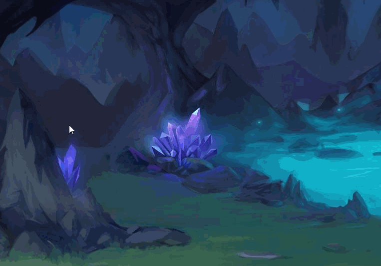

# 使用2D地图3D人物混合进行游戏开发

###### *version :2.2.0bate4   Update:2019-9-11*

在LayaAir3D中支持在正交投影摄影机下，屏幕坐标转换为世界坐标。

这需要使用 **Camera** 的 `convertScreenCoordToOrthographicCoord` 接口。

**注意：**该接口需要对应渲染像素的值。2D世界的适配模式（使用了 **物理分辨率模式** ，并且使用了会有缩放的适配模式）可能会缩放stage，所以开发者在传值时需要注意统一参考系，关于适配模式具体可以查看文档 [屏幕适配的缩放模式详解](https://ldc2.layabox.com/doc/?nav=zh-as-1-8-3)。

<br>(图1)

下面的代码在官方示例的基础上添加了一个点击事件，通过点击场景可以将猴子添加到对应的位置。（[demo地址](https://layaair2.ldc2.layabox.com/demo2/?language=ch&category=3d&group=Advance&name=Scene2DPlayer3D)）。

> 放置猴子

```typescript
//监听一次点击事件
Laya.stage.once(Event.MOUSE_DOWN,this,function ():void 
{
    scene.addChild(layaMonkey);
    _layaMonkey = layaMonkey;
    //设置缩放
    var tmpLocalScale:Vector3 = layaMonkey.transform.localScale;
    tmpLocalScale.setValue(0.3, 0.3, 0.3);
    layaMonkey.transform.localScale = tmpLocalScale;
    /*添加部分*/
    _pos.x = Laya.stage.mouseX;
    _pos.y = Laya.stage.mouseY;
    
    //转换2D屏幕坐标系统到3D正交投影下的坐标系统
    camera.convertScreenCoordToOrthographicCoord(_pos, _translate);
    layaMonkey.transform.position = _translate;
    //设置选择
    var tmpRotationEuler:Vector3 = layaMonkey.transform.rotationEuler;
    tmpRotationEuler.setValue(-30, 0, 0);
    layaMonkey.transform.rotationEuler = tmpRotationEuler;
});
```

<br>

(图2)
