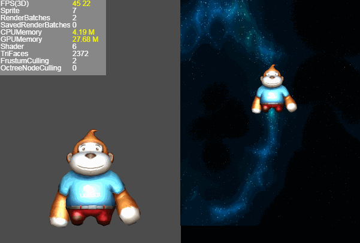

# 多摄像机窗口的使用

###### *version :2.2.0   Update:2019-8-24*

​	在同一个场景中，可以使用多个摄像机，当加载到场景中后，它们会产生各自的游戏视图画面。在我们以前遇到的游戏中，如双人3D游戏就使用了两个3D摄像机，左半屏幕显示一个玩家，右半屏幕显示另一个，极大的丰富了游戏性。

不过多摄像机的缺点是非常耗性能，模型三角面数与DrawCall数量会成倍上升，多几个摄像机就会多出几倍性能损耗，因此开发者们需酌情考虑。

3D场景的显示大小与位置与2D游戏不太一样，主要是靠摄像机的视口（ViewPort）来控制，通过它来进行屏幕的分割。

下例中我们创建一个场景，并且简单的加载一个模型，并通过ViewPort进行左右视口分离，代码如下：

```typescript
//创建场景
var scene:Scene3D = Laya.stage.addChild(new Scene3D()) as Scene3D;
//创建相机1
var camera1:Camera = scene.addChild(new Camera(0, 0.1, 100)) as Camera;
//设置相机1清除颜色
camera1.clearColor = new Vector4(0.3, 0.3, 0.3, 1.0);
camera1.transform.translate(new Vector3(0, 0, 1.5));
//设置裁剪空间的视口
camera1.normalizedViewport = new Viewport(0, 0, 0.5, 1.0);

//创建相机2
var camera2:Camera = scene.addChild(new Camera(0, 0.1, 100)) as Camera;
camera2.clearColor = new Vector4(0.0, 0.0, 1.0, 1.0);
camera2.transform.translate(new Vector3(0, 0.15, 0.5));
camera2.normalizedViewport = new Viewport(0.5, 0.0, 0.5, 0.5);

//添加平行光
var directionLight:DirectionLight = scene.addChild(new DirectionLight()) as DirectionLight;

//加载模型
Sprite3D.load("res/threeDimen/skinModel/LayaMonkey/LayaMonkey.lh", Handler.create(null, function(sp:Sprite3D):void {
    //将模型加到场景上
    var layaMonkey:Sprite3D = scene.addChild(sp) as Sprite3D;
}))
```

编译运行上述代码，运行效果如图6。开发者们同时也可以测试，在单摄像机下时，DrawCall与三角面数会少很多。([demo地址](https://layaair.ldc.layabox.com/demo2/?language=ch&category=3d&group=Camera&name=MultiCamera))

<br>(图1)

#### 如何动态修改Camera的视口

在上面的例子中我们设置了摄影机的视口。我们在上面的代码基础上进行动态修改摄影机是视口。

**注意：** `Camera`的 `normalizedViewport` 裁剪空间的视口 与 `viewport` 屏幕像素坐标的视口 这两个都是 get/set方法。所以在修改摄影机视口参数时不能单纯的知识修改视口参数，还需要对视口重新赋值。

> 动态修改摄影机视口

```typescript
Laya.timer.once(3000,this,function ():void 
{	
    //获取第一个摄影的视口
    var viewport1:Viewport = camera1.normalizedViewport;
    //修改参数
    viewport1.width = 0.2;
    //重新赋值是视口
    camera1.normalizedViewport = viewport1;

    var viewport2:Viewport = camera2.normalizedViewport;
    viewport2.width = 0.8;
    viewport2.x = 0.2;
    camera2.normalizedViewport = viewport2;
});
```

<br>(图2)