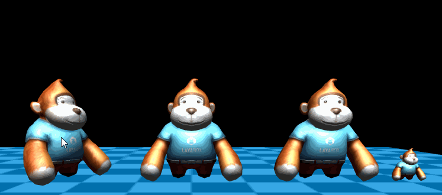

# 鼠标脚本 

###### *version :2.1.1   Update:2019-8-2*

  	在LayaAir2.0中为了方便开发者，提供了鼠标脚本---Script3D中的鼠标事件。如果想要使用鼠标脚本，在脚本owner上还是需要有物理碰撞器。

**Tips**：鼠标脚本依赖射线检测，只不过不用开放者自己手动创建射线了。

**鼠标脚本内容：**

> Method

`onMouseClick():void` 鼠标点击时执行

`onMouseDown():void` 鼠标按下时执行 

`onMouseDrag():void` 鼠标拖拽时执行

`onMouseEnter():void` 鼠标进入时执行

`onMouseOut():void` 鼠标离开时执行 

`onMouseOver():void` 鼠标经过时执行 

`onMouseUp():void` 鼠标弹起时执行

上面的方法都为虚方法，使用时重写覆盖即可。

在上面示例基础上我们创建了个鼠标脚本，并且给4个猴都添加了脚本。

> **脚本类**：

```typescript
class MouseScript extends Script3D{
		private var meshsp:MeshSprite3D;
		public function MouseScript() {}
		/**
		* 覆写3D对象组件被激活后执行，此时所有节点和组件均已创建完毕，此方法只执行一次
		*/
		override public function onAwake():void{
			//获取脚本的拥有者
			meshsp = this.owner as MeshSprite3D;
		}
		//物体必须拥有碰撞组件（Collider）
		//当被鼠标点击
		override public function onMouseDown(e:Event):void{
			//trace("点击到了我box",owner.name);
			//从父容器销毁我自己
			meshsp.removeSelf();
		}
	}
```

> **主类**:

```typescript
//给四个猴子添加脚本
staticLayaMonkey.addComponent(MouseScript);
layaMonkey_clone1.addComponent(MouseScript);
layaMonkey_clone2.addComponent(MouseScript);
layaMonkey_clone3.addComponent(MouseScript);
```

鼠标脚本的效果如图1所示：

<br>(图1)
