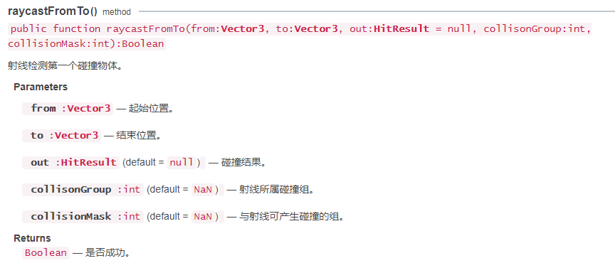
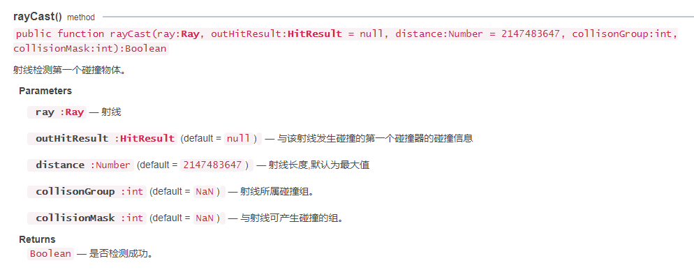
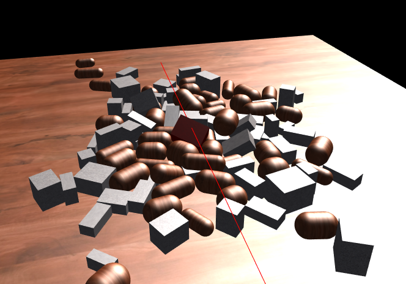
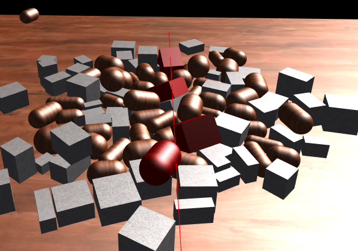
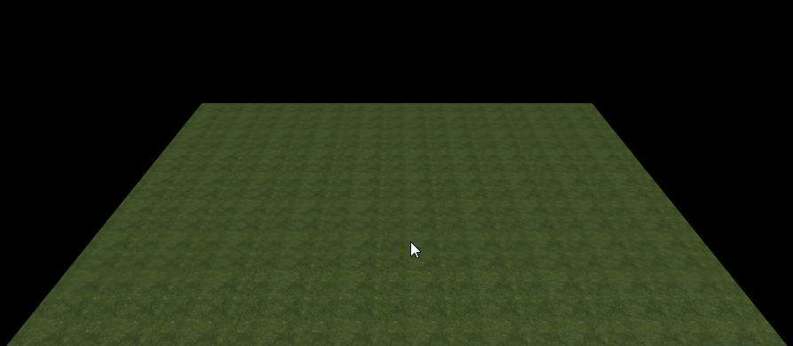

# 物理射线检测

在前面的**图形系统概念**篇有讲到过射线这数学工具，在**摄像机**篇讲过如何从摄像机创建一条射线，在这里我们详细讲解下射线的使用。

在LayaAir3D中实现射线检测的核心是使用Scene3D场景属性中的**PhysicsSimulation物理模拟器**。详情可以查看[Api地址](https://layaair.ldc.layabox.com/api2/Chinese/index.html?category=3D&class=laya.d3.physics.PhysicsSimulation)。射线检测使用的接口有4个，分为两类。`raycastFromTo`，`raycastAllFromTo`一类，`rayCast`，`rayCastAll`一类。我们将前面2个成为A类，后面为B类，我们来看下这两种方法的api：

<br>(图1) 

<br>(图2) 

A类使用的是一个两个点作为参数，B类里使用的已经创建好的射线，但是需要设置射线长度。而带`All`的方法只是是否检测所有物体，也就是是否穿透物体。这种方法的`out:Vector.<HitResult>` — 碰撞结果[数组元素会被回收]。

下面我们先来展示A类`raycastFromTo`，`raycastAllFromTo`的使用，这段代码源自于官方示例（[demo地址](https://layaair.ldc.layabox.com/demo2/?language=ch&category=3d&group=Physics3D&name=PhysicsWorld_RayShapeCast)）；

```typescript
var hitResult:HitResult = new HitResult();
var hitResults:Vector.<HitResult> = new Vector.<HitResult>();
//是否穿透
if (castAll) {
    //进行射线检测,检测所有碰撞的物体
    scene.physicsSimulation.raycastAllFromTo(from, to, hitResults);
    //遍历射线检测的结果
    for (i = 0, n = hitResults.length; i < n; i++)
        //将射线碰撞到的物体设置为红色
        ((hitResults[i].collider.owner as MeshSprite3D).meshRenderer.sharedMaterial as BlinnPhongMaterial).albedoColor = new Vector4(1.0, 0.0, 0.0, 1.0);
} else {
    //进行射线检测,检测第一个碰撞物体
    scene.physicsSimulation.raycastFromTo(from, to, hitResult);
    //将检测到的物体设置为红色
    ((hitResult.collider.owner as MeshSprite3D).meshRenderer.sharedMaterial as BlinnPhongMaterial).albedoColor = new Vector4(1.0, 0.0, 0.0, 1.0);
}
```

<br>(图3) 不穿透的射线

<br>(图4) 穿透的射线

B类`rayCast`，`rayCastAll`方法使用，这段代码来自于官方示例。（[demo地址](https://layaair.ldc.layabox.com/demo2/?language=ch&category=3d&group=Camera&name=CameraRay)）

示例根据屏幕空间中一点（由鼠标按下的点），形成一条由近裁剪面到远裁剪面的射线，进行射线检测。效果如（图5）

```typescript
point.x = MouseManager.instance.mouseX;
point.y = MouseManager.instance.mouseY;
//产生射线
_camera.viewportPointToRay(point,_ray);
//拿到射线碰撞的物体
_scene.physicsSimulation.rayCast(_ray,outs);
//如果碰撞到物体
if (outs.length != 0) {
    for (var i:int = 0; i < outs.length; i++){
        //在射线击中的位置添加一个立方体
        addBoxXYZ(outs[i].point.x, outs[i].point.y, outs[i].point.z );
    }		
}

//在传入的x,y,z位置添加一个box
public function addBoxXYZ(x:int, y:int, z:int ):void {/**内容省略**/}
```

<br>(图5)