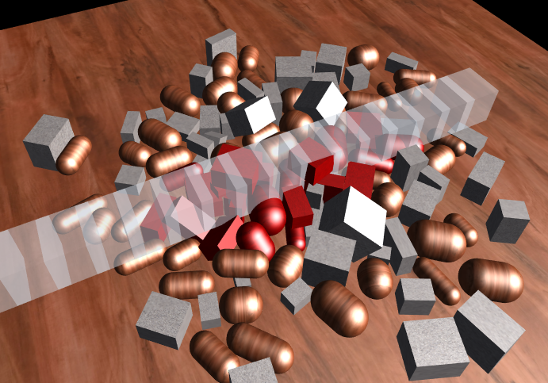

# 物理形状扫描检测

###### *version :2.1.1   Update:2019-7-19*

在场景中按照一个选择的形状投射出一个线段来检测碰撞，返回碰撞到的物体。这个检测有`shapeCastAll`和`shapeCast`两个接口，区别于前面的射线检测相同。常用于自定义形状的射线检测，形状弹道的碰撞。

下面的代码来自于示例（[demo地址](https://layaair.ldc.layabox.com/demo2/?language=ch&category=3d&group=Physics3D&name=PhysicsWorld_RayShapeCast)），

```typescript
//创建球型碰撞器
var sphereCollider:SphereColliderShape = new SphereColliderShape(0.5);
//使用球型碰撞器进行形状检测
if (castAll) {
    //进行形状检测,检测所有碰撞的物体
    scene.physicsSimulation.shapeCastAll(sphereCollider, from, to, hitResults);
    for (i = 0, n = hitResults.length; i < n; i++)
        ((hitResults[i].collider.owner as MeshSprite3D).meshRenderer.sharedMaterial as BlinnPhongMaterial).albedoColor = new Vector4(1.0, 0.0, 0.0, 1.0);
} else {
    //进行形状检测,检测第一个碰撞物体
    if (scene.physicsSimulation.shapeCast(sphereCollider, from, to, hitResult))
        ((hitResult.collider.owner as MeshSprite3D).meshRenderer.sharedMaterial as BlinnPhongMaterial).albedoColor = new Vector4(1.0, 0.0, 0.0, 1.0);
}
```

注意：该示例中射线摆放的模型是使用代码创建的，只是为了方便观察和理解形状扫描检测。

<br>(图1)

