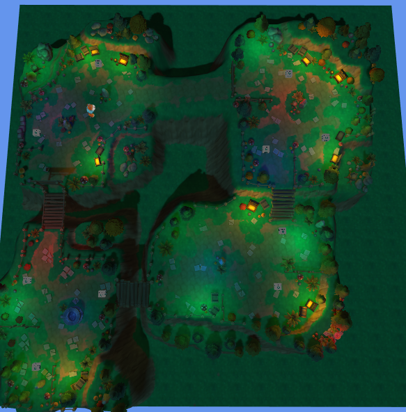
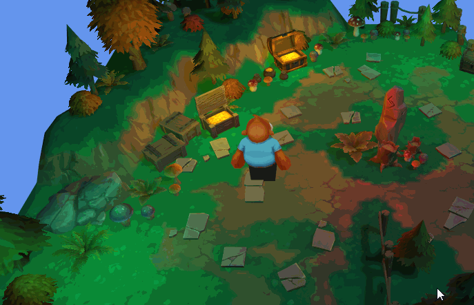

# 寻路系统

###### *version :2.2.0bate4   Update:2019-9-11*

在LayaAir3D中可以使用第三方的Astar自动寻路算法。（[demo地址](https://layaair2.ldc2.layabox.com/demo2/?language=ch&category=3d&group=Advance&name=AStarFindPath)）

在这个示例中我们使用了地形精灵x，z最小的点作为原点来与遮挡图相关联。即图1中左上角的点。

(图1)<br>

> 加载完成，设置遮挡图并且

```javascript
onLoadFinish() {
    // .......前面摄影机，猴子精灵相关操作忽略
 	var heightMap = Laya.Loader.getRes("res/threeDimen/scene/TerrainScene/Assets/HeightMap.png");
    //初始化MeshTerrainSprite3D
    this.terrainSprite = MeshTerrainSprite3D.createFromMeshAndHeightMap(meshSprite3D.meshFilter.sharedMesh as Mesh, heightMap, 6.574996471405029, 10.000000953674316);
    //更新terrainSprite世界矩阵(为可行走区域世界矩阵)
    this.terrainSprite.transform.worldMatrix = meshSprite3D.transform.worldMatrix;
    //读取墙壁的数据
    this.aStarMap = Laya.Loader.getRes("res/threeDimen/scene/TerrainScene/Assets/AStarMap.png");
     //通过遮挡图生成astar网格数据
     var aStarArr = this.createGridFromAStarMap(this.aStarMap);
     //使用astar组织数据
     graph = new window.Graph(aStarArr);
     opts = {};
     opts.closest = true;
     opts.heuristic = window.astar.heuristics.diagonal;
     //......
 }
```

> 通过遮挡图生成

```typescript
/**
* 通过图片数据计算得到AStar网格
*/
createGridFromAStarMap(texture) {
    var textureWidth = texture.width;
    var textureHeight = texture.height;
    //读取图片像素
    var pixelsInfo = texture.getPixels();
    var aStarArr = [];
    var index = 0;
    //像素值为黑色不可通行，白色部分可以通行
    for (var w = 0; w < textureWidth; w++) {
        var colaStarArr = aStarArr[w] = [];
        for (var h = 0; h < textureHeight; h++) {
            var r = pixelsInfo[index++];
            var g = pixelsInfo[index++];
            var b = pixelsInfo[index++];
            var a = pixelsInfo[index++];
            if (r == 255 && g == 255 && b == 255 && a == 255)
                colaStarArr[h] = 1;
            else {
                colaStarArr[h] = 0;
            }
        }
    }
	return aStarArr;
}
```


> 监听鼠标事件，通过A星路径数据，换算出对应的3D世界的路径数据

```typescript
//监听鼠标抬起
Laya.stage.on(Laya.Event.MOUSE_UP, this, function() {
    this.index = 0;
    //获取每次生成路径
    this.getGridIndex(this.path[this.curPathIndex % this.pointCount].x, this.path[this.curPathIndex++ % this.pointCount].z, this.startPoint);
    this.getGridIndex(this.path[this.nextPathIndex % this.pointCount].x,this.path[this.nextPathIndex++ % this.pointCount].z, this.endPoint);
			
    //开始于结束点数据
    var start = this.graph.grid[this.startPoint.x][this.startPoint.z];
    var end = this.graph.grid[this.endPoint.x][this.endPoint.z];
    //生成路径
    this._everyPath = window.astar.search(this.graph, start, end, {
                  closest: this.opts.closest
                 });
    if (_everyPath && _everyPath.length > 0) {
         getRealPosition(start, this._everyPath);
    }
});
```
> 通过3D世界的x，z换算出对应的网格索引，并且通过astar路径再转换为3D世界路径

```typescript
/**
 * 得到整数的网格索引
 */
 getGridIndex(x, z,out){
    var minX = this.terrainSprite.minX;
    var minZ = this.terrainSprite.minZ;
    var cellX = this.terrainSprite.width / this.aStarMap.width;
    var cellZ = this.terrainSprite.depth / this.aStarMap.height;
    var gridX = Math.floor((x - minX) / cellX);
    var gridZ = Math.floor((z - minZ) / cellZ);
    var boundWidth = this.aStarMap.width - 1;
    var boundHeight = this.aStarMap.height - 1;
    (gridX > boundWidth) && (gridX = boundWidth);
    (gridZ > boundHeight) && (gridZ = boundHeight);
    (gridX < 0) && (gridX = 0);
    (gridZ < 0) && (gridZ = 0);
   	out.x = gridX;
	out.y = gridZ;
}

/**
 * 得到世界坐标系下的真实坐标
 */
getRealPosition(start, path){
    this.resPathLength = path.length;
    var minX = this.terrainSprite.minX;
    var minZ = this.terrainSprite.minZ;
    var cellX = this.terrainSprite.width / this.aStarMap.width;
    var cellZ = this.terrainSprite.depth / this.aStarMap.height;
    var halfCellX = cellX / 2;
    var halfCellZ = cellZ / 2;
    
    resPath[0].x = start.x * cellX + halfCellX + minX;
    resPath[0].z = start.y * cellZ + halfCellZ + minZ;
    
   if(this.resPath.length < path.length ){//如果预先准备的Vector2不够
       var diff = path.length - resPath.length;
       for(var j = 0; j < diff; j++){
           var newPoint = new Laya.Vector2();
           this.resPath.push(newPoint);
       }
   }

    for (var i = 1; i < path.length; i++) {
        var gridPos = path[i];
        this.resPath[i].x = gridPos.x * cellX + halfCellX + minX;
        this.resPath[i].y = gridPos.y * cellZ + halfCellZ + minZ;
    }
}
```

越精细的遮挡图生成的路径越详细，但是也需要更多的运算，开发者可以根据个人需求选择。


<br>(图1)

