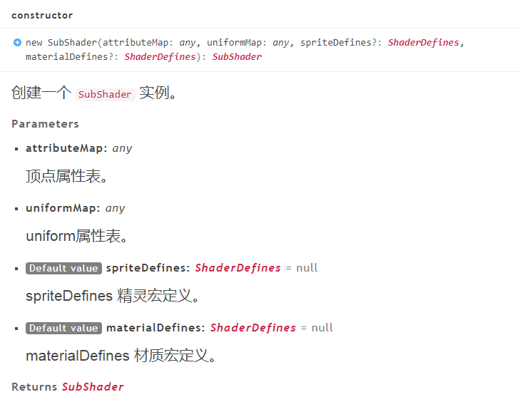

# SubShader介绍

###### *version :2.3.0   Update:2019-10-8*

​		**SubShader 子着色器**可以理解为Shader的渲染方案。每个Shader至少1个subShader，可以有多个subShader。

​		在LayaAir3D中的SubShader属性介绍：

​		`setFlag` 添加标记。

​		`getFlag` 获取标记。

​		`addShaderPass` 添加一个ShaderPass。

### 1. 创建一个SubShader

在前面的简单自定义shader使用中我们已经简单的接触到了subshader，并且已经使用了最重要的 `addShaderPass` 增加一个ShaderPass接口。

```typescript
 //所有的attributeMap属性
var attributeMap = {
    'a_Position': Laya.VertexMesh.MESH_POSITION0,
    'a_Normal': Laya.VertexMesh.MESH_NORMAL0
};

//所有的uniform属性
var uniformMap = {
    'u_MvpMatrix': Laya.Shader3D.PERIOD_SPRITE, 
    'u_WorldMat': Laya.Shader3D.PERIOD_SPRITE
};

//注册CustomShader 
var customShader = Laya.Shader3D.add("CustomShader");

//创建一个SubShader
var subShader = new Laya.SubShader(attributeMap, uniformMap);

//我们的自定义shader customShader中添加我们新创建的subShader
customShader.addSubShader(subShader);

//往新创建的subShader中添加shaderPass
subShader.addShaderPass(simpleShaderVS, simpleShaderFS);
```

### 2. attributeMap 与 uniformMap

这里我们着重讲解创建SubShader时需要的两个重要的参数：`attributeMap`，`uniformMap`。

> 关于 `spriteDefines` 与 `materialDefines` 会在后面的 **Shader宏定义** 篇讲解。同时在2.3.*版本已经优化了SubShader创建，可以不用再传这两个属性。

<br>

这两个**Object**都是以自己Shader中的 attribute变量名 或者 uniform变量名 为 key，例如 a_Position ， u_MvpMatrix。

**attributeMap** 中key对应的value是该属性在渲染时所对应的顶点通道。

**uniformMap** 中key对应的value是该属性的提交周期。

`uniformMap` 目前支持的周期类型：

**Shader3D.PERIOD_CAMERA**     :shader变量提交周期，逐相机。

**Shader3D.PERIOD_CUSTOM**     :shader变量提交周期，自定义。

**Shader3D.PERIOD_MATERIAL**  :shader变量提交周期，逐材质。

**Shader3D.PERIOD_SCENE**         :shader变量提交周期，逐场景。

**Shader3D.PERIOD_SPRITE **       :shader变量提交周期，逐精灵和相机，注：因为精灵包含MVP矩阵，为复合属性，所以摄像机发生变化时也应提交。

逐场景，逐相机，逐精灵和相机，这三种周期的uniform是引擎自动传入的值。即当场景，相机，精灵与相机随意一个有变化时，引擎会自动提交变动

逐材质与自定义周期的uniform都是由开发者接管的传入。像官方示例 多Pass描边shader中（[demo地址](http://layaair2.ldc2.layabox.com/demo2/?language=ch&category=3d&group=Shader&name=Shader_MultiplePassOutline)），开发者自己处理的**描边颜色**，**描边线宽**等uniform值。（关于开发者如何自己处理uniform值会在 **关联shader的uniform** 篇中讲解）

关于引擎支持的attribute，与由引擎处理的uniform可以查看对应表格。（attribute表格，uniform表格）


