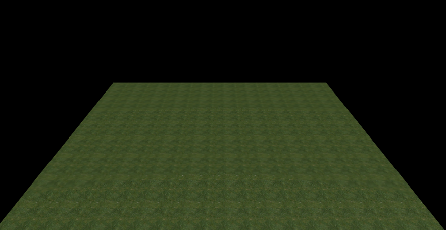

# 物理碰撞器

###### *version :2.1.1   Update:2019-7-19*

 LayaAir3D中的 **PhysicsCollider** 物理碰撞器就是静态碰撞器。它总是停留在一个地方，永远不会四处移动。刚体会与它发生碰撞，但是不会移动它。

在Unity导出时，如果只有`Collider`没有刚体，导出后就是`PhysicsCollider`组件。这个组件常用于制作场景中静止不动的物体，或者常用于设置为触发器。

#### (1) 使用代码创建物理碰撞器

在这里我们简单的介绍下，使用代码添加物理碰撞器。下面的代码简单的创建了一个平面。如图1所示。

```typescript
//平面
var plane = scene.addChild(new Laya.MeshSprite3D(Laya.PrimitiveMesh.createPlane(10, 10, 10, 10))) as Laya.MeshSprite3D;
//新建材质
var planeMat:Laya.BlinnPhongMaterial = new Laya.BlinnPhongMaterial();

Laya.Texture2D.load("res/threeDimen/Physics/grass.png", Laya.Handler.create(this, function(tex:Laya.Texture2D) {
    	planeMat.albedoTexture = tex;
}));
//设置纹理平铺和偏移
planeMat.tilingOffset = new Laya.Vector4(10, 10, 0, 0);
//设置材质
plane.meshRenderer.material = planeMat;

//平面添加物理碰撞体组件
var planeStaticCollider:Laya.PhysicsCollider = plane.addComponent(Laya.PhysicsCollider);
//创建盒子形状碰撞器
var planeShape:Laya.BoxColliderShape = new Laya.BoxColliderShape(10, 0, 10);
//物理碰撞体设置形状
planeStaticCollider.colliderShape = planeShape;
//物理碰撞体设置摩擦力
planeStaticCollider.friction = 2;
//物理碰撞体设置弹力
planeStaticCollider.restitution = 0.3;
```

<br>(图1)

#### (2) 获取导出模型上的物理碰撞器

在导出后，可能需要调整物理碰撞器的一些属性。这时候就需要从导出的模型上获取物理碰撞器了。

```typescript
//加载模型
Laya.Sprite3D.load("Conventional/shoot.lh",Laya.Handler.create(this,function(sp:Laya.Sprite3D){
    var cube = sp.getChildAt(0) as Laya.MeshSprite3D;
    //获取物理碰撞器
    var cubeCollider:Laya.PhysicsCollider = cube.getComponent(Laya.PhysicsCollider);
}));
```


