## 3D游戏入门基础

Author ：charley        Date ：2019-11-05

学习最大的障碍就是未知，比如十八般兵器放在你面前都认不出来，又谈何驰骋沙场。3D游戏开发本就是一个门槛不低的工作。所以，本篇抛开引擎的结构，本着初次认知3D游戏世界的逻辑，让没有3D基础的开发者，通过本篇文章，对LayaAir 3D引擎的功能以及基础概念有一个概览性认识。

至少，我们要了解3D世界的基础都有哪些，然后再依据官方的文档，再逐个深入学习掌握。

另外，本篇不仅对于3D游戏开发者有启蒙入门的作用，对于游戏行业的非技术岗位工作者，也有着基础概念的名词科普作用。即使没有任何开发基础，读完本篇也可以对3D游戏开发有一个基础的认知，对一些专业性名词有一些理解，与3D游戏研发工作者交流的时候，不再被当成技术文盲，可减少交流障碍。

#### 一、场景与摄像机

场景就是游戏中的3D世界，有了场景，才可以在场景中添加一切物体，包括摄像机。

而摄像机是3D游戏世界的眼睛，通过摄像机，玩家才能看到游戏中三维世界，看到场景中的各种物体。

所以，场景里最少要有一台摄像机。

 

当我们在写3D游戏的代码时，要先在舞台中添加3D场景，添加3D摄像机。再写其它代码。

摄像机在3D场景中，可以是唯一的，也可以放置多台摄像机，比如在3D场景中出现的弹窗换装面板，或者某些对战游戏的同屏需求时会用到多个摄像机。

 

这里再顺便提一下，摄像机成相效果，也分为透视和正交两种。LayaAir引擎的3D摄像机默认是透视模式，这是一种模拟了人眼的视觉效果，近大远小。

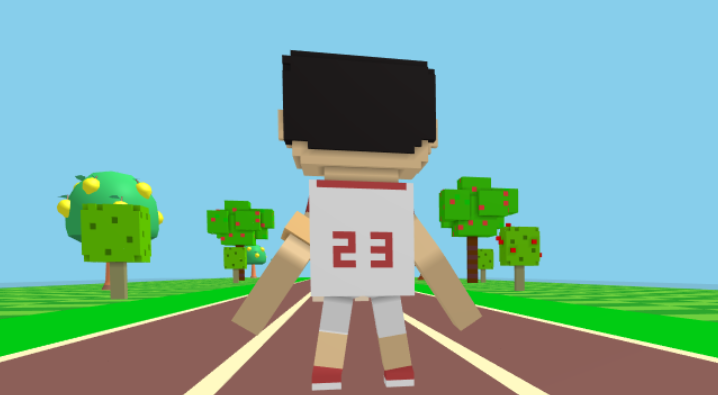 

正交则没有透视感，常用于天空视角俯视大地的感觉。

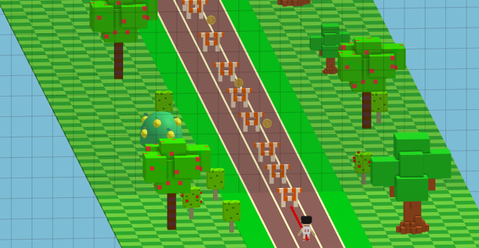 

#### 二、坐标系与坐标

坐标是3D空间世界的基础之一，干啥都离不开坐标，移动摄像机，定位，绘制图形等等。

在学习LayaAir 3D时，我们需要了解两个坐标，一个是顶点坐标，一个是UV坐标。

而了解这两种坐标之前，我们先介绍一下空间笛卡尔直角坐标系。

空间笛卡尔直角坐标系是用经过相同原点的xyz三条互相垂直的坐标轴相交而构成。

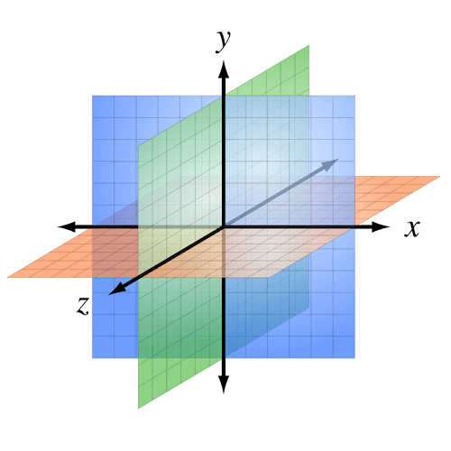 

坐标系的两个轴正方向一致的情况下，因第三轴正方向相反，所以将坐标系分为左手坐标系与右手坐标系。

这两种坐标系没有好或不好，都应用的都比较广泛，比如Direct3D与Unity等采用的是左手坐标系，OpenGL与LayaAir等采用的是右手坐标系。所以我们有必要理解什么是左手坐标系与右手坐标系，以及两者的区别。

两种3D坐标系之所以用左右手分别命名，是为了便于记忆，分别用左手和右手三个手指的朝向来代表三个坐标轴的正方向，这三个手指分别是拇指、食指、中指。

无论是左手还是右手，我们要记住，大拇指朝向的方向是x轴正方向，食指的朝向是y轴的正方向，中指的朝向是z轴的正方向。

现在我们面向屏幕，准备好双手来摆造型。我们先将左右两个手的食指（y）轴指向天空方向（在房间的就指天花板），然后将中指冲前（立正站立时眼睛平视的方向），此时两个手的中指应该与都与食指保持90度垂直。然后，再伸出大拇指与食指和中指都保持90度垂直。可以参照下图手势。

 

> 网络中有不同的左右手坐标系统的说法和介绍，如果图片和轴朝向与本篇介绍的不同，一般也都是摄像机角度的差异，不用管别的，学习LayaAir以本篇为准来理解记忆即可。

摆好后，我们会发现，在保持z轴和y轴正方向相同的情况下，x轴的正方向是相反的。这就是左手坐标系和右手坐标系的区别。LayaAir引擎unity导出插件就是以x轴取反来自动适配LayaAir引擎。所以，直接在unity里编辑导出，然后在LayaAir引擎中使用，是不需要手工对坐标进行转换的。如果开发者一定要在LayaAir引擎项目中手动来调坐标，那需要注意左手坐标系与右手坐标系在x轴正方向的差异。

了解完坐标系，那3D空间中的任意一个点都可以用xyz三轴坐标点来定位，这个点就是顶点，所以这个3D空间坐标也可以称之为顶点坐标。但顶点又不仅包含了坐标位置信息，还有UV、法线、颜色等信息。其它的先不讲，我们继续来了解UV。

UV其实也是坐标， 完整的说应该是UVW（由于xyz已经被顶点坐标轴占用，所以另选三个字母表示）， 这三个轴U是屏幕水平方向，V是屏幕垂直方向，W的方向是垂直于显示器表面的，到目前为止，一般游戏开发是用不上的，所以我们通常就会简称为UV。

去掉了W，那UV坐标就是一个2D平面坐标，UV坐标可用于模型纹理贴图等（后面介绍纹理的时候还会提及）。

 

UV坐标向右和向下分别是U与V的坐标正方向。取值范围是0-1，这与3D空间的无限坐标是不同。在计量单位方面，由于2D素材是以像素为单位，那UV坐标是按2D素材像素比来平铺。

而顶点坐标，则没有没有恒定的计量单位，最小的单位是点，无论是现实世界还是3D世界，点都是一个基础的抽象概念，他代表着一个单独的个体，可以无限大，也可以无限小。所以，点可以是1个像素，也可以是1毫米、1纳米、1千米等任意单位的基础单元。最终顶点之间用什么计量单位，通常由3D美术结合游戏设计而设定，3D游戏美术用的比较多的单位是米。所以程序的设定要与美术设定的单位保持统一，否则就会造成视觉效果上的过大或过小，出现与设计不符的效果。

#### 三、三角面、网格、模型

模型是3D游戏中可见物的基础，比如人物，房屋，树木，山川，河流等等，几乎绝大多数可见物体都是以模型为基础构成。

要进一步了解模型，我们先从三角形平面（简称三角面）开始，三角面是由三个顶点构成，是显卡唯一能处理的基础多边形。之所以把三角面视为最基本的多边形，其中一个重要原因是，由三个点构成的三角面一定是在同一个平面上，而四个或更多点构成的多边形在三维空间中，不一定会在同一个平面上。

而网格（ Mesh）则是由一个三角面或多个三角面拼接形成，是构建模型形状的基础。在LayaAir引擎中， 构成各种图形形状的三角面顶点数据以及三角面的索引数据集合就是网格，所以网格在游戏运行时是不可见的，下图是使用像素线精灵来表现模型的网格构成。

模型是由网格（ Mesh）与材质（ Material）组成。材质展开内容太多，先放一边。从构成三维图形形状而言，我们可以理清以下关系，模型的基础是网格，网格的基础是三角面。三角面越多，模型可表现的细节越丰富。下图正是40000面和4000面及400面的模型细节表现差异。细节表现比较丰富的，通常被称为精模，细节表现相对较弱的，被称为简模。

 

到底使用精模还是简模，这需要研发技术结合整体效果和游戏硬件性能可承受的压力情况向美术提出需求，在这一点上，移动端H5及小游戏与手游APP标准可保持相等标准。

####  四、材质

之前讲过，网格只是三维形状的数据，网格形状本身是不可见的。怎么可见，那就需要材质（ Material）了。

顾名思义，材质就是材料的质感。例如，木头与金属、玻璃与毛发，从粗糙度、光泽度、反射、透明、颜色、纹理等等方面，不同的材料质感会明显不同。

根据这些物体的差异，我们可以将材质划分为很多种类，LayaAir引擎支持的材质分类为模型材质、天空材质、拖尾材质、粒子材质。（天空、拖尾、粒子尚未提及，我们先介绍模型材质。）

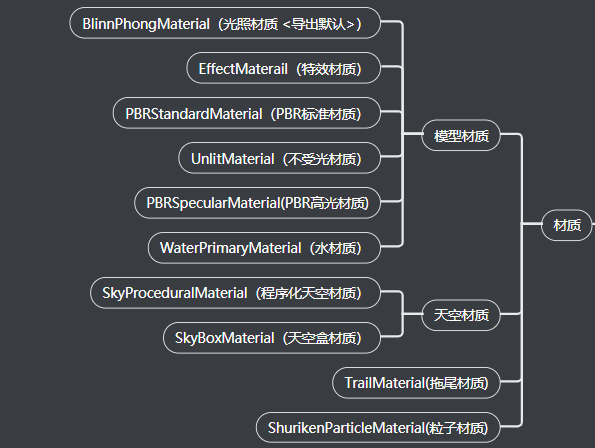 

LayaAir引擎的模型材质还可以继续划分，分别为光照材质（BlinnPhongMaterial） 、不受光材质（UnlitMaterial）、特效材质（EffectMaterail）、PBR标准材质（PBRStandardMaterial） 、PBR高光材质(PBRSpecularMaterial) 、 水材质（WaterPrimaryMaterial）。

BlinnPhong材质是默认使用的标准感光材质，而UnlitMaterial材质恰恰相反，并不受光照影响，只显示原贴图的外观图像效果。

 下图中，图左是光照材质（ BlinnPhongMaterial）被光照射后的效果。图右是同样被光照射后的不受光材质（ UnlitMaterial ）效果。

  

 特效材质（EffectMaterail） 是一种无需外部光照，通过混合模式让自身产生一种光效视觉效果的材质，常用于特殊效果的制作，所以称为特效材质。视觉效果如下图所示。 

 

PBR材质是一种基于物理渲染 (Physicallly Based Rendering) 的材质，通过模拟自然界的物理规律可以让3D模型的质感更为真实，接近或还原现实世界中的质感。例如，下图中的桶采用了PBR材质。

 

LayaAir引擎中，PBR材质主要分两类，分别是PBR标准材质（PBRStandardMaterial）和PBR高光材质(PBRSpecularMaterial) 。 PBR标准材质一般用于粗糙质感的材质，PBR高光材质一般用于光滑金属感的材质。

 水材质（WaterPrimaryMaterial）比较容易理解，是一种可以设置水面反射与波纹等具有水特性属性的材质。如下图所示。

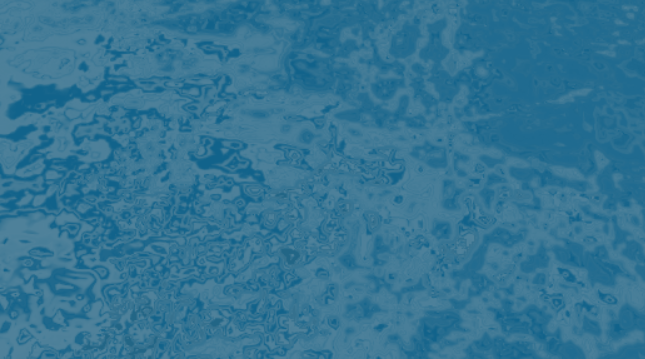 

#### 五、纹理、贴图、面片

纹理是指物体表面的外观效果，表现为2D位图形式。下图为3D地球仪表面的纹理。

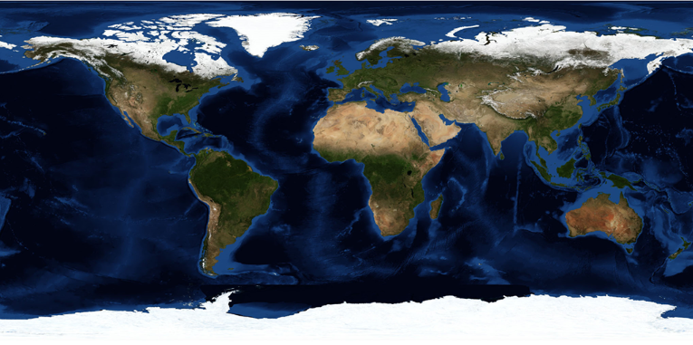 

贴图简单通俗的理解，就是将2D纹理贴到3D模型网格的过程。这个将3D顶点坐标与2D纹理的UV坐标映射对应的过程由引擎完成，开发者直接调用API，为材质设置对应的纹理即可。下图左侧为仅添加材质，而没有设置贴图的效果。下图右侧是对材质添加了纹理的已贴图效果。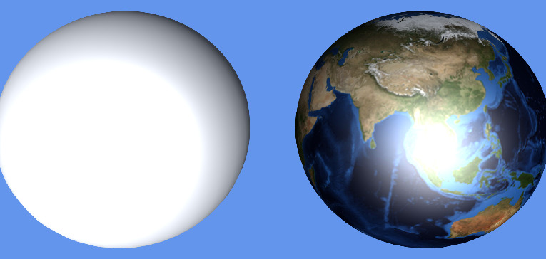 

通过效果图我们可以看出，尽管网格与材质已经可以让模型在3D游戏场景中可见了，但不对材质贴图，没有纹理的情况下，我们看到的只是不同质感的纯色模型。有了纹理才有了真实丰富的外观。所以纹理也是比较重要的一个知识点，如果展开讲，纹理可以介绍很多。本篇不再详述。

介绍到这里，我们已能初步理解到纹理与贴图的区别。然而，是很多时候，在文档或口述交流的时候，很多人会把用于贴图的纹理，也简称为贴图。所以我们应该能理解到贴图在某些应用场景下就是代指纹理。

之所以把面片放到纹理一起介绍，是因为对3D一知半解时，不少人会有一个误区，认为面片就是在3D空间中放了一个2D纹理位图。实际上，在三维空间中，哪怕只有一个三角形平面，也可以构成网格，可以设置材质，那这就是模型。所以面片，与其它多面体模型，本质上都是一样的，我们在3D空间中看到的图片，是这个面片材质的贴图。

#### 六、灯光、阴影、反射光

光源是3D场景中不可缺少的重要组成部分，网格和纹理决定了物体的形状和外观，光源则可以照明、可以产生阴影、还可以影响场景环境以及3D模型的颜色、亮度、氛围等等。

3D中的光源就是灯光，其它如泛光、环境光等都是光效，而非光源。3D灯光有三种， 平行光（DirectionLight），点光（PointLight），聚光（SpotLight），LayaAir引擎不仅支持这些光源的任意类型，还支持在同一场景下任意添加多个不同类型的光源。 下面简单介绍一下这三种光的区别。

平行光是一种模拟大自然太阳光的灯光，光源来自无穷远的位置，来自光源的光线始终都是平行的且没有衰减。引擎中可设定光源方向，用于给全场景照亮。

 

点光是一种以光源点为中心，向四周呈发射状的光源，光源点位于3D空间中的某个位置。类似于现实中的蜡烛光、篝火、家用电灯等发光的方式，这种光拥有照射范围和衰减半径。光照范围之外的地方则处于无光的黑暗之中。   

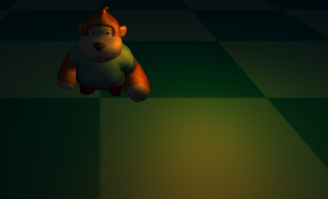 

聚光与点光类似，都属于位置光，也是位于3D空间的某个位置，也有照射范围和衰减半径，但是，与向四周发散的无方向点光不同，聚光则拥有光源方向，是一种呈锥形角度的光源，类似于现实中的手电洞、舞台聚光灯等光源效果。

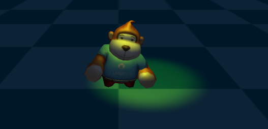 

阴影是灯光照射模型时产生的， 实时阴影随着灯光角度、灯光强度、模型位置等变化而变化。能产生更加强烈的立体感与真实感。 

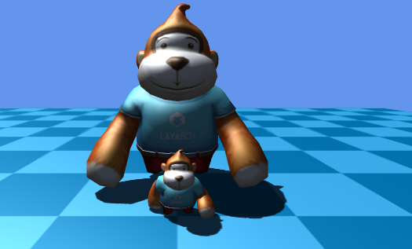  

反射光，是指光源在照射到3D模型上，反射产生的光效。为了模拟自然反射现象，根据不同材质，引擎对反射光会使用不同的光照模型，比如，BlinnPhong材质中使用了漫反射和镜面反射模型。我们简单来理解一下两者的差异。

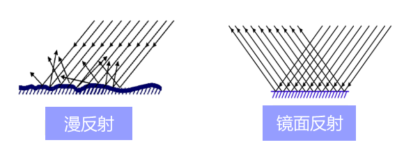

引擎中的漫反射主要是模拟材质表面粗糙不平的光学反射效果，理想的漫反射材质表面是完全不光滑且没有光泽的，当光源照射到这种材质上，呈现出发散的反射效果。

引擎中的镜面反射用于模拟光滑水平面的光学反射效果，理想的高光反射材质是表面完全光滑且水平面的，比如像镜子的平面一样，光照以直角方向进行反射。镜面反射常用于闪闪发光的视觉效果，且会产生高亮的点状光斑，所以镜面反射有的时候也叫镜面高光，如果LayaAir文档材质篇中提到高光颜色或者高光贴图，我们要能理解，这是指针对镜面反射效果的高光颜色和高光贴图。

引擎中的反射采用了多个光照反射模型，并非只有漫反射和镜面反射两种 ，比如PBR材质的反射光是更为复杂的混合模型，本篇先揭开一点。暂且先有一个初步的认知。我们继续来了解一些其它与光相关的概念。

#### 七、自发光、环境光、泛光、光照贴图

上一小节是介绍的3D灯光以及与灯光息息相关的光效。这个小节还是介绍光，但这些光不属于照射光，只是看起来比较像是光的一些效果。我们将逐个了解LayaAir引擎中的一些其它光效。

首先是自发光，自发光是材质本身就会有发光的效果，比如前文中介绍过的特效材质就属于自发光。自发光不会对周围环境及其它模型产生影响，但会被外部环境影响视觉效果，类似于现实中的荧光棒在白天和黑夜使用的差异。 

 

环境光类似于全局颜色滤镜。设置白色等亮色，即便没有光源，场景中也都能比较明亮。想表现阴天的感觉，也可以加入一些灰暗的环境光颜色。或者要表现夜视镜效果等等，都可以通过环境光来设置。

 

泛光在LayaAir引擎中属于后期效果。即便没有光源的照射，也可以产生一种类似光晕叠加的效果。

 

光照贴图是一种通过贴图的方式模拟游戏场景中的光影效果，也是游戏中为了节省性能而常用的一种伪光照视觉效果的制作方式。下图中的光效并非是通过灯光实现，是光照贴图的效果。

 

#### 七、Shader（着色器）

**Shader** 中文名为着色器， shader本质上是一段采用GLSL着色语言编写（着色语言好几种，基于webGL只能用GLSL语言）在GPU上运行的程序 ，  用于告诉图形软件如何计算和输出图像。shader主要分两类：顶点着色器和片段着色器（也叫片元着色器） 。

顶点着色器是用来处理顶点数据的程序，如顶点坐标、法线、颜色和纹理坐标。  它在每个顶点上调用，可将几何图形（例如：三角形）从一个位置转换为另一个位置， 例如，用于顶点变换、纹理坐标生成、 纹理坐标变换等等。

之前已介绍过，网格由三角形构成，而每个三角形的表面可称为片段。片段着色器就是运行在每个片段的所有像素上面的代码， 片段着色器用来计算和填充每个像素的颜色，所以也称为像素着色器。 可用于插值的运算、 纹理存取、纹理应用 、 雾 、 色彩计算等。

shader这一节新手先不要急着研究这个，LayaAir提供自定义Shader功能，可以让开发者实现一些引擎未曾提供的功能或者效果。

#### 八、天空、粒子、拖尾

基于网格与材质组成了模型这一概念，理论上一切可见的形状物体，都是模型。但依据开发的易用性，引擎会进一步对一些常用功能进行封装，本节将继续描述这些概念，比如天空、粒子系统、拖尾系统。

LayaAir模拟的3D天空，提供了两种现成的网格，一种是立方体网格，这种天空称为天空盒( SkyBox)。另一种是球形网格( SkyDome )，这种可称为天空球或球形天空，当然，开发者也可以自定义其它的天空网格。

基于立方体网格的天空， 以6张无缝连接的材质纹理贴图形成，类似盒子拆开平铺。例如下图的纹理，

 

球形网格的天空则采用1张纹理贴图形成，该技术方案相较于天空盒，可以制作出完全相同的视觉效果，但球形网格的顶点要多于天空盒，性能的消耗自然要大一些。如果只有一张贴图纹理的可以采用天空球的技术方案，否则建议采用天空盒方案。

另外，两种3D天空技术方案的使用与材质有关，LayaAir引擎中自带了一个对应天空盒网格的天空盒材质（SkyBoxMaterial）、而天空球要么使用无法贴图的程序化天空材质（SkyProceduralMaterial），要么就使用模型材质，因为天空不受光照影响，最好使用不受光材质。

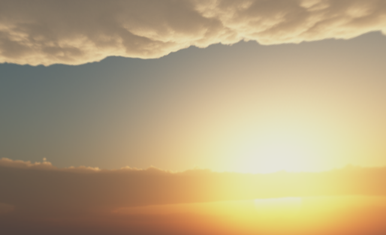 

粒子是一组分散的微小物体集合，通过让这些微小的物体按某种算法运动起来，从而实现诸如火焰、烟、爆炸、流水、等比较灵动的效果。粒子系统并不是一种绘制形式，而是一种动画方法，粒子系统的作用是在粒子产生、运动、变化以及消失这个生命周期内去控制它们。LayaAir引擎的粒子系统包括了粒子发射器、粒子动画器、和粒子渲染器等多个部分。

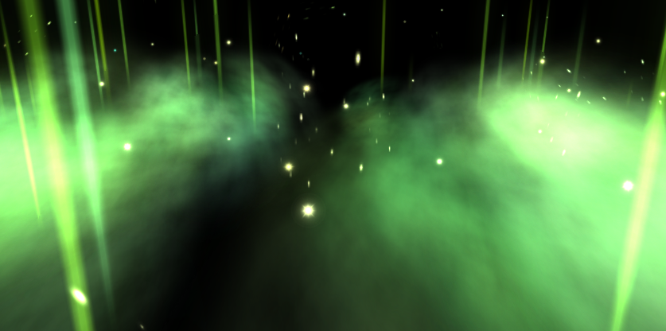 

拖尾，顾名思义是拖在后面尾巴一样的效果，常用于带条状3D特效，比如，刀光拖尾，跑酷小球游戏的行动轨迹拖尾等。LayaAir引擎内置的拖尾系统和拖尾材质，方便开发者快捷使用3D拖尾。

 

#### 九、3D物理系统、3D动画系统

3D物理系统是通过模拟真实物理属性的方式来计算重力、运动、旋转、碰撞反馈等，LayaAir引擎内置了bullet 3D物理引擎。官网中有详细的学习文档。

动画是交互式游戏不可缺少的组成部分。 LayaAir引擎中支持使用材质动画，刚体动画，摄像机动画，骨骼动画这几种动画类型。 

其中，材质动画是以改变材质的颜色与贴图方式的动画。

刚体动画又称为变换动画，是指不改变模型顶点、材质的基础上，只对模型进行旋转、缩放、位移的动画，比如，脚底光环、刀光等。刚体动画也经常与材质动画结合使用。

骨骼动画也称为蒙皮动画，这种动画主要是以改变模型顶点的方式产生动画。 

摄像机动画是指通过改变摄像机位置而产生的动画效果。

#### 十、3D基础的常用数学概念

在之前的9个小节中，我们已经可以对3D游戏和图形开发，有了一个基础的概念性认知。最后简单介绍一些3D数学的基础常用概念。例如： 向量、 矩阵、 欧拉角、四元数、射线、包围体。

##### 1、向量

 既有大小又有方向的量称之为向量（物理学叫矢量），向量也有维度，例如，2维、3维、4维。与向量对应的是数量（物理学叫标量），数量是只有大小没有方向的量。 有的文章把数量理解为1维向量，而我们通常所指的向量是2维或以上维度，不包括1维。 

在LayaAir引擎中，针对2维、3维、4维向量的封装方法示例分别为： Vector2(1, 2) 、Vector3(1, 1, 3)、Vector4(1, 2, 3, 0.5) 。然而LayaAir引擎封装的Vector方法，不仅可以作为向量的使用，还可以用于顶点坐标位置，或者表达颜色的时候使用。比如原点坐标Vector3(0, 0, 0)，颜色值Vector3 (0.6, 0.6, 0.6) 、Vector4(0.9, 0.5, 0.1, 1)。

提到向量，再顺带理解一下分量，我们把一个向量分解成几个方向的向量之和，那这些分解的向量就叫做该向量的分量（也称为向量投影）。 例如，某个向量坐标u为（5，10），那分解的向量坐标w1（5，0）和w2（0，10）都是向量坐标u的分量。在引擎中，我们也可以把向量元素视为分量，比如 Vector4(0.9, 0.5, 0.1, 1)，有4个分量，其中的0.1称为这个向量的第3个分量。

##### 2、 矩阵

在线性代数中，矩阵是以行和列形式组织的矩形数字块。如果把向量定义为1维数组，那么矩阵就是2维数组。这里不要把2维理解为2D，是指来自数组的行与列形成2维。以数组的角度去理解，那向量是数量的数组，矩阵则是向量的数组。

矩阵是在显卡图形API中直接用于描述方位的形式，可立即进行向量的旋转。LayaAir引擎提供了3×3的旋转矩阵Matrix3x3() 和4×4的变换矩阵Matrix4x4()，变换矩阵可用于平移、旋转、缩放计算。

##### 3、欧拉角、四元数

欧拉角与四元数都是用于旋转计算的数学方法，刚刚介绍的矩阵明明也可以用于旋转计算，为什么要介绍这两种呢？相对而言，3×3旋转矩阵需要9个数，欧拉角只需3个数（3维向量），四元数只需要4个数（4维向量），明显轻量了很多。那是不是欧拉角最优，也不尽然。尽管欧拉角内存占用小，也更加易用，但欧拉角也有他特有的问题，那就是可能会导致万向节死锁。而四元数则相对于矩阵内存占用小，也不受万向节死锁的困扰，而且在平滑插值方面只能是四元数才能完成。

##### 4、射线

射线是只有一个端点无限延长形成的直的线，在LayaAir引擎中的射线 Ray是一个数据对象，拥有起点与发射方向两个属性。常用于基础的碰撞检测，也可以用于鼠标拾取。

##### 5、包围体

包围体用于可见检测计算，基本思想是体积稍大且结构简单的包围体来替代结构复杂的被包围体，当进行检测的时候，达到提高检测效率的作用。比如，一旦检测到包围体被遮挡不可见，那无论包围体内是什么样的模型，那全部不可见。LayaAir引擎中提供了盒状包围体（ 包围盒 ）与球状包围体（包围球）。

##### 

#### 写在最后

LayaAir在引擎官网中已经提供了大量的引擎文档，尤其是3D文档，示例DEMO，和API说明文档。然而还是会碰到一些开发者在学习3D的时候无从下手，因此产生了本篇这个更为基础的入门文档，应该已经覆盖了大多数基础概念。希望大家在此文启蒙性认知上，进一步学习引擎的使用，以及从本文中涉及到的未能充分理解的概念有针对性的深入研究学习。

本文仅作为一个基础入门的文档，尽可能去多覆盖一些基础概念，然而文档写作的过程中为了保持写作逻辑的延续续对于一些基础概念并没有完全都介绍全面，比如法线、八叉树等概念并未讲到。开发者可以在官网文档的学习过程中，如果遇到一些陌生的词语，尽可能先购买基础的图形学书籍或者在搜索引擎中找到适合的文章来补补课。也可以找到官网中QQ群管理员进行反馈，我们会针对引擎使用的文档进行补充和完善。

