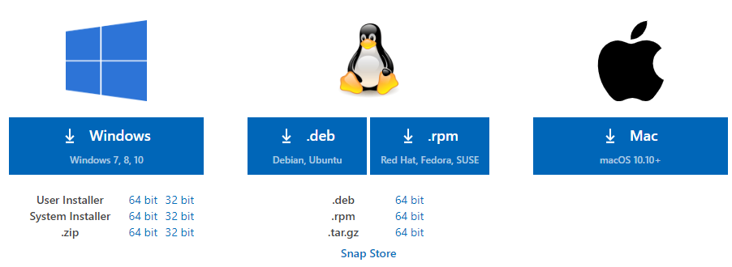
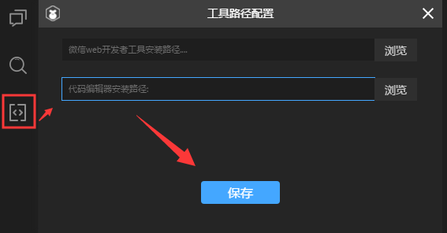
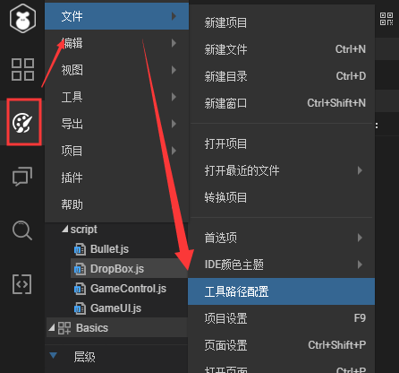
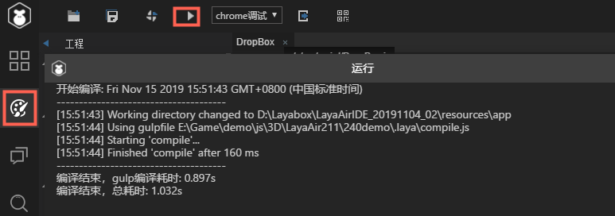
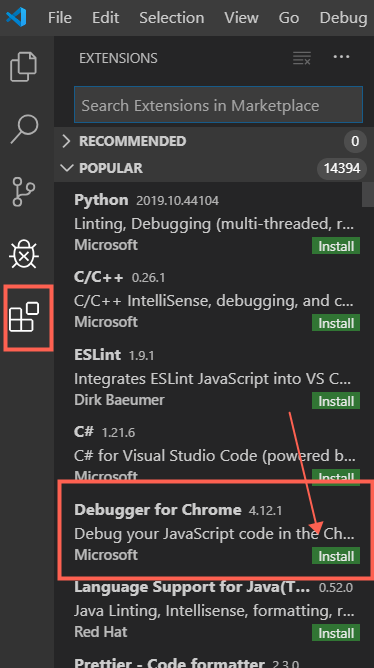

## 如何使用外置的代码编辑器

> Date ：2019-11-15
>

2.4.0开始，把内置的VSCode剥离出了LayaAirIDE，不再内置。然而发现，还是有一些开发者并不了解VSCode这个工作流，对于拆出后如何衔接，感觉到比较迷茫。因此，对于这些开发者，我们为了用户的体验，出来一篇指引文档。

### 1、LayaAirIDE为什么要剥离VSCode

在2.4.0之前的所有LayaAirIDE都是内置VSCode代码编辑器，我们之所以要内置到LayaAirIDE里，是基于集成开发环境的思想，整合在一起会让工作流程的切换更平滑，管理起来也不松散。这种模式得到不少开发者的好评。

然后，由于LayaAirIDE是基于开源编码工具VSCode做的底层进行修改和打包成exe工具。所以由于VSCode自身的限制也面临了一些无法掌控的问题。比如：

##### AS3编码之痛 ：

LayaAir引擎支持AS3语言编码，这是我们引擎独有的特色之处，然而，VSCode本身是不支持AS3语言开发的，尽管我们找到了基于VScode的AS3编码插件，并联系上国外的插件作者，进行了一些付费功能定制。然而，最终的开发体验仍然与Flash Builder和FlashDevelop相差很远，甚至还有一些莫名其妙的问题出来。

##### F5调试相关：

基于IDE自身的F5断点调试需要源映射（Source Map），所以LayaAirIDE2.2之前的版本是内置开启了Source Map，这会导致随着项目的增大Source Map也越来越大。然而，也有大量的开发者只使用chrome调试，希望减少项目大小。于是LayaAirIDE2.2默认去掉了Source Map内置，并给出了官方文档中给出了如何打开启sourceMap的技术文档说明，此种作法的动机是，一是，让是否开启IDE调试的选择权交给开发者，二是，发现一个是偶现的BUG"调试时编码面板与运行窗口之间来回闪切"，这个BUG是VScode自身问题，我们无法解决。总之，基于种种原因，LayaAirIDE2.2版本开始，去掉了默认的Source Map内置开启，提供开启文档，让开发者自由决定是否开启。然而被一些开发者不断吐槽，希望我们再默认加回来。

##### VSCode的BUG与升级相关：

由于LayaAirIDE整合的VSCode版，已作了一些修改，而且和IDE中很多对接功能耦合性比较高，导致了升级VSCode版本所消耗的成本与精力比较大，因此，内置的VSCode版本升级很慢，比如TS实验版中出现的一些警告误报问题，这些VScode BUG导致，因升级速度跟不上VSCode官方的版本，让开发者的体验并不友好。

##### 剥离VSCode的好处

 从开发者的角度而言，使用VSCode官方的版本，可以即时升级版本或者自由的选择版本，以及安装插件。其实很多有经验的开发者，都是在使用独立的VSCode官方版本。

对于引擎方而言，VSCode编码工具本不是引擎方研发的，出现问题的维护难度较大，剥离之后，可以减少维护压力，更加集中精力做好引擎和可视化UI与场景编辑器。

### 2、LayaAirIDE如何配置VSCode的关联

#### 2.1 下载VSCode工具

LayaAirIDE 2.4开始，如果是TS或者JS语言的项目，需要使用VSCode官方的编码工具，没有的话，请前VSCode官方网站往下载，下载地址为： [https://code.visualstudio.com/Download](https://code.visualstudio.com/Download) 

 

#### 2.2 配置IDE的关联

正常情况下，安装好VSCode，Windows版LayaAirIDE能自动找到安装目录进行关联。然而也会有无法自动关联的情况出现。MAC版本，当前因打包机制的原因，也没办法自动关联。

所以当无法自动关联的情况出现后，点击LayaAirIDE中的编辑模式按钮，会弹出来`工具路径配置`的页面。

 

需要注意的是，在2.4.0beta版里目前有个BUG，点浏览可能会无法选中VSCode的可执行文件。开发者可以不要关闭这个界面的情况下，打开VSCode的安装目录，找到VSCode的可执行文件，拖入到代码编辑器安装路径那一栏，然后点击保存，即完成了VSCode工具的配置。

然后再点击LayaAirIDE左侧的编辑模式按钮，即可调起VSCode工具。因LayaAirIDE方案的问题，windows版与MAC版会有一个差异。当在LayaAirIDE里打开项目后，windows版点编辑模式可以自动打开该项目。而MAC版仅仅是调起VSCode，并不能打开LayaAirIDE中的当前项目。这个原因是目前LayaAirIDE的底层打包方案有所限制导致，未来，我们有计划变更底层打包方案来优化开发工具的工作流。

#### 2.3 修改IDE的关联

如果有开发者不小心选择错误的目录，保存后，点击LayaAirIDE左侧的编辑模式按钮，那也会直接打开错误的路径。如果想修改，可以在设计模式下，打开 `菜单` -> `文件` -> `工具路径配置`，即可重新拖入正确的可执行文件到对应的配置栏目。操作指引如下图所示。

 

### 3、如何管理项目与调试

对于创建项目、管理项目，以及发布项目（各种不同平台的发布），仍然需要在LayaAirIDE中进行，和之前的版本没有什么差别。只是编码工具剥离出来而已。

#### 3.1 LayaAirIDE编译、运行、调试

对于项目的编译、运行、调试，我们建议每次在VSCode工具中编码后，再切到LayaAirIDE工具中，采用LayaAirIDE的原有的流程进行编译、运行、调试。如下图所示。

 

#### 3.2 VSCode中编译、运行、调试

当然，VSCode中也是可以编译、运行、调试的。但是需要一些配置。如果觉得麻烦的，可以直接用layaAirIDE的。想用VSCode中的断点调试等功能的，可以继续看下去。

##### 3.2.1 安装Debugger for Chrome

全新安装的VSCode是无法直接调试的，对于H5项目，需要搜索安装Debugger for Chrome插件并安装。如下图所示。

 

安装后，就可以通过F5进行VSCode断点调试了。

##### 3.2.2 关于编译项目

对于编译项目，我们建议在LayaAirIDE中通过快捷键F8完成。

如果一定要在VSCode内编译，那采用LayaAirIDE发布项目前，一定要用LayaAirIDE先行编译一次，否则可能会与LayaAirIDE的发布流程不符，而导致发布失败。如果是经验丰富的老手，可以通过调 layaair2-cmd命令行发布或者自己实现打包编译工作流的除外。

> 注：在LayaAir 2.4.0版本， layaair2-cmd 暂时还不支持Ts实验版，预计 LayaAir 2.5.0发版的时候会支持好。

除了编译的注意事项，具体怎么使用VSCode编译，本篇就不展开讲了，因为我们还是推荐采用LayaAirIDE编译，不想用LayaAirIDE编译的开发者，可以自行研究如何使用VSCode编译项目
