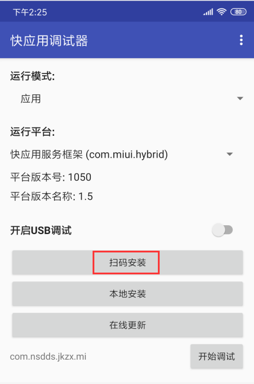

# 小米快游戏发布与调试指南

> update : 2019-07-17
>
> 小米快游戏的发布必须要使用LayaAirIDE，关于IDE的下载使用相关，请查看相关文档，不在本篇介绍范围内。

## 1、小米快游戏发布、调试环境准备

1、小米品牌的手机（注意必须是MIUI 8.5或以上版本）。

2、下载安装小米的测试APP，下载页面：[[https://dev.mi.com/console/doc/detail?pId=1738](https://dev.mi.com/console/doc/detail?pId=1738)](https://dev.mi.com/console/doc/detail?pId=1779)

进入页面后，下拉找到第3步，**调试自测**那一栏里，直接按提示下载即可。

3、PC电脑的chrome浏览器与手机数据连接线。

4、安装nodejs 环境 [node官网：[https://nodejs.org/en/](https://nodejs.org/en/)]

就是下载安装，比较简单，也不细介绍。能在命令行里调起npm命令就算是成功了。

5、LayaAirIDE集中开发环境，LayaAir 2.0.2beta 或以上版本 [ 官网下载: [https://ldc2.layabox.com/layadownload/?type=layaairide](https://ldc2.layabox.com/layadownload/?type=layaairide) ]

6、安装ADB

建议安装ADB，因为有些时候，因为授权或者别的莫名其怪的原因。会导致无法正常启动chrome联真机调试。所以安装ADB 可以验证和有助于手机与PC电脑的连接授权。如果确保无USB调试授权问题的，也可以不装。

 [ ADB官网下载:  [http://adbshell.com/downloads](http://adbshell.com/downloads) ]

简单提示一下，下载 ADB Kits，下载后的压缩包，建议解压放到一个路径简单一些的目录（如: `D:\adb`）。要记得添加环境变量（不知如何添加环境变量的可自行百度）。

## 2、小米快游戏发布与接入完整流程

### 1、发布小米快游戏包(xx.rpk)

LayaAirIDE的发布功能，内置了小米快游戏的发布功能，需要先将LayaAir引擎的项目，通过发布功能打成.rpk后缀的包。关于发布功能的使用。这里不重复介绍了。不会的可以前往官网文档查看。

链接：[https://ldc2.layabox.com/doc/?nav=zh-ts-3-0-6](https://ldc2.layabox.com/doc/?nav=zh-ts-3-0-6)

### 2、保留发布二维码界面。

发布完成后会有一个二维码的界面，如图1所示。这个界面不要关，后面手机扫码需要用。

 

（图1）

### 3、打开发布文件夹并启动命令行模式

点击图1中`打开发布文件夹`按钮，进入发布后的小米快游戏项目目录。然后按住`Shift + 右键` 可以在当前目录快速进入shell或者命令窗口模式，如图2-1或者2-2中标出部分所示。

 

（图2-1）

 

（图2-2）

当然，也可以通过Git进入命令行（Git Bash Here）或者其它方式进入命令行，然后进入小米快游戏项目目录即可完成本步骤。

这个环节主要是告诉开发者，怎么在命令行模式入快速进入当前的发布目录。因为启动chrome调试的debug命令必须要在小米快游戏的发布目录进行操作。这里先简单了解，并保持命令行是打开的。后面会用到。

### 4、启动chrome调试环境

####  4.1 安装并进入快应用调试器

要启动电脑PC的chrome调试环境，我们要先安装好小米快游戏的调试APP（快应用调试器），如图3所示。然后点击进入。

 

（图3）

#### 4.2 在快应用调试器界面扫码安装小米快游戏的rpk包

进入快应用调试器之后，我们可以看到如图4所示的APP操作界面。

 

(图4)

这时候我们点击图4中的扫码安装，扫一下LayaAir IDE中发布界面上的那个二维码（之前不让关，关了的要重新发布让二维码显示出来）。手机中就可以在真机环境中运行了。

> 这里要提示的是：手机网络要和PC在同一个局域网段里（用4G网扫局域网的码肯定是不行的）。

如果把发布目录下/dist目录内的rpk包传到手机里，通过点`本地安装`按钮来安装，也是可以的。但是建议扫码安装，因为扫码的步骤更方便快捷。

#### 4.3 保持物理线路连接以及授权

对于比较有相关经验的开发者，确保USB手机连接线物理线路是已连接状态，并且USB调试授权也没问题的，可以跳过本步骤。

##### 相关操作如下：

1、先用手机连接线将手机与PC保持物理上的连接。打开手机的开发者模式，且打开Usb调试。

此时，我们要关注手机端，是否出现如图5-1所示的提示，如果有，则点 确定 允许调试。

 

（图5-1）

2、验证授权。

当USB调试模式授权成功之后，我们输入adb devices，应该如图5-3所示。

 

（图5-2）

总之，在这个环节里，我们要保障PC是有权限调试这个手机设备的。

#### 4.4 启动chrome调试环境

小米快游戏在PC上没有工具的开发调试环境，是通过USB联接到手机设备，然后在PC命令行模式下，通过 `npm run debug` 命令调起Chrome调试器（前提要保障PC是已安装了chrome浏览器的）来联调手机真机环境的rpk包，如图6所示。

 

(图6)

当我们能看到`Debugger URL opened in Chrome.`这个提示的时候，说明chrome已被成功调起，并与真机中的画面保持一致。如图7所示。真机中的各种操作，会完全同步到PC这个chrome里，我们就按chrome的调试方式来调试小米快游戏项目即可。

 

(图7)

至此，小米快游戏从发布到启动chrome调试的完整流程已介绍完。

最终具体的调试方式。就不在本篇中细讲了。

## 本文赞赏

如果您觉得本文对您有帮助，欢迎扫码赞赏作者，您的激励是我们写出更多优质文档的动力。

