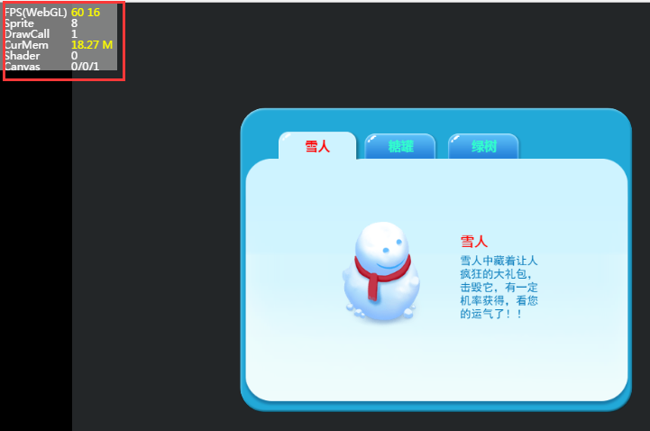

#CacheAs static cache optimization

In other general attributes in the attribute setter, we introduce cacheAs cache optimization concepts and functions. It is also recommended that developers use it reasonably when making UI interface. Next, we will use a UI example to show the application of cacheAs in the project. At the same time, we will analyze the data before and after the use of cacheAs for developers'reference.

Let's first look at the situation where CacheAs caching is not used, as shown in Figure 1. In the debugging mode of webgl, you can see that the number of Sprite render nodes per frame in the UI is 23, the number of drawcall renderings is 8, and the number of shader material submissions is 7. (* This data can be used for performance optimization comparisons after optimization *)

  
(Fig. 1)

##1. CacheAs as Noral Cache Optimization

When we use cacheAs, we set cacheAs to "normal" mode, DrawCall and Shader remain unchanged, the number of Sprite nodes has been reduced from 23 to 8, and the rendering performance of nodes has been optimized nearly three times. As shown in Figure 2.

   (图2)

**Tips**:

When the cacheAs attribute value is "normal", canvas caching is performed under Canvas and command caching is performed under webgl mode. The performance of this mode is moderately optimized. It can reduce the number of nodes rendered per frame, but it will not reduce the number of DrawCall and Shader.

##2. CacheAs as Bitmap Cache Optimization

When we use cacheAs, we set cacheAs to "bitmap" mode. The number of Sprite nodes was 8, DrawCall was reduced to 1, and Shader was reduced to 0. Only one configuration was modified, and the performance was more than ten times better than that without cacheAs. The effect is shown in Figure 3.

  (Figure 3)

**Tips**:

Canvas is still a canvas cache. Using renderTarget cache in webgl mode is equivalent to caching static bitmaps and submitting graphics card rendering. It should be noted that the renderTarget caching mode under webGL has a size limit of 2048, which will increase the memory overhead if it exceeds 2048. In addition, the overhead of continuous redrawing is relatively high, but drawcall is reduced, rendering performance is the highest.

In this document, our example UI is relatively simple. For some large-scale games, the number of UIs with more than 50 nodes is not small. With cacheAs caching technology, rendering performance will be improved many times.

##3. How to choose cache optimization

###3.1 Memory and CPU Considerations

####Bitmap Mode and Memory Increase

In the example above, we can also see that when using Bitmap bitmap caching mode, the CurMem memory value increases from 17.22M to 18.27M, because some memory is consumed when caching bitmaps, but as long as the UI width is not very large, the additional memory will not be too large.

####Frequent refresh CPU consumption

The most important thing to note is whether the UI refreshes frequently. If it refreshes frequently, the CPU will lose a lot, because once the sub-objects change when the bitmap is cached, the engine will automatically re-cache the bitmap, and the process of caching the bitmap will consume CPU.

If we choose to use the normal or bitmap mode of cacheAs or not, we need to consider the increase of memory and CPU consumption as the key factors.

###3.2 Test for frequent redrawing

The DebugPanel debugging tool provided by LayaAir engine can help you see the game redrawing area and add it to the code.`DebugPanel.init();`Method: After compiling and running the project, a debug window appears in the browser, as shown in Figure 4.

  (Figure 4)

Let's tick“`显示当前cache重绘`” Options or“`显示所有重绘区域`" If the UI is redrawn, the redrawn area will show a green frame, the upper left corner of the green box shows the number and time of redrawing, and performance statistics tools such as Prite, DrawCall will also change.

In the absence of mouse operation, if the green wireframe appears frequently, explain**If the UI is redrawing frequently, it is better not to use bitmap caching mode. Normal mode can be considered as appropriate.**。 Of course, UI can also be hierarchically managed, frequently updated as a layer (without cacheAs) and infrequently updated as a layer (with cacheAs), which can also improve performance.

###3.3 Configuration factors of low-end models

When we do game projects, we usually take mobile phone configuration into account. In most cases, the more mobile phones the game adapts to, the better. Game testers will use mobile phones with high, middle and low-end configuration to test, and then provide optimization suggestions. So when using cacheAs, you also need to refer to the memory and CPU size of the mobile phone.

For some low-end computers, CPU and memory are not high. If cacheAs is used to improve rendering performance, problems may arise.

At this point, developers need to make trade-offs, choose performance or the breadth of the game model, or choose the right one. If you choose to adapt to more low-end models, you need to repeatedly test whether to use cacheAs, and compare the normal and bitmap mode which is more suitable, in order to minimize CPU and memory loss in the case of optimizing performance.

##4. Under what circumstances cacheAs cannot be used

###4.1 Object cannot be used when it is very simple

When the object is very simple, such as a word or a picture, setting cacheAs will not improve performance, but will lose performance.

###4.2 Frequently changing content cannot be used

There are constantly changing contents in the container, such as an animation or countdown in the container. If you set cacheAs on the container again, you will lose performance.

By looking at the first value of Canvas statistics in the Performance Statistics panel, if it changes all the time, it means that it has been redrawn. In this case, cacheAs cannot be used.