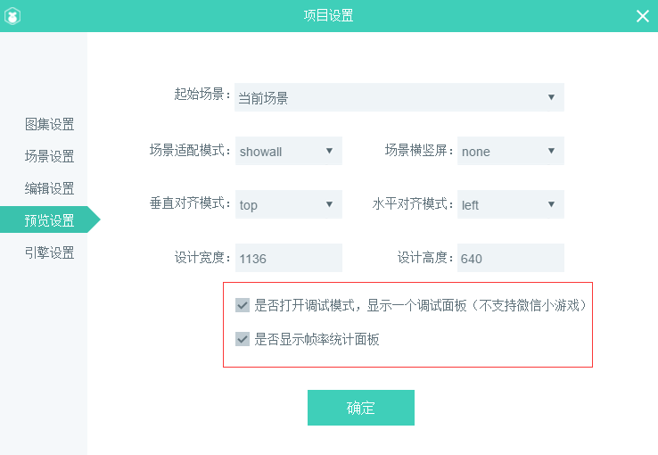
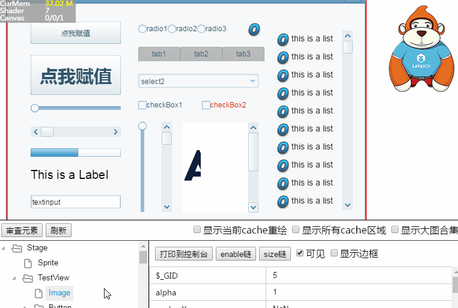
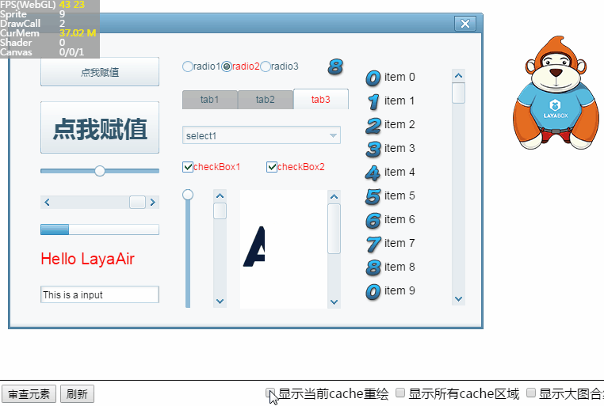

#LayaAir DebugPanel Tool

###1. Enable DebugPanel Debugging Panel

The DebugPanel debugging panel is a Div-based debugging window. In editing mode, press F9 to open the settings panel, as shown in the figure.



Just check to open the debugging panel. (Note that this method is strongly recommended! )

Start the debug panel in code mode`Laya.enableDebugPanel();`, you can initialize the stage method`Laya.enable()`Additional use is added to any subsequent code, as shown in the following code:

Entry class Main.as


```java

package
{
	import laya.debug.DebugPanel;
	import laya.display.Sprite;
	
	public class Main
	{
		public function Main()
		{
			//初始化舞台
			Laya.init(1334,750);    
			//调用DebugPanel调试面板
			Laya.enableDebugPanel();
			//设置舞台背景色
			Laya.stage.bgColor  = "#ffffff";
			
			var Img:Sprite = new Sprite(); 			 
			//添加到舞台
			Laya.stage.addChild(Img);   
			Img.loadImage("res/img/monkey1.png",200); 	
		}
	}
}
```


The effect is shown in Figure 1.

 <br /> (图1)


###2. Refresh Display Object Node Tree

By default, only the display object node tree has`DebugInfoLayer`Node, which the node developer does not care about (for engine developers). The object node in the product page needs to be refreshed before it can be displayed. Click`调试面板`Upper`刷新`The button displays all the node tree structures on the page. As shown in Figure 2.

 <br /> (动图2)


###3. Viewing the properties of node objects

Click on the node in the node tree to view the selected node object properties on the right, as shown in Figure 3.

<br/> (Figure 3)

**Tips**: by viewing or modifying the attribute values of node objects in the debugging panel, you can speed up the judgment and debugging of problems.


###4. Review page elements

In addition to clicking on the node object from the node tree to view the properties. By clicking first`审查元素`Button, and then click the target content in the page, you can directly view the object properties of the node in the right area of the debug panel. The effect is shown in Figure 4.

<br/> (Motion 4)


###5. Modify node object properties in debugging panel

To avoid modifying the code every time you debug, compile and run the complex debugging process again. You can modify the property values directly in the debugpanel debug panel. Then move out the property value input box to see the modification effect. The operation and effect are shown in Fig. 5.

<br/> (Fig. 5)


###6. Node visibility control

After selecting the node in the debug panel, you can use the**cancel**The node`可见勾选状态`Let the node in**Not visible on the page**。 Click again`勾选`Visible, it will be displayed again, and the effect is shown in Figure 6.

<br/> (Motion 6)


###7. Node Red Border Display Control

In the debug panel`可见`The right side of the control is`显示边框`Control, when checked, the node in the page is**Red border**Highlight display. The effect is shown in Figure 7.

<br/> (Figure 7)

**Tips**:*When the cacheAs property setting of the node takes effect, the display border check will not show the red border.*


###8. Print the node object to the console

Click the debug panel`打印到控制台`Button to output the selected node object to the browser's console (* console *) for further debugging in the console. The effect is shown in Figure 8.

<br/> (Figure 8)


###9. View the enable chain and size chain in the console

By enable chain and size chain button, enable-related attributes or size-related attributes of node objects can be output to the console. As shown in Figure 9.

<br/> (Figure 9)


###10. Display and Switch Large Graph Set

In webgl mode, in order to optimize performance, less than`512*512`Resource engines are automatically merged into a large collection of images (including image and text information). The default upper limit of the LayaAir engine is six large image collections, which can be optimized by looking at the number and content of large image collections.

Checklist`显示大图合集`After that, you can view the current collection of large images, and the upper left solution will appear red.`图集当前数/图集总数`There are two values. Cancel check and select again. Yes.`切换`Go to the next big picture collection. As shown in Figure 10.

<br/> (Figure 10)

**Tips**:

The function of displaying large image aggregation is limited to webGL mode, but the function button has no effect in Canvas mode.

The total width and height of a single set of large graphs are`2048*2048`。


###11. Display the current cache redraw area and all cache areas

Setting cache can optimize performance, but unreasonable cache settings can also reduce performance. For example, frequent redrawing of cache areas can degrade performance.

adopt`显示当前cache重绘`And`显示所有cache区域`You can view the status of cache by statistics.

**Green is the current cache area**The area color box will stay on display for 3 seconds. The effect is shown in Figure 11.

<br/> (Motion Fig. 11)


**All cache areas are purple borders**The area color box disappears immediately after the display and stays in the last cache area. The effect is shown in Figure 12.

<br/> (Motion 12)


 

