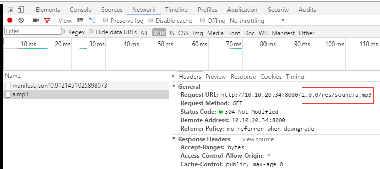

## 资源版本管理

​	在项目上线之后，难免会遇到要更新资源版本。但是浏览器的缓存问题会导致拉取的资源不是最新版本，项目版本不一致导致运行不正常。所以合理的管理资源，更新资源尤为必要。LayaAir引擎提供的资源版本管理工具，有效的解决了这个问题。下面看下具体的用法。**注意：引擎的版本号需要1.7.3以上才可以。**

​	这里我们配合命令行来使用。下面看下步骤。

- 安装nodejs，官网下载nodejs 下载地址https://nodejs.org/en/

- 安装 layacmd工具 。下载地址https://www.npmjs.com/package/layacmd

  这里我用win系统演示。打开cmd窗口，命令行输入 npm install layacmd -g 即可。

  这个命令行工具提供了很多的功能包括编译，发布，导出资源，创建静态服务器等等功能，相关的教程可以参考layacmd的专题教程。这里我们就拿资源管理的功能来进行说明下。

- 新建个LayaAir项目。这里我们以as语言为例子。

  然后进入到h5目录下，新建个res的文件夹把资源都放到res目录下，这里我们随便添加几个资源。这里我们添加一个声音文件夹，里面放一个声音文件a.mp3，外层放一个img文件夹，放一个图片1.png的图片。

  在bin/h5目录下打开命令行，在命令行输入 `layacmd resourceVersion -i res -o . -n 1.0.0`。这里-i代表资源路径，-o . 代表版本资源输出路径为当前路径，当然开发者也可以自定义输出路径，比如定义路径为version文件夹等等，-n 1.0.0初始化版本为1.0.0。回车之后我们看到生成了几个文件和文件夹。如图：

  

  1.0.0的文件夹，里面是1.0.0版本的资源。`.record`文件记录的是文件的md5信息，误删！`manifest.json`文件里面记录的资源的版本号。

  下面看下在程序中怎么应用。

  ```java
  package
  {
      import laya.net.Loader;
      import laya.net.ResourceVersion;
      import laya.utils.Handler;
      
      public class Main
      {
          //设置资源配置文件的地址，我这里加了随机参数，保证每次加载的都是最新的。
          private var configUrl:String ="manifest.json?"+Math.random();
          public function Main()
          {
                Laya.init(500,500);
                ResourceVersion.enable(configUrl,Handler.create(this,this.completeHandler));
          }
          private function completeHandler(e:Object):void
          {
             Laya.loader.load([{"url":"res/sound/a.mp3","type":Loader.BUFFER}],Handler.create(this,loadSound));
          }
          private function loadSound():void
          {
              var obj:Object = Laya.loader.getRes("res/sound/a.mp3");
              
          }
          
      }
  }
  ```

  在初始化完引擎之后，我们要做的第一件事情就是加载这个`manifest.json`这个文件。引擎提供了相应的方法启用版本管理。

` ResourceVersion.enable`这个方法传递进去的是manifest.json文件的路径，ResourceVersion类改写了URL.customFormat的方法。在load资源的时候就会匹配manifest.json里面资源的版本号，进行加载。加载完manifest.json文件后在开始我们的项目的正式逻辑。

​	我们在项目逻辑中加载一个声音文件。编译运行上面的代码。打开谷歌的控制台。看下加载文件的信息。如图：



​		可以看到加载的是`1.0.0/res/sound/a.mp3`文件夹下的资源。我们在增加一个资源，新建一个文本文件。命名为data.data。放到res/data/data.data文件加下。进行加载代码如下：

```java
package
{
    import laya.net.Loader;
    import laya.net.ResourceVersion;
    import laya.utils.Handler;
    
    public class Main
    {
        
        private var configUrl:String ="manifest.json?"+Math.random();;
        public function Main()
        {
              Laya.init(500,500);
              ResourceVersion.enable(configUrl,Handler.create(this,this.completeHandler));
              
        }
        private function completeHandler(e:Object):void
        {
           var obj:Object = Laya.loader.getRes(configUrl);
           var data:Array =[
               {"url":"res/sound/a.mp3","type":Loader.BUFFER},
               {"url":"res/data/data.data","type":Loader.TEXT}
           ]
           Laya.loader.load(data,Handler.create(this,resComplete));
        }
        private function resComplete():void
        {
            
        }
        
    }
}
```


​	编译上面的代码，打开谷歌管理器看下加载的路径。


​	从中我们看到，在开发模式的时候我们资源还是都放到res目录下，正式发版本的时候我们在用命令行工具进行版本管理。

​	

​	下面我们在命令行输入下刚才的命令，假设我们还是定义为1.0.0版本`layacmd resourceVersion -i res -o . -n 1.0.0`执行完成之后 在刷新页面看下：


​	发现已经加载的是1.0.0文件夹下的资源了。

​	上面说的是增加了资源，假如修改了资源呢？那么我们发布版本的时候增加下版本号就好。比如我们修改下data.data的内容。然后在发布下

`	layacmd resourceVersion -i res -o . -n 1.0.1`命令行执行下。然后刷新页面看下加载情况。


​	**看下这时候加载的是1.0.1文件夹下的资源，a.mp3这个文件没有修改，他还是会去加载1.0.0文件夹下的资源。**

​	总结:

​	至此我们看到只要有资源修改我们就可以修改发布的版本号。这样就会去相应的文件夹下去加载资源。manifest.json文件中记录的版本信息就会更改。