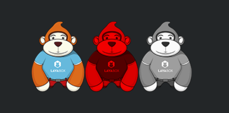
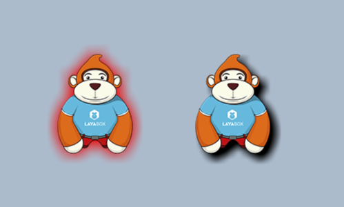
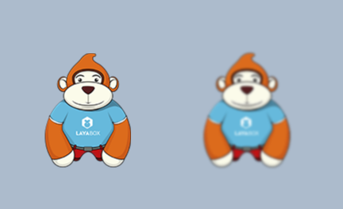

#Setting up filter effect

> LayaAir engine provides three effects: color filter, light (or shadow) filter and blur filter. Among them, the color filter supports canvas and webgl mode, while the luminous filter and blur filter only support webgl mode due to their high performance consumption.


##1. Setting up color filters

###1.1 Color Filter API

The color filter class, ColorFilter, is located in the laya. filters package and changes the color channels by specifying a matrix (* arranged into 4 x 5 matrices *).

click[laya.filters.ColorFilter ](http://layaair.ldc.layabox.com/api/index.html?category=Filter&class=laya.filters.ColorFilter)Check the API instructions.


###1.2 Setting Color Filter

If you want to set a color filter for a bitmap, you need to set a color matrix first, and then create an example of a color filter using the ColorFilter method, as shown in the following code:


```java

			//由 20 个项目（排列成 4 x 5 矩阵）组成的数组，红色
			var redMat:Array = 
				[
					1, 0, 0, 0, 0, //R
					0, 0, 0, 0, 0, //G
					0, 0, 0, 0, 0, //B
					0, 0, 0, 1, 0, //A
				];

			//创建一个颜色滤镜对象,红色
			var redFilter:ColorFilter = new ColorFilter(redMat);
```


Finally, the color filter effect is superimposed on the bitmap through the filter attribute of Spriter. Next, we create a main.as entry class and set it as the default application (flashbuilder is recommended). The code is as follows:


```java

package
{
	import laya.display.Sprite;
	import laya.display.Stage;
	import laya.filters.ColorFilter;
	import laya.resource.Texture;
	import laya.utils.Browser;
	import laya.utils.Handler;
	import laya.webgl.WebGL;
	
	public class Main
	{
		private const ApePath:String = "res/img/monkey1.png";

		private var apeTexture:Texture;

		public function Main()
		{
			// 不支持WebGL时自动切换至Canvas
			Laya.init(Browser.clientWidth, Browser.clientHeight, WebGL);

			Laya.stage.alignV = Stage.ALIGN_MIDDLE;
			Laya.stage.alignH = Stage.ALIGN_CENTER;

			Laya.stage.scaleMode = "showall";
			Laya.stage.bgColor = "#232628";

			Laya.loader.load(ApePath, Handler.create(this, setup));
		}

		private function setup(e:*=null):void
		{
			normalizeApe();
			makeRedApe();
			grayingApe();
		}

		private function normalizeApe():void
		{
			var originalApe:Sprite = createApe();
			
			apeTexture = Laya.loader.getRes(ApePath);
			originalApe.x = (Laya.stage.width - apeTexture.width * 3) / 2;
			originalApe.y = (Laya.stage.height - apeTexture.height) / 2;
		}

		private function makeRedApe():void
		{
			//由 20 个项目（排列成 4 x 5 矩阵）组成的数组，红色
			var redMat:Array = 
				[
					1, 0, 0, 0, 0, //R
					0, 0, 0, 0, 0, //G
					0, 0, 0, 0, 0, //B
					0, 0, 0, 1, 0, //A
				];

			//创建一个颜色滤镜对象,红色
			var redFilter:ColorFilter = new ColorFilter(redMat);

			// 赤化猩猩
			var redApe:Sprite = createApe();
			redApe.filters = [redFilter];

			var firstChild:Sprite = Laya.stage.getChildAt(0) as Sprite;
			redApe.x = firstChild.x + apeTexture.width;
			redApe.y = firstChild.y;
		}
		
		private function grayingApe():void
		{
			//由 20 个项目（排列成 4 x 5 矩阵）组成的数组，灰图
			var grayscaleMat:Array = [
				0.3086, 0.6094, 0.0820, 0, 0, 
				0.3086, 0.6094, 0.0820, 0, 0, 
				0.3086, 0.6094, 0.0820, 0, 0, 
				0, 0, 0, 1, 0];
			
			//创建一个颜色滤镜对象，灰图
			var grayscaleFilter:ColorFilter = new ColorFilter(grayscaleMat);
			
			// 灰度猩猩
			var grayApe:Sprite = createApe();
			grayApe.filters = [grayscaleFilter];

			var secondChild:Sprite = Laya.stage.getChildAt(1) as Sprite;
			grayApe.x = secondChild.x + apeTexture.width;
			grayApe.y = secondChild.y;
		}

		private function createApe():Sprite
		{
			var ape:Sprite = new Sprite();
			ape.loadImage(ApePath);
			Laya.stage.addChild(ape);
			
			return ape;
		}
	}
}
```


In the code above, we create an original bitmap, a red filter effect bitmap, and a gray filter effect bitmap. The operation effect is shown in Figure 1:

<br/> (Fig. 1)


##2. Setting up Luminescent and Shadow Filters

###2.1 Luminescent Filter API

The GlowFilter class is located in the laya. filters package. It can also be used as a shadow filter by adjusting the light-emitting offset angle. The parameter description is shown in Figure 2. Note: This filter only supports WebGL mode.

<br/> (Figure 2)

click[laya.filters. GlowFilter](http://layaair.ldc.layabox.com/api/index.html?category=Filter&class=laya.filters.GlowFilter)Check the API instructions.


###2.2 Setting up Luminescent Filter and Shadow Filter

The settings of luminous and shadow filters are relatively simple. We can see the effect of the example directly by encoding.

First, create a Main.as entry class and set it to the default application (Flash Builder is recommended). Write the following code:


```java

package
{
	import laya.display.Sprite;
	import laya.filters.GlowFilter;
	import laya.webgl.WebGL;

	public class Main
	{
		public function Main()
		{
			//初始化舞台
			Laya.init(1334,750,WebGL);                
			//设置舞台背景色
			Laya.stage.bgColor  = "#ffffff";
			
			//原始位图
			createImg(100,50);			
			//发光滤镜
			creteGlowFilter();			
			//阴影滤镜
			createShadeFilter();
		}
		
		/**创建发光滤镜位图**/
		private function creteGlowFilter():void
		{			
			//创建发光滤镜
			var glowFilter:GlowFilter = new GlowFilter("#ff0000", 15, 0, 0)
			//在坐标280,50创建位图
			var img:Sprite = createImg(280,50); 		
			//添加发光滤镜
			img.filters = [glowFilter];
			
		}	
		
		
		/**创建阴影滤镜位图**/
		private function createShadeFilter():void
		{
			//创建阴影滤镜
			var glowFilter:GlowFilter = new GlowFilter("#000000", 8, 8, 8)
			//在坐标460,50创建位图
			var img:Sprite = createImg(460,50);			
			//添加阴影滤镜
			img.filters = [glowFilter];				
		}
		
		/**创建位图**/
		 private function createImg(w:int,h:int):Sprite
		{
			 var Img:Sprite = new Sprite(); 			 
			 //添加到舞台
			 Laya.stage.addChild(Img);   			 
			 //加载显示图片，坐标位于100,50
			 Img.loadImage("res/img/monkey1.png",w,h); 			 
			 return Img;
		}
	}
}
```


In the code above, we create an original bitmap, a light-emitting filter effect bitmap, and a shadow filter effect bitmap. The operation effect is shown in Figure 3.

<br/> (Figure 3)


##3. Setting up a Fuzzy Filter

###3.1 Brief Introduction of Fuzzy Filter API

BlurFilter is located in laya. filters package. By adjusting the strength parameter to set the intensity of the blurred filter, the greater the value, the more blurred the filter. The parameter description is shown in Figure 4. Note: This filter only supports WebGL mode.

< br / > (Figure 4)

click[laya.filters. BlurFilter](http://layaair.ldc.layabox.com/api/index.html?category=Filter&class=laya.filters.BlurFilter)Check the API instructions.


###3.2 Setting up Fuzzy Filter

The setting of the blur filter is relatively simple. Create an example of the blur filter, then set the blur intensity and superimpose it on the bitmap. We can see the effect of the example directly by coding.

First, create a Main.as entry class and set it to the default application (Flash Builder is recommended). Write the following code:


```java

package 
{
	import laya.display.Sprite;
	import laya.display.Stage;
	import laya.filters.GlowFilter;
	import laya.resource.Texture;
	import laya.utils.Browser;
	import laya.utils.Handler;
	import laya.webgl.WebGL;
	import laya.filters.BlurFilter;
	
	public class Main{
		private const apePath:String = "res/img/monkey1.png";

		private var ape:Sprite;
        private var ape2:Sprite;

		public function Main() 
		{
			// 不支持WebGL时自动切换至Canvas
			Laya.init(Browser.clientWidth, Browser.clientHeight,WebGL);

			Laya.stage.alignV = Stage.ALIGN_MIDDLE;
			Laya.stage.alignH = Stage.ALIGN_CENTER;

			Laya.stage.scaleMode = "showall";
			Laya.stage.bgColor = "#aabbcc";

			Laya.loader.load(apePath, Handler.create(this, setup));
		}

		private function setup(tex:Texture):void
		{
			createApe();
			createBlurFilter();
            
		}

		private function createApe():void
		{
			ape = new Sprite();
			ape.loadImage(apePath);

            ape2 = new Sprite();
			ape2.loadImage(apePath);

			var texture:Texture = Laya.loader.getRes(apePath);
			ape.x = (Laya.stage.width - texture.width) / 2 -100;
			ape.y = (Laya.stage.height - texture.height) / 2;

            ape2.x = (Laya.stage.width - texture.width) / 2 +100;
			ape2.y = (Laya.stage.height - texture.height) / 2;
            
			Laya.stage.addChild(ape);
            Laya.stage.addChild(ape2);
		}

		private function createBlurFilter():void
		{
			//创建模糊滤镜实例
			var blurFilter:BlurFilter = new BlurFilter();
			//设置模糊滤镜
			ape2.filters = [blurFilter];
		}

    
	}
}
```


In the code above, we created an original bitmap, a blurred filter effect bitmap. The operation effect is shown in Figure 5.

< br / > (Figure 5)


