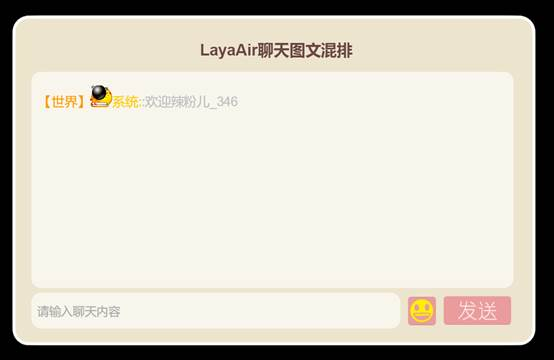
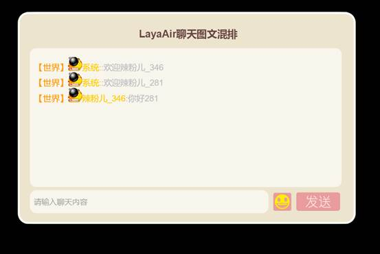
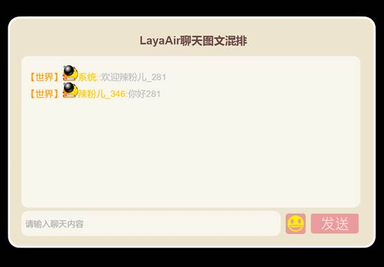
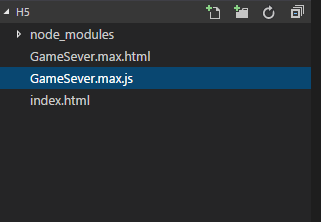
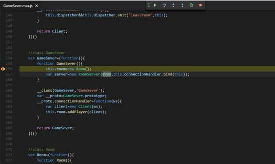

## Actionscript3.0之服务器


　　传统意义上的AS3.0只能做页游手游的客户端，但是随着laya赋予它新的生命力以及nodejs的盛行，那么用js开发服务器越来越快速高效。但是系统越来越庞大，ES5面向过程那种写法已经越来越难维护，用面向对象的语言来开发显得尤为重要，nodejs开发可以用三种语言来开发，AS，TS，JS.。三种语言各有优势和特点，没有优劣之分。在笔者看来开发nodejs都非常适合。下面我们就简单介绍下如何用AS开发nodejs。这里我们拿websocket来进行讲解。本教程都是在win系统上，mac的开发者不同的地方可以自行更正之间的不同。


#### 环境搭建

　　开发nodejs当然少不了nodejs的安装。从官网[https://nodejs.org/en/](https://nodejs.org/en/) 下载nodejs的稳定版本。然后基本一路next安装就行。安装完毕，打开cmd 输入`node -v` 假如显示相应得到版本信息就表明安装成功。关于nodejs的详细信息这里就不在阐述。

　　新建项目，这里我们选择传统的flashbuilder 新建一个Actionscript项目。项目命名GameSever。这里的启动类要改成如下格式。

````java
package
{
    public class GameSever
    {
        public function GameSever()
        {
            
        }
    }
}
````


　　开发者可以发现这里的启动类是没有继承的，服务端运行不需要flash显示列表的东西，这里要去掉继承。

　　网络模块的下载，node服务端的websocket模块需要用第三方模块，这里我们选用ws模块即可（模块开发者可换成自己熟悉的）。打开cmd ，cd进入项目的 *bin-debug/h5* 的目录,输入`npm install ws –-save`回车。

 

　　如下，表明ws模块安装成功。ws模块的git地址[https://github.com/websockets/ws](https://github.com/websockets/ws)。

　　nodejs原生函数封装。nodejs有一些全局的函数和对象，我们为了代码的友好提示，我们来写下这些类的声明，nodejs一些常见的函数和模块大致有这些: [Global Objects](https://nodejs.org/dist/latest-v6.x/docs/api/globals.html#globals_global_objects), [Events](https://nodejs.org/dist/latest-v6.x/docs/api/events.html#events_events)，[Buffer](https://nodejs.org/dist/latest-v6.x/docs/api/buffer.html#buffer_buffer)，[File System](https://nodejs.org/dist/latest-v6.x/docs/api/fs.html#fs_file_system)，[Path](https://nodejs.org/dist/latest-v6.x/docs/api/path.html#path_path)，[OS](https://nodejs.org/dist/latest-v6.x/docs/api/os.html#os_os)，[process](https://nodejs.org/dist/latest-v6.x/docs/api/process.html#process_process)，[HTTPS](https://nodejs.org/dist/latest-v6.x/docs/api/https.html#https_https)，[HTTP](https://nodejs.org/dist/latest-v6.x/docs/api/http.html#http_http)，[Child Process](https://nodejs.org/dist/latest-v6.x/docs/api/child_process.html#child_process_child_process)，[Cluster](https://nodejs.org/dist/latest-v6.x/docs/api/cluster.html#cluster_cluster)等模块。各个模块的api的介绍这里不是我们的重点。开发者可以移步到nodejs的官网查看相应的信息。我们这里只封装几个必要的模块，仅仅是声明，laya编译的时候不会把他们编译进去。nodejs的模块化管理，最终要的一个函数就是require，所以我们在src下新建个require.as。

​	代码如下：

```java
package
{
    /*[IF-FLASH-BEGIN]*/
    public class require
    {
        public function require(path:String)
        {
        }
    }
    /*[IF-FLASH-END]*/
}
```


> /\*[IF-FLASH-BEGIN]和[IF-FLASH-END]\*/
>
> 这个是laya编译器的识别标签。表明此代码块不会编译。


　　再封装一个事件的类Event.用来发送事件。


```java
package
{
    /*[IF-FLASH-BEGIN]*/
    public class Event
    {
        
        public function Event()
        {
        }
        public function on(type:String,caller):void
        {
            
        }
        public function emit(eventName:String,...arg):void
        {
            
        }
    }
    /*[IF-FLASH-END]*/
    
    //[IF-JS]Event = require('events');
}
```


　　简单的聊天室,nodejs这两个模块就足够。剩下的就是每个类的逻辑完善。

　　下面正式开始逻辑代码的完善。


1. 服务器的搭建

　　本示例比较简单，所以我们就架设一个房间，一个服务器。新建一个RoomServer的类，用来创建房间服务器，这里借助ws模块来创建服务器（更详细的api可以参考ws的api文档），逻辑代码如下：

```java
package
{
	public class RoomServer
	{
		private static var _server:Object;
		public static const WebSocket:Object = require('ws');//导入ws模块
		public function RoomServer(port:int,connectionHandler:Function)
		{
			_server = new WebSocket.Server({ port: port });
			trace("启动服务器,端口号:"+port);
			trace("服务器IP地址为:"+IP);
			_server.on('connection',connectionHandler);
		}
		/**
		 * 获取本机的ip地址 
		 * @return 
		 * 
		 */		
		private function get IP():String
		{
			var os:Object = require("os")
			var ifaces:Object = os.networkInterfaces();
			var ip:String= '';
			for (var dev:String in ifaces)
			{
				ifaces[dev].forEach(function(details):void
				{
					if (ip === '' && details.family === 'IPv4' && !details["internal"])
					{
						ip = details.address;
						return;
					}
				});
			}
			return ip||"127.0.0.1";
		}
	}
}
```


　　构造函数接受两个参数，一个是外部传递的端口号，一个是客户端连接回调函数。里面还封装了一个获取本机ip地址的方法。


2. 新建一个Client的类，代表每一个客户端的连接。代码中都用详细的注释。

   ```java
   package
   {
   	public class Client
   	{
   		private var ws:Object;
   		private var dispatcher:Event;
   		public var name:String="";
   		private var  msgData:Object ={"name":"","data":""};//定义一个简单的消息体 客户端名字，客户端消息体；
   		public function Client(ws:Object)
   		{
   			this.name = "辣粉儿_"+(Math.random()*1000>>0).toString();//随机产生一个名字
   			this.ws = ws;
   			this.ws.on("message",this.messageHandler.bind(this));
   			this.ws.on("close",closeHandler.bind(this));
   		}
   		/**
   		 * 初始化传递一个房间的消息发送器。 
   		 * @param dis
   		 * 
   		 */		
   		public function init(dis:Event):void
   		{
   			dispatcher = dis;
   		}
   		/**
   		 * 接收客户端发送过来消息 
   		 * @param msg
   		 */		
   		public function messageHandler(msg:Object):void
   		{
   			msgData.name = this.name;
   			msgData.data = msg;
   			dispatcher&&dispatcher.emit("message",JSON.stringify(msgData));
   		}
   		/**
   		 * 发送给客户端 
   		 * @param msg
   		 */		
   		public function send(msg:Object):void
   		{
   			this.ws.send(msg);
   		}
   		/**
   		 * 客户端断开连接 
   		 * @param e
   		 */		
   		public function closeHandler(e:Object):void
   		{
   			dispatcher&&dispatcher.emit(EventName.LEAVEROOM,this);
   		}
   	}
   }
   ```

   ​

3. 新建一个room类，管理房间内的用户。

   ```java
   package
   {
   	public class Room
   	{
   		/**
   		 *所有客户端的连接 
   		 */		
   		public var clients:Array = new Array();
   		/**
   		 *消息发送监听消息 
   		 */		
   		public var dispather:Event = new Event();
   		public var msgData:Object ={"name":"","data":""};//定义一个简单的消息体 客户端名字，客户端消息体；
   		public function Room()
   		{
   			dispather.on(EventName.MESSAGE,broadcast.bind(this));
   			dispather.on(EventName.LEAVEROOM,removeUser.bind(this));
   		}
   		/**
   		 * 添加新来的客户端 
   		 */		
   		public function addPlayer(client:Client):void
   		{
   			this.clients.push(client);
   			client.init(this.dispather);
   			msgData.name ="系统:";
   			msgData.data = "欢迎"+client.name;
   			this.broadcast(JSON.stringify(msgData));
   		}
   		/**
   		 *移除房间的用户 
   		 */		
   		private function removeUser(client:Client):void
   		{
   			var index:int = this.clients.indexOf(client);
   			if(index!=-1)
   			{
   				this.clients.splice(index,1);
   				trace("系统消息:"+client.name+"离开房间");
   				msgData.name ="系统:";
   				msgData.data = client.name+"离开房间";
   				this.broadcast(JSON.stringify(msgData));
   			}
   		}
   		/**
   		 *广播消息 
   		 */		
   		public function broadcast(msg:String):void
   		{
   			var len:int = this.clients.length;
   			var client:Client;
   			for(var i:int = 0;i<len;i++)
   			{
   			     client =this.clients[i];
   				 client.send(msg);
   			}
   		}
   		
   	}
   }
   ```

   ​

4. 一些事件的常量我们单独放到一个EventName类里面：

```java
package
{
	public class EventName
	{
		public static const ADDROOM:String ="addroom";
		public static const NEWUSER:String ="newuser";
		public static const MESSAGE:String ="message";
		public static const LEAVEROOM:String ="leaveroom";
		public function EventName()
		{
		}
	}
}
```


5. 最后我们来完善启动类。

```java
package
{
	public class GameSever
	{
		/**
		 *新建一个房间 
		 */		
		public var room:Room = new Room();
		public function GameSever()
		{
			///创建房间服务器，端口号设置为8989，设置客户端连接回调函数
			var server:RoomServer = new RoomServer(8989,connectionHandler.bind(this));
			
		}
		private function connectionHandler(ws:Object):void
		{
			//新的客户端连接服务器，创建client类，添加到房间
			var client:Client = new Client(ws);
			this.room.addPlayer(client);
		}
	}
}
```

　　声明创建了一个房间类，创建一个服务器，端口号为8989，客户端建立连接的回调函数里面创建一个`client`，建立连接就添加到房间。到此服务器的基本架构就完成，然后我们用**node**启动这个服务器，打开**cmd**进入到*bin-debug/h5*目录下。**node**运行我们编译好的*GameSever.max.js*文件，如图：

 

​	 出现上图的提示表明我们的服务器已经成功创建并启动。

## Actionscript3.0之客户端

　　客户端我们用layaAir的图文混排的那个demo来进行改造。改造的地方很小，具体步骤如下。


#### 添加网络socket功能

　　找到*ChatUI.as*这个类，添加网络socket的功能。接收消息内容进行解析显示。

```java
package view.chat
{
	import laya.events.Event;
	import laya.net.Socket;
	import laya.utils.Ease;
	import laya.utils.Handler;
	import laya.utils.Pool;
	import laya.utils.Tween;
	
	import ui.chatList.ChatViewUI;
	
	
	/**
	 *  聊天UI
	 * @date 2016年12月08
	 */	
	public class ChatUI extends ChatViewUI
	{
		/**聊天内容存放容器 **/
		private var _chatInfoArr:Array;
		/**聊天内容条目UI存放容器 **/
		private var _chatLineArr:Array;
		/**聊天内容上限设置（默认最多50条） **/
		private var _chatLimitInt:int = 50;
		/**聊天内容条目总高度 **/
		private var _chatMsgTotalHeight:Number;
		/**表情容器UI **/
		private var _chatFaceResUI:ChatFaceResUI;
		private var socket:Socket;
		public function ChatUI()
		{
			super();
			init();
			socket = new Socket();
			socket.connectByUrl("ws://10.10.20.34:8989");
			socket.on("onopen",this,openHandler);
			socket.on("message",this,messageHandler);
		}
		private function openHandler(e:Object):void
		{
			trace("房间服务器已经连接");
		}
		/**
		 *接收网络消息进行处理
		 */		
		private function messageHandler(msg:String):void
		{
			trace(msg);
			var deleteChatLineUI:ChatLineUI;
			var chatStr:String = onGetChatInfo(msg);
			var chatLineUI:ChatLineUI = Pool.getItemByClass("chatLineUI",ChatLineUI);
			var obj:Object = JSON.parse(msg);
			chatLineUI.init(obj);
			chatPanel.addChild(chatLineUI);
			if(_chatInfoArr.length > 15)
			{
				_chatInfoArr.shift();
				deleteChatLineUI = _chatLineArr.shift();
				deleteChatLineUI.dispose();
				chatPanel.removeChild(chatPanel);
				Pool.recover("chatLineUI",deleteChatLineUI);
				onReChatLinePos();//重新针对聊天条目进行排版
			}
			chatLineUI.y = _chatMsgTotalHeight;
			_chatInfoArr.push(chatLineUI.height);
			_chatLineArr.push(chatLineUI);
			
			chatInfo.text = "";
			_chatMsgTotalHeight += chatLineUI.height;
			chatPanel.vScrollBar.max = chatPanel.contentHeight;
			chatPanel.vScrollBar.value=chatPanel.vScrollBar.max;
		}
		
        ......
	}
}
```

　　可以看到我们把以前demo的点击按钮的发送逻辑移到了接收消息这里。接收到的消息处理完成要显示到聊天窗内。


#### 改动单击事件

　　以前单机版是直接把输入框的内容显示到聊天窗，但是网络版的需要服务端广播，发送按钮的功能就成了发送给服务器，服务器广播给其他用户。

```java
private function onSendMsgClick(evt:Event):void
{
    this.socket.send(chatInfo.text);
}
```

　　可以看到，单击的逻辑已经变成发送给服务器。


#### 改造ChatLineUI

　　`ChatLineUI`这个类的`init`方法我们传递进来一个`Object`，存储消息的name和消息体。

```java
public function init(msg:Object):void
{
    this.pos(0,0);
    if(_textfiled == null)
    {
        _textfiled = new HTMLDivElement();
        addChild(_textfiled);
    }
    _textfiled.width = 945;
    _textfiled.style.color = "#c0c0c0";
    _textfiled.style.fontSize = 26;
    _textfiled.style.valign = "middle";
    var hostStr:String = "<span style='color:#ffcc00;'>"+msg.name+"</span>:";
    var pindaoStr:String = "<span style='color:#ff9900;'>【世界】</span>"+ "</img>" + hostStr;
    _textfiled.innerHTML = pindaoStr  +  msg.data;
    
    _textfiled.height = _textfiled.contextHeight + 4;
}
```

　　到此我们的客户端也改造完成。编译客户单项目。显示如下：

 

　　进入房间服务器会给我们推送一条欢迎消息：名字随机为`辣粉儿_346`。

　　然后我们在打开一个客户端,输入信息显示界面如下：

 

 

　　可以看到两个窗体之间消息已经进行了同步。

　　到此我们的聊天功能基本完成。


## 服务器之调试

　　服务器在开发过程中难免要调试，**nodejs**的服务器的调试方法很多，网上也提供了很多的插件，我们这个介绍一个最简单也是最好用的调试方法。**vscode**调试。

　　下载最新版本的vscode，然后打开我们的服务器项目的*bin-debug/h5*目录。

 

　　直接按F5进入调试界面，如下图。

 

 

## 总结

　　由此我们看到了Laya编译器赋予了**ActionScript3**强大的生命力，真正的实现了全平台，全端的开发。我们这个例子只是一个简单的demo，至于负载均衡，消息的优化，网络流量等等，还是需要开发者去优化和改造。这个引导仅起抛砖引玉的作用。

 