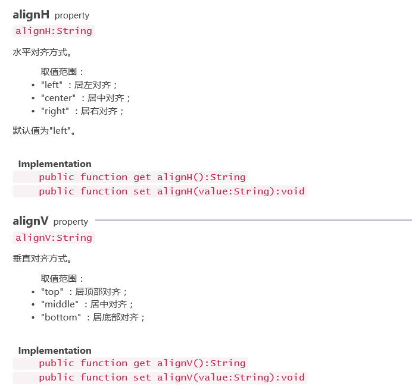

#Alignment mode: horizontal alignment and vertical alignment

> As for alignment mode, it is mainly horizontal alignment and vertical alignment. LayaAir engine can be easily and quickly configured. Let's first understand the parameters of the API, and then introduce them through the example code.

The parameter descriptions are shown in Figs. 1 and 2.

​<br/>
Figure (1) Screen alignment mode


​<br/>
Figure (2) Attributes in alignment patterns


We use the demo of horizontal and vertical center to demonstrate:


```javascript

package 
{
    import laya.display.Stage;
    import laya.webgl.WebGL;
 
    public class SmartScale
    {
        public function SmartScale() 
        {
            //初始化舞台，不支持WebGL时会自动切换至Canvas
            Laya.init(200, 300, WebGL);
       
            //垂直居中对齐，另一种写法：Laya.stage.alignV = Stage.ALIGN_MIDDLE
            Laya.stage.alignV = "middle";
             
            //水平居中对齐，另一种写法：Laya.stage.alignH = Stage.ALIGN_CENTER;
            Laya.stage.alignH = "center";
 
            Laya.stage.bgColor = "#FF0000";
        }
    }
}
```


The operation effect is shown as follows:

​<br/>

Figure (3) Running results of an example


Other alignment modes can modify the values in AlignH and AlignV, and experience different alignment modes in the actual coding process.