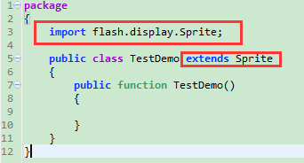
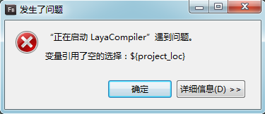

# 新手常见问题：配置环境之后点击运行报错、黑屏


### 一、由于引用AS3原生导致的报错

**现象：**

​        在FB中新建项目之后配置FB的编译环境，环境配置后点击应用-运行报错，如图1所示：

​        	<br/>
​        （图1）

**原因：**

​         报错是由于代码中引入原生Flash AS3的API和继承原生AS3的Sprite导致。LayaAir引擎支持Flash AS3语言的基础语法，但不支持原生AS3 API的引用与继承。

​           <br/>
​        （图2）

**建议：**

​        1、项目右键 -> 属性 -> 构建路径 -> 把flash原生的sdk删掉。确认已在库路径中引入Laya的swc文件、在源路径中引入Laya的引擎库文件。如图3，图4，图5所示。

​        2、开发时需要熟知LayaAir引擎API，使用LayaAir引擎的API进行开发。

​           <br/>
​        （图3）删除原有的sdk

​        <br/>
​        （图4）引入LayaAir引擎库压缩包中带的playerglobal.swc，图中路径仅供参考

​        <br/>
​        （图5）引入引擎库，图中路径仅作参考


### 二、文档类（默认程序）未设置导致的编译报错

**现象：**

​        <br/>
​        （图6）项目编译时出错

**原因：**

当编译时出现图6的错误时，可以肯定就是没有设置文档类（默认程序）导致的。

**解决方案：**

​        <br/>
​        （图7）在FlashBuilder里，需要将入口程序设置为默认应用程序

​        <br/>
​        （图8）在FlashDevelop里，需要将入口程序设为文档类

​            <br/>
​            （图9）在LayaAirIDE里，在asconfig.json工程文件内修改


### 三、多余字符导致的编译报错

**现象：**

​        <br/>
​        （图10）

​        在出现图10的错误后，点击确定，浏览器控制台中报错如图11所示：

​        <br/>
​        （图11）

**原因：**

​        出现这种错误大多数情况都是多余字符等语法非法问题导致的。

**建议：**

​        推荐使用FlashBuilder开发AS3语言版本的LayaAir引擎项目，FlashBuilder中自动语法检查功能比较成熟，会避免因一些不留意的小失误导致报错。


### 四、未选中程序文件导致的编译报错

**现象：**

​        点击或使用快捷键编译时出现图12的报错。

​        <br/>
​        （图12）

**原因：**

​            由于没有鼠标没有选中程序文件，直接运行编译，会导致图12的报错。

**解决方案：**

​            选中有效的程序文件或文件夹，重新编译即可。


### 五、跨域导致的黑屏问题

**现象：**

​            运行项目后，浏览器中显示黑屏，控制台中显示如图13所示：

​        <br/>
​        （图13）   

 

**原因：**
​              浏览器默认是不允许文件跨文件读取的，会涉及到跨域的问题。

**解决方案：**

​                1、本地调试解决：

​                在chrome浏览器快捷方式->右击打开属性->快捷方式一栏->目标末尾添加 `--allow-file-access-frome-files`

​                  2、服务器webServer解决：

​                   需要修改webServer(一般webserver大多数都是 apache、nginx、tomcat等)，在请求特定的域名下加上跨域标识，这里以nginx为例：

```nginx
http {

  ......

  add_header Access-Control-Allow-Origin *;

  add_header Access-Control-Allow-Headers X-Requested-With;

  add_header Access-Control-Allow-Methods GET,POST,OPTIONS;

  ......

}

```


这样就可以实现GET,POST,OPTIONS的跨域请求的支持

也可以 `add_header Access-Control-Allow-Origin http://www.layabox.com;` -- 指定允许的url;

​                    3、如果是数据请求跨域，需要后端语言配合修改，在请求里加上header标识，这里以php语言为例：

`header("Access-Control-Allow-Origin: *");`不一定用`*`，`*`是允许所有的主机跨域访问，你也可以写指定域名下的主机可以访问；
