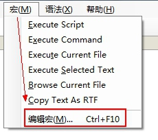
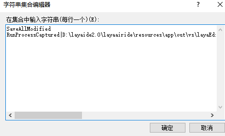

# FlashDevelop开发环境配置

### 第一步： LayaAir Engine下载

#### 1.1 引擎下载

​     使用LayaAirIDE开发的话，下载LayaAirIDE会自带引擎包。若开发者使用第三方工具开发，那需要先下载引擎。在官网首页或者开发者中心菜单中，拥有引擎下载的链接入口，打开链接后会出现引擎各个版本的下载列表，每一个版本均提供AS3、TS、JS三种开发语言，选择对应的开发语言包，去官网下载。

####  1.2 引擎包目录结构介绍 

由于本篇介绍的是FlashDevelop开发环境，所以我们下载AS3版本的引擎包。当下载解压后，可以看到AS3版本的目录结构如下图所示：

​    <br/>
​  图(1)

- "jslibs",“libs”为引擎代码目录，LayaAir引擎库代码处于该目录中。

- “laya.js.exe”为Windows系统下的AS3代码编译器，用于将AS3代码编译为JS代码。

- “Layajs”为苹果MAC系统下的AS3代码编译器，用于将AS3代码编译为JS代码。

  ​


### 第二步 安装Google Chrome浏览器

​    当执行AS3代码编译后，默认调用Chrome浏览器打开运行项目，需要安装此浏览器进行项目调试。已安装的可跳过本步骤。

 

### 第三步 配置FlashDevelop中的AS3编译环境

​    **步骤一**：打开FlashDevelop，在菜单栏里找到“宏”并打开“编辑宏”面板。

​    <br/>
​  图(2)

​    **步骤二**：首先点击“添加”增加一条宏命令，然后选中刚刚增加的宏命令，在“Label”栏修改宏命令的菜单名称为“LayaCompiler”，以及在“Shortcut”栏设置宏菜单快捷键为“Alt+F5”（快捷键设置仅作参考，不要和别的快捷键冲突）。

​    <br/>
​  图(3)

​    **步骤三**：在“Entries”栏的右侧位置点击“...”操作区域，打开“字符串集合编辑器”窗口。

​    <br/>
​  图(4)

​    **步骤四**：在字符串集合编辑器面板里，输入宏指令：

```
SaveAllModified
RunProcessCaptured|D:\layaide2.0\layaairide\resources\app\out\vs\layaEditor\laya\libs\2.0.0beta1\as\layajs.exe;"$(ProjectPath)";iflash=false;quickcompile=true;out=bin/js/bundle.js;subpath=
```

如果编译不启动谷歌浏览器，在上方加入chromerun=false; 即可

```
SaveAllModified
RunProcessCaptured|D:\layaide2.0\layaairide\resources\app\out\vs\layaEditor\laya\libs\2.0.0beta1\as\layajs.exe;"$(ProjectPath)";iflash=false;chromerun=false;quickcompile=true;out=bin/js/bundle.js;subpath=
```

​    <br/>
​  图(5)

**Tips：“D:\layaide2.0\layaairide\resources\app\out\vs\layaEditor\laya\libs\2.0.0beta1\as\laya.js.exe”应为laya.js.exe的实际所在路径。**


​    **步骤五**：点击”确定“完成宏指令配置后，已经完成宏命令“LayaJsCompiler”全部配置，并即时生效，直接点击“关闭”按钮即可。

  

**至此，建立项目前的LayaAir引擎下载，浏览器下载，FlashDevelop环境下的AS3编译器配置就结束了。欢迎开发者在其它章节里继续学习。**

