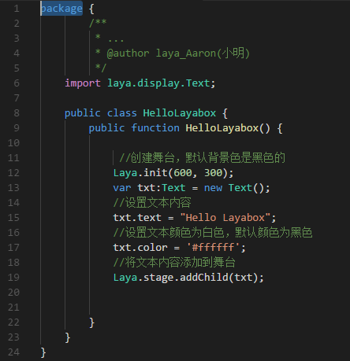
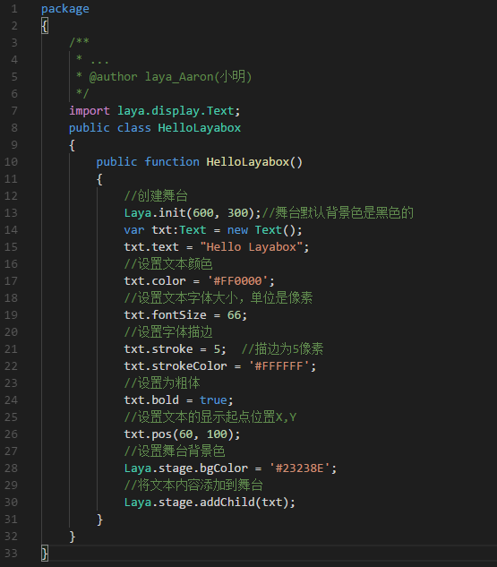

# LayaAirIDE中第一个程序“Hello Layabox”

> 本篇采用AS3语言在LayaAirIDE环境中显示文本Hello Layabox
>
> 学完本篇即为完成LayaAir引擎的第一个程序。在学习本篇前务必保证先阅读完：**《用LayaAirIDE创建AS3项目并详解目录结构》**
>

​   

 **步骤一**：打开LayaAirIDE的AS3项目，在src目录下，点击“新建文件”，如图1所示。

​    <br/>
​   图（1）


​    **步骤二**：输入类名HelloLayabox.as，然后回车，即可生成一个HelleLayabox.as的as3类文件，如图2所示。

​    <br/>
​   图（2）


​    **步骤三**：把HelleLayabox.as设为文档类。点击打开FlashDevelop的工程文件`“项目名.as3proj”`（这里是`myLaya.as3proj`），修改`<compileTargets></compileTargets>`标签内的文档类编译路径，如图3所示，修改为本例中新建的类文件HelleLayabox.as的路径，具体操作如下图所示： 

​    <br/>
​   图（3）


​    **步骤四**：将一个`“Hello Layabox”`的文本添加到舞台。点击打开HelleLayabox.as增加代码如下：
​    <br/>
​   图（4）


**HelleLayabox.as代码：**

```javascript
package 
{
    /**
     * ...
     * @author laya_Aaron(小明)
     */
    import laya.display.Text;
    public class HelloLayabox
    {
        public function HelloLayabox()
        {
            //创建舞台，默认背景色是黑色的
            Laya.init(600, 300);
            var txt:Text = new Text();
             
            //设置文本内容
            txt.text = "Hello Layabox";
             
            //设置文本颜色为白色，默认颜色为黑色
            txt.color = '#ffffff';
             
            //将文本内容添加到舞台 
            Laya.stage.addChild(txt);       
        }
    }
 
}

```

​    

**步骤五**：完成代码编写后，用F5快捷键编译并运行结果如下图所示：

​    <br/>
​   图（5）


​    **步骤六**：如上图所示，`“Hello Layabox”`已经显示出来了，但是比较简陋，下面我们就让`“Hello Layabox”`变的更好看些，继续修改代码如下：

​    <br/>
​   图（6）

**HelleLayabox.as代码：**

```javascript
package 
{
    /**
     * ...
     * @author laya_Aaron(小明)
     */
    import laya.display.Text;
    public class HelloLayabox
    {
        public function HelloLayabox()
        {
            //创建舞台
            Laya.init(600, 300);//舞台默认背景色是黑色的
            var txt:Text = new Text();
            txt.text = "Hello Layabox";
             
            //设置文本颜色
            txt.color = '#FF0000';
            //设置文本字体大小，单位是像素
            txt.fontSize = 66;
             
            //设置字体描边
            txt.stroke = 5;  //描边为5像素
            txt.strokeColor = '#FFFFFF';
             
            //设置为粗体
            txt.bold = true;
             
            //设置文本的显示起点位置X,Y
            txt.pos(60, 100);
             
            //设置舞台背景色
            Laya.stage.bgColor = '#23238E';
             
            //将文本内容添加到舞台
            Laya.stage.addChild(txt);
        }
    }
 
}
```

​  

  运行结果如下图所示：

​    <br/>
​   图（7）


至此，如果您能跟随本篇入门教程，完成上图的显示，恭喜您入门成功，我们已经在LayaAirIDE中完成了第一个采用AS3语言开发的HTML5程序，也说明了LayaAir的开发环境配置无误。更多LayaAir引擎开发的API使用方法，请前往官网Layabox开发者中心查看在线API与在线DEMO

