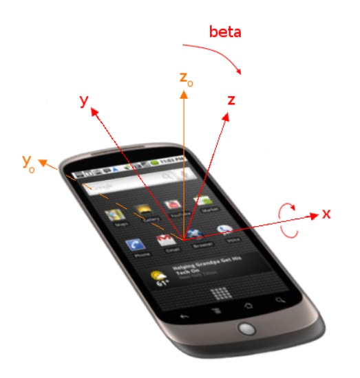

#Lalaya. device. motion: gyroscopes and accelerometers

[TOC]

Laya.device.motion has four classes for developers to use, namely acceleration info, accelerometer accelerator, gyroscope and rotationinfo. This section describes the laya. device. motion API in detail.

##1. Gyroscope

​`Gyroscope`adopt`change`Events monitor changes in device direction. The event has two callback parameters:

##-`absolute`——If the orientation provided by the equipment is based on the difference between the equipment coordinate system and the earth coordinate system, then`true`If the device fails to detect the Earth's coordinate system,`absolute`by`false`。 `rotationInfo`—— RotationInfo type, including`alpha`,`beta`,`gamma`Three values, discussed in detail below.

​`alpha`,`beta`and`gamma`Attributes must indicate the direction of the device in the form of a transformation from a coordinate system fixed on the earth to a coordinate system fixed on the device. The coordinate system must be adjusted as described below.

The Earth coordinate system is a "east, north and upper" system located at the user's position. It has three axes and the ground is tangent to the user location of spheriod of the 1984 World Geodetic System.

- The East (X) is on the ground, perpendicular to the North axis, and positive to the east.

- North (Y) is on the ground, and North (pointing to the North Pole).

- The upper (Z) is perpendicular to the ground and positive upward.

For a mobile device, such as a phone or a tablet, the device coordinate system is defined in the standard direction of the screen. If the orientation of the screen changes when the device rotates or unfolds the sliding keyboard, this will not affect the orientation of the coordinate system of the device.

- On the screen or keyboard plane, the right side of the screen or keyboard is positive.

- y is on the screen or keyboard screen, positively above the screen or keyboard.

-Z is perpendicular to the screen or keyboard screen, leaving the screen or keyboard positive.

Rotation must use the right-hand rule, that is, to rotate forward along an axis and clockwise from the direction of that axis. Starting from the coincidence of the two systems, the following rules are applied to the rotation:

One####Rotate on the Z axis of the equipment coordinate system`alpha`Degree.`alpha`The scope is [0,360].

<br/>
(Fig. 1)

Two####Rotate on the x-axis of the equipment coordinate system`beta`Degree.`beta`The scope of is [- 180, 180].

<br/>
(Fig. 2)

Three####The Y-axis of the coordinate system of the equipment is an axis and rotates.`gamma`Degree.`gamma`The scope of is [- 90, 90].

<br/>
(Fig. 3)
The following illustration shows how to obtain rotation azimuth information:


```typescript

private var info:Text;
 
public function Gyroscope_Sample() 
{
 Laya.init(550, 400);
  
 info = new Text();
 info.fontSize = 50;
 info.color = "#FFFFFF";
 info.size(Laya.stage.width, Laya.stage.height);
 Laya.stage.addChild(info);
  
 Gyroscope.instance.on(Event.CHANGE, this, onDeviceorientation);
}
 
private function onDeviceorientation(absolute:Boolean, rotationInfo:RotationInfo):void 
{
 info.text = 
 "alpha:" + Math.floor(rotationInfo.alpha) + '\n' +
 "beta :" + Math.floor(rotationInfo.beta) + '\n' +
 "gamma:" + Math.floor(rotationInfo.gamma);
}
```


##2. Accelerometer

​`Accelerator`Class A periodic motion sensor detection activity for sending equipment. This data represents the motion of the device on the 3D axis. When the device moves, the sensor detects the movement and returns the accelerated coordinates of the device. Even at rest, acceleration coordinates containing gravity can be obtained.

​`change`The callback function of an event has the following parameters:

##-`acceleration`-`AccelerationInfo`Type. Provides acceleration information of the host device relative to the Earth coordinate system in the form of the principal coordinate system defined in the chapter of the gyroscope.`m/s^2`。 `accelerationIncludingGravity`-`AccelerationInfo`Type. As an alternative to the implementation of acceleration data that cannot be provided to exclude the effects of gravity (such as the lack of gyroscopes), acceleration data affected by gravity can be provided. This is not very useful for many applications, but providing this information means providing maximum support. In this case,`accelerationIncludingGravity`Attributes provide acceleration information for the host device, plus an anti-gravity acceleration with equal acceleration and opposite acceleration. Its manifestation is the principal coordinate system defined in the chapter of gyroscope. The unit of accelerated information is`m/s^2`。
##-`rotationRate`-`RotationInfo`Type. Property provides the rate of rotation of the host device in space, which is expressed as the rate of angular change defined in the gyroscope chapter. The unit must be`deg/s`。 `interval`—— The interval between acquisitions of data from hardware in milliseconds.

###2.1 Obtaining the Physical Direction Motion Information of Equipment

The accelerometer axis is the physical direction of the device, which means that when you rotate the device, the accelerometer axis will rotate with it.

Following is a demonstration of acquiring device motion information:


```typescript

private var info:Text;

public function Accelerator_Sample()
{
	Laya.init(Browser.width, Browser.height);
	
	info = new Text();
	info.fontSize = 50;
	info.color = "#FFFFFF";
	info.size(Laya.stage.width, Laya.stage.height);
	Laya.stage.addChild(info);
	
	Accelerator.instance.on(Event.CHANGE, this, onMotoin);
}

private function onMotoin(acceleration:AccelerationInfo, accelerationIncludingGravity:AccelerationInfo, rotationRate:RotationInfo, interval:int):void
{
	info.text = 
		'acceleration:(' + acceleration.x.toFixed(3) + ', ' + acceleration.y.toFixed(3) + ', ' + acceleration.z.toFixed(3) + ')\n' +
		'accelerationIncludingGravity:(' + accelerationIncludingGravity.x.toFixed(3) + ', ' + accelerationIncludingGravity.y.toFixed(3) + ', ' + accelerationIncludingGravity.z.toFixed(3) + ')\n' +
		'rotationRate: alpha ' + Math.floor(rotationRate.alpha) + ', beta ' + Math.floor(rotationRate.beta) + ', gamma ' + Math.floor(rotationRate.gamma) + '\n' +
		'interval: ' + interval;
}
```


### **2.2 Obtaining the Directional Motion Information of Device Display**

Since we may need to display the direction of the operation information, this means that even if the device is rotated, the accelerometer axis does not change, such as the Y axis is always perpendicular. Use`Accelerator.getTransformedAcceleration()`The operation information in the display direction can be obtained.

The code in the preceding example`onMotion`In the function, use`AccelerationInfo`First use`Accelerator.getTransformedAcceleration()`Transform information:


```typescript

private function onMotoin(acceleration:AccelerationInfo, accelerationIncludingGravity:AccelerationInfo, rotationRate:RotationInfo, interval:int):void
{
	acceleration = Accelerator.getTransformedAcceleration(acceleration);
  	accelerationIncludingGravity = Accelerator.getTransformedAcceleration(accelerationIncludingGravity);
  	......
}
```
