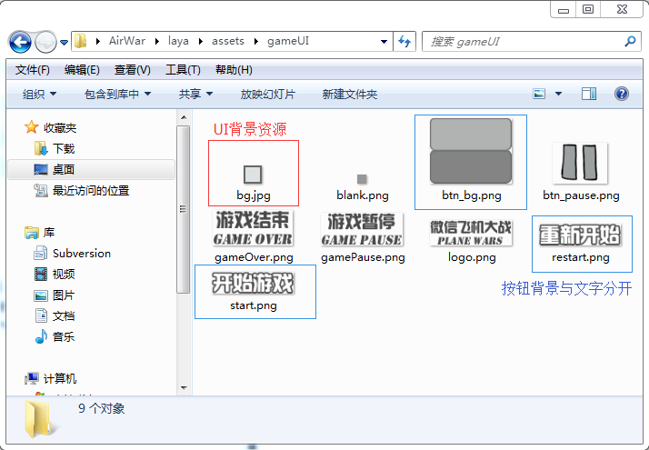

#1. Requirement Analysis and Resource Preparedness of Aircraft Battle Project

> This tutorial is different from the old video tutorial "Weixin Aircraft Battle". LayaAirIDE editor is more used to develop this tutorial, which increases the function and production tutorial of process UI, reduces the amount of code, and optimizes the program structure. Developers who have studied video tutorials can also reorganize their studies according to this tutorial.

###Preface

Remembering the Wechat game Aircraft Warfare, you can play it directly without downloading, and you can also share your rankings. Countless people are crazy about it. This is the spread charm of HTML 5 game.

In line with the ideal of paying tribute to the classics, the author will demonstrate how to use LayaAir to develop quickly and reproduce the classic games. First of all, declare that the scene and role resources in the game are all owned by the original developer. This example is only for research and learning. The source code and resources should not be commercialized.

**Game Play Address**:[http://layabox.github.io/layaair-examples/](http://layabox.github.io/layaair-examples/)

Game project source code:[https://github.com/layabox/layaair-doc/tree/master/project/AS3/AirWar](https://github.com/layabox/layaair-doc/tree/master/project/AS3/AirWar)

 （图1） 

  (Figure 2)

  (Figure 3)

###Project Requirement Analysis

At the beginning of all game projects, project requirement analysis accounts for a large proportion of time. After planning the project requirements, experienced programmers will also build their own logical thinking map, so that the program architecture considerations are more reasonable and development ideas are clearer.

Therefore, this tutorial provides a basic logical mind map for reference according to the development needs. It is suggested that developers develop the habit of project development planning.

< br / > (Figure 4)

According to the above mind map analysis, we can draw the following development ideas:

1. Visual material production is divided into two steps. One is editing UI, drawing effects, outputting picture resources matching IDE naming rules, and then editing UI pages. The other is visual character animation production, which produces character animation effect through IDE timeline, WYSIWYG. The program directly calls animation to generate files, and also reduces the amount of code.
2. Game process control, processing the process pages of game start, game in and game end interface, and realizing its UI function.
3. The main logic functions of the game are developed step by step, including game maps, game roles, game manipulation, game logic, game upgrade, etc.

After we have the basic development ideas, let's start the game preparation work first.

###New LayaAir Project

Open LayaAirIDE and create a new empty project. As shown in Figure 5, the project name can be customized. In this case, ActionScript 3.0 is used as the version, and other languages are the same. After clicking the Create button, the project directory appears in the IDE's default Code Mode project manager.

< br / > (Figure 5)

"Project directory structure and how to create project and environment configuration with Laya air ide" has been mentioned in "technical document - 2D basic chapter - Quick Start", so we will not talk about it here. Students who don't understand are advised to take a look first.

High-rise buildings start at the foot. Everything has a beginning. From simplicity to difficulty, we begin with dealing with art resources.

 

###Game resource preparation

Open the generated project, click on "Design Mode" and drag the image resources of art production to "Resource Manager". Or right-click to open the directory and copy it into it. The directory is "... AirWar laya assets". When the copy is finished, the editor needs to be refreshed (shortcut F5).

In Resource Manager, each folder automatically generates a packaged atlas resource when the editor exports (shortcut F12). It is recommended that the size of atlas should not exceed 1024 x 1024. If the size of a single atlas exceeds 512 x 512, it is not recommended to pack it. Open menu "**Project settings**"Panel (shortcut key F9) to automatically package the size limit of the atlas.

Game resource folder and resource size management are important. If handled well, the loading speed will be faster and the operation efficiency will be higher. For example, to make the game's resource material (Figure 6), we divided it into two folders, UI resource folder and character animation resource folder, and a background image over 512 is not packaged.

  （图6）

In the GameUI resource folder (Figure 7), the background resources of bj.jpg are smaller and can be enlarged by zooming in the nine-pane. The text of the button is separated from the background of the btn_bg.png button, and the background of the button can be used repeatedly to save resources.

   (Figure 7)
(Fig. 6)

The GameRole folder only stores character animation resources (Figure 8) for animation in IDE.

  (Figure 8)

###Game resources release

When the resource file is ready, you can try to publish the resource (shortcut key F12), and generate the catalog of the atlas resource as follows: "... AirWar bin h5 res atlas" (figure 8). Loading the. Atlas or. Josn file in the game program can obtain the corresponding image resources.

  (Figure 8)

Through the above steps, we clearly sorted out the project development ideas, and prepared the game art material resources. Next, we begin to formally enter the game production process, starting with visual UI and animation production.