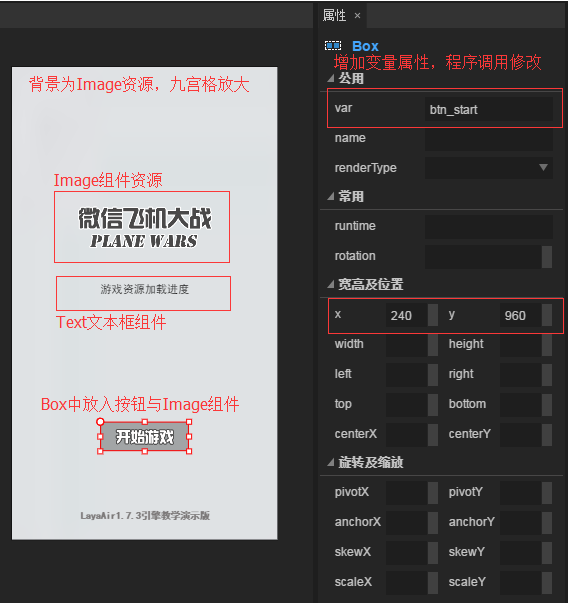
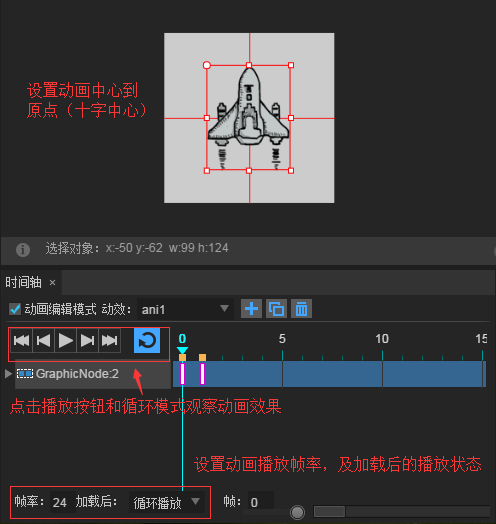

#2. Editor Visualization Resource Making

###Overview of game visualization resources

In the previous section of the course, we analyzed the development ideas, prepared and classified the resources of art materials. In this lesson, don't rush to knock on the code, we make UI interface and animation before we do logic processing. LayaAirIDE is a powerful visual editing tool. The visible parts of the game can be implemented in IDE.

These visual elements include various components, icons, UI pages, animations, maps, particles, etc. If students are not so familiar with IDE components, you can see "Technical Documents - LayaAir IDE Chapter" for a detailed tutorial. Let's start to make the visual resources in "airplane battle" step by step.

###Create game pages

In this example, we create the start page, the in-progress page, the end page and the game map page in the project manager in turn. (Fig. 1 and 2).

In order to adapt to the screen of popular mobile phone, the page resolution is set to 720X1280. We choose the default View type page on the game map page while the game is in progress. Dialog type with pop-up animation effect, so "start" and "end" pages use this type.

  (Fig. 1)

  (Figure 2)

Refer to the table below for the corresponding instructions for the new page.

| Game IDE Visualization File | File Description|
| -------------------------------------------------------------------------------------------------------------------------------------------|
| GameBg.ui | Game Scroll Map, View Page Type|
| GameOver.ui | Game End Page, Dialog Page Type|
| GamePlay | In-game Page, View Page Type|
| GameStart.ui | Game Start Interface, Dialog Page Type|

####Game Process Page Making

After creating and opening the GameStart.ui start page, drag the corresponding components or resources from the resource or component manager, adjust the location and composition by IDE tools, and adjust the element hierarchy and nesting relationship by IDE hierarchical interface (similar to photoShop layer). The right attributes bar can also manipulate the width and height of the elements and rotate and zoom, and finally achieve the requirements of the art rendering (Figure 3).

After the page layout is adjusted, the variable name (var attribute) is added to the elements that need to be modified by the program. For example, the Text component VaR of the progress loading text box is named txt_load, and the Box component VaR of the button is named btn_start.

GamePlay, GameOver pages and GameStart pages are basically the same way to make (Figure 4) (Figure 5), and then do not describe more.

  (Figure 3)

  (Figure 4)

  (Fig. 5)

####Game map background

Create and open the GameBg. UI page. We drag two background. PNG from the Explorer to the Scene Editor for background use. The upper and lower sides are continuous and aligned for continuous rolling use of the map. The variable names (var attribute) of the two graphs are set to BG1 and bg2. The y coordinate of BG2 is -1280.

Of course, only a long bipartite continuous graph can be used. Some games have two layers on the background, one is the vision (slow rolling) and the other is the close-range (fast rolling).

 （图6）

At this point, the game page is completed, saved and released (shortcut F12). Under Code Mode, we can see that UI folders are generated in the project  SRC directory, which are four UI classes generated by IDE publishing, and can be loaded into the stage after the program is instantiated.

###Button Animation in Game Pages

Sometimes we can add animation to some buttons or interface elements to make the interface more effective. For example, the "restart" button in the end page can jump up after clicking. Let's take this example to learn how to make it.

1. Select the "Restart" button in the Scene Editor. Then check the "animation editing mode" in the timeline interface, and the play control button and timeline will appear (Figure 7).

  (Figure 7)

2. Select the position around the 8th frame and move the button upward by about 10 pixels. The corresponding object name and two key frames will appear on the time axis. Click on the small triangle on the left of the object name, and there will be y attribute below. There are also two corresponding key frames. This is because we have changed the attributes on the Y axis of the object. Of course, if you change other attributes to generate animation, such as x, alpha, scaleX, etc., it will also appear below the object name (Figure 8).

Click on the Play Control button above the object name, and we can see the animation! If you think the animation is too fast or too slow, you can move the key frame around the mouse to the right position.

  (Figure 8)

3. In order to achieve richer animation effect, select the first frame on the y-axis, there will be a "slow" selection on the right "frame attribute" interface (Figure 8). After checking, select the slow type as elastic Out, then the button will have a quick rebound effect. Students can also choose other slow motion to try.

Finally, we changed the ani_restart name for this animation to facilitate program calls.

Note: Animation editor can produce many cool animation effects. For a detailed tutorial, please refer to "technical documentation - layaair ide chapter - creating with IDE".

###Game Character Animation

In the project manager, right-click to create and open GameRole. ani character animation (shortcut key Ctrl + N), we use the role resources to create all kinds of animation resources for the game.

The default Graphic Animation (Figure 9) is chosen for the character animation type. The size of the animation page is invalid in the game, so it can be set according to preferences. Because our aircraft character is black and white, we adjust the reference color to be non-black.

< br / > (Figure 9)

After creating the animation file, click on the role resource folder GameRole in Resource Manager, which contains the resources we need to make animation, and the resources correspond to the type of role and the animation status. According to the requirements, our role types are divided into four types: hero, enemy 1-3, props ufo1-2, and bullet 1-2. The animation status is flying, injured hit, dead down.

For example, the resource name is hero_down1, which represents the first animation of the hero's death state. Here, we can use a table to make it clear.

| StatusRole TypeMain CharacterHeroEnemy 1Enemy 2Enemy 3BossPropsBullets|
| ---------------------------------------------------------------------------------------------------------------------------------------------------------------------------------------------------------------------|
|Flying | hero | fly1-2 | enemy1 | fly1 | enemy2 | fly1 | enemy3 | fly1-2 | ufo1 | bullet1-2|
|Injured | no | no | enemy2 | HIT1 | enemy3 | HIT1 | |.|
| Death | hero_down1-4 | enemy1_down1-4 | enemy2_down1-4 | enemy3_down1-4|||

Method and Step of Creating Character Animation

1. Check "Animation Editing Mode" in the Animation Editor Interface. Play control buttons and time axis will appear (Figure 10).

  (Fig. 10)

2. Select one or more animation resource pictures in Explorer and drag them onto the timeline to generate animation (Figure 11).

For example, to create a protagonist flight animation, select hero_fly1 and hero_fly2 and drag them onto the time axis to generate the protagonist's flight animation, open the loop button, and then click on the playback to observe the effect. If you think the animation is too fast or slow, you can adjust the frame rate or the interval between two frames.

< br / > (Figure 11)

3. adjust the animation resources in the scene editor to the origin of animation. In the project program, the role collision is calculated according to the radius of the role center, so we need to adjust the center of the role animation to the origin, so we can write less code (Figure 10).

The frame rate is the playback frequency of the animation file itself, and the main frame rate in the game program will not interfere. In this case, all animations do not adjust the time interval of frames, only set the frame rate to 12 frames.

Note: after loading, the play state is only valid when the animation is directly placed in the UI. The animation loaded by the program needs to be played by the play () method of the animation (Figure 10).

  (Fig. 10)

4. Modify the dynamic name. The dynamic name in IDE is ani_0by default, which is not convenient to use in the game program. It needs to be modified into a combination name to distinguish the character type and animation state.

When switching the animation, use play () method to switch the animation, such as hero_fly, hero_die in the following figure, and call hero. play (0, true, "hero_fly") to play the main character's flight animation. When hero. play (0, true, "hero_die") is called, the leading character's death animation is played.

In this case, because the animation resources are small, we store all the character animations in GameRole. ui, including the protagonists, enemies, bullets and props. After clicking the "Add" button, a new empty time axis appears. Repeat the above four steps to complete the animation of all the characters. The added action will appear in the action drop-down list. Select one of the animations to edit (Figure 11).

< br / > (Figure 11)

To sum up, in this lesson, we have produced all the game visualization materials, which lay a good foundation for the development of the post-game sequence. In the process of project development, UI interface changes a lot. At this time, colleagues in art posts can also learn how to make IDE pages and animations to improve work efficiency. After the art is finished, the program can be released and processed by UI logic with some simple adjustments.