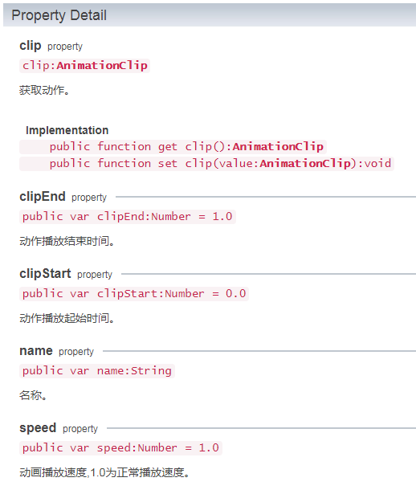

# 动画状态

###### *version :2.1.0beta   Update:2019-6-13*

​		在前面的**播放动画**这一节中，我们简单的使用了AnimatorState 动画状态 。他能指定动画播放某一帧到某一帧，可在原有动画的基础上创建增加动画剪辑（片断）。这一小节我们详细讲解下动画状态。

<br>(图1)

 看过API 我们再来查看之前的代码就更好理解了。动画状态还可以添加脚本，这个会在后面的一节单独介绍。

```typescript
//获取精灵
var monkey:Sprite3D = Loader.getRes("res/threeDimen/skinModel/LayaMonkey/LayaMonkey.lh");
scene.addChild(monkey);
//获取角色动画组件
var ani:Animator = monkey.getChildAt(0).getComponent(Animator);
//创建一个动画动作状态
var state1:AnimatorState = new AnimatorState();
//设置动作状态的名称
state1.name = "hello";
//设置动作状态播放的起始时间（起始时间与结束时间的设置为0-1的百分比数值）  要截取的时间点 / 动画的总时长
state1.clipStart = 10/40;
//设置动作状态播放的结束时间
state1.clipEnd = 20/40;
//得到默认动画赋值给Clip（getDefaultState默认动画为Unity中animation的数组顺序0下标的动画）
state1.clip = ani.getDefaultState().clip;
//动画播放是否循环
state1.clip.islooping = true;
//添加动画状态到动画组件里
ani.addState(state1);
//播放动画
ani.play("hello");
```

