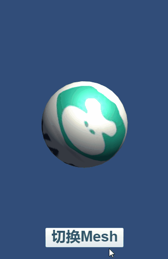

# 模型的功能介绍

###### *version :2.0.2beta   Update:2019-4-26*

3D模型在有时候会由多个子模型对象构成，例如场景模型.ls，基本都是由多个物体模型与材质构成，外层是Sprite3D容器，内部才是真正的模型MeshSprite3D或SkinnedMeshSprite3D。并且还可能会有多个层次嵌套。

#### 获取子对象模型网格

在编写游戏逻辑时，有的模型需要被修改，或者是切换与删除模型、或者是给模型加组件、或者是获取模型上的动画组件及修改模型的材质等。这都需要从加载的模型中去获取子对象，我们可以通过 **getChildAt()、getChildByName()** 方法去获取子对象，这与2D引擎获取子对象方法一样。

下面我们来加载一个场景的.ls文件，然后获取它的子对象。在获取子对象之前，建议打开.ls文件查看模型的父子层级关系，因为在制作模型时，我们也不能确定模型是由多少个子对象模型构成，及它们的命名规则。

**Tips**：在3ds max中建模时，建议对模型的子对象取名，并且制定项目的资源命名规则，不要用默认的模型名称。

```typescript
//初始化3D场景
var scene:Scene3D = Laya.stage.addChild(Loader.getRes("res/threeDimen/scene/ChangeMaterialDemo/Conventional/scene.ls")) as Scene3D;
//获取球型精灵
var sphere:MeshSprite3D = scene.getChildByName("Sphere") as MeshSprite3D;
//获取精灵的mesh
var sphereMesh:Mesh = sphere.meshFilter.sharedMesh;
//此时已经拿到了场景中的球体的网格
```


#### 修改子对象模型网格

获取子对象时还应注意一个问题，就是模型与材质未加载完成，是无法获取子对象的，因此需要资源预加载，或异步加载时进行完成事件监听。在这个demo中事先使用了 `Laya.loader.create`来预加载资源。

在游戏中，我们经常打造角色换装系统，有时是换模型，有时是换贴图，有时候两者都换。因为材质贴图部分在后续章节中才讲解，因此本章节中我们只介绍更换模型网格的方法。

模型MeshSprite3D或SkinnedMeshSprite3D中有 **meshFilter** 属性，它是一个网格过滤器类实例，这个属性中的**sharedMesh**  就是模型的网格，可以对它进行重新创建更换及销毁。

在下面示例中，我们给按钮加了添加了个点击事件。每次点击index值自加，然后根据index值修改从场景ls中获取到的模型网格。

```typescript
//新建四个mesh
var box:Mesh = PrimitiveMesh.createBox(0.5, 0.5, 0.5);
var capsule:Mesh = PrimitiveMesh.createCapsule(0.25, 1, 10, 20);
var cylinder:Mesh = PrimitiveMesh.createCylinder(0.25, 1, 20);
var cone:Mesh = PrimitiveMesh.createCone(0.25, 0.75);
var index:int = 0;

//.............按钮点击事件 监听
changeMeshButton.on(Event.CLICK, this, function():void{
    index++;
    if (index % 5 === 1 ){
        //切换mesh
        sphere.meshFilter.sharedMesh = box;
    }
    else if (index % 5 === 2){
        //切换mesh
        sphere.meshFilter.sharedMesh = capsule;
    }
    else if(index % 5 === 3){
        //切换mesh
        sphere.meshFilter.sharedMesh = cylinder;
    }
    else if(index % 5 === 3){
        //切换mesh
        sphere.meshFilter.sharedMesh = cone;
    }
    else{
        //切换mesh
        sphere.meshFilter.sharedMesh = sphereMesh;
    }
});
```

效果如图1:

<br>(图1)