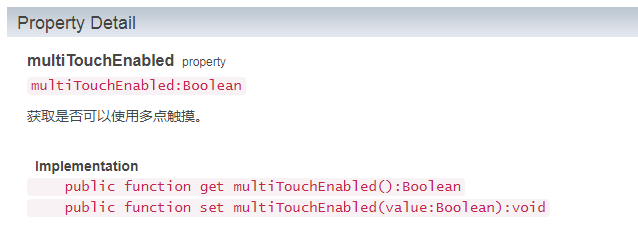
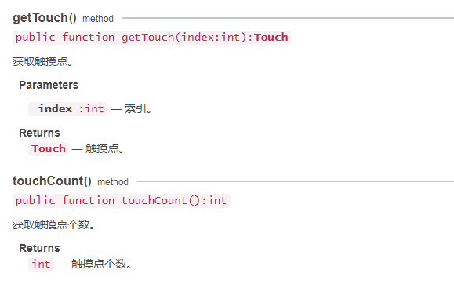
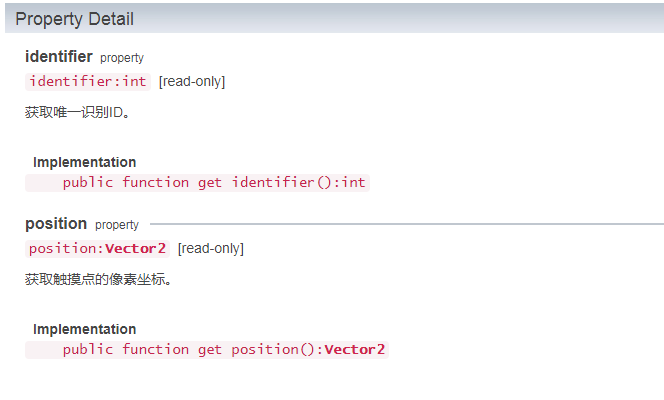
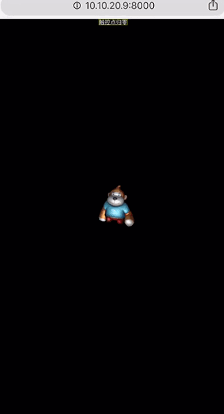

# 多点触控的使用

###### *version :2.1.1   Update:2019-8-2*

在LayaAir3D中也是支持多点触控的，甚至用起来要比2D中更为方便。2D中的多点触控是依托于`Event`事件中的`touches:Array`[read-only] 触摸点列表属性，这样操作起来是比较麻烦的。但是在3D中使用到的是scene场景中的`input:Input3D`3D输入属性，能在任何地方获取，使用起来是非常的方便的。

> **注意事项：**在多点触控的情况下，只会发射一条射线用于检测，该点是多个触碰点的中心点。如果需要发射多个射线用于检测，需要开发者自己处理。

**Input3D详解**

> 属性

<br>(图1)

> 方法

<br>(图2)

**Touch属性**

<br>(图3)

下面的示例代码节选自官方示例([demo地址](https://layaair2.ldc2.layabox.com/demo2/?language=ch&category=3d&group=MouseInteraction&name=MultiTouch))。

在主类中给猴子添加了脚本。同时在舞台上添加另一个方便显示输出的`Text`文本。

脚本类：

```typescript
//重写脚本中的onUpdate方法
override public function onUpdate():void {
    var touchCount:int = _scene.input.touchCount();
    if (1 === touchCount){
        //判断是否为两指触控，撤去一根手指后引发的touchCount===1
        if (isTwoTouch){
            return;
        }
        _text.text = "触控点为1";
        //获取当前的触控点，数量为1
        var touch:Touch = _scene.input.getTouch(0);
        //是否为新一次触碰，并未发生移动
        if (first){
            //获取触碰点的位置
            lastPosition.x = touch.position.x;
            lastPosition.y = touch.position.y;
            first = false;
        }
        else{
            //移动触碰点
            var deltaY:int = touch.position.y - lastPosition.y;
            var deltaX:int = touch.position.x - lastPosition.x;
            lastPosition.x = touch.position.x;
            lastPosition.y = touch.position.y;
            //根据移动的距离进行旋转
            (owner as Sprite3D).transform.rotate(new Vector3(1 * deltaY /2, 1 * deltaX / 2, 0), true, false);
        }
    }
    else if (2 === touchCount){
        _text.text = "触控点为2";
        isTwoTouch = true;
        //获取两个触碰点
        var touch:Touch = _scene.input.getTouch(0);
        var touch2:Touch = _scene.input.getTouch(1);
        //是否为新一次触碰，并未发生移动
        if (first){
            //获取触碰点的位置
            disVector1.x = touch.position.x - touch2.position.x;
            disVector1.y = touch.position.y - touch2.position.y;
            distance = Vector2.scalarLength(disVector1);
            first = false;
        }
        else{
            disVector2.x = touch.position.x - touch2.position.x;
            disVector2.y = touch.position.y - touch2.position.y;
            var distance2:Number = Vector2.scalarLength(disVector2);
            //根据移动的距离进行缩放
            _camera.transform.translate(new Vector3(0, 0, -0.01 * (distance2 - distance)));
            distance = distance2;
        }	
    }
    else if (0 === touchCount){
        _text.text = "触控点归零";
        first = true;
        lastPosition.x = 0;
        lastPosition.y = 0;
        first = true;
        isTwoTouch = false;
    }
}
```

<br>(图4)