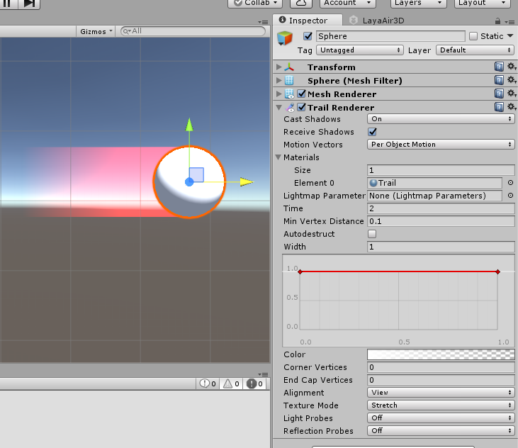
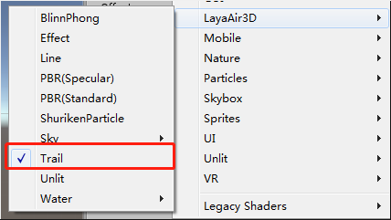
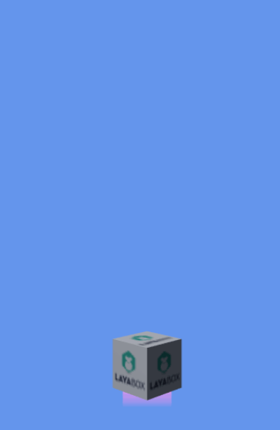

# 在Unity中导出拖尾系统

###### *version :2.1.1beta   Update:2019-8-2*

在LayaAir3D插件是支持 **TrailRenderer**组件导出的。

我们首先在Unity3D中给一个Sphere添加上 `Trail Renderer`，并且简单的制作了一个拖尾效果。效果如图1所示。

<br>(图1)

编辑好之后好之后我们选择导出预设。

**Tip**：拖尾所使用的的材质只能是`LayaAir3D/Trail Shader`，如果使用的是其他Shader在导出时会自动转成该Trail Shader。自动转换会导致实际效果与设计时的效果有较大偏差，所以在设计时就应当注意这一点。

<br>(图2)

**注意:**带拖尾的对象导出后就会是拖尾精灵，并不会携带模型，像在这里导出后就没有Sphere。所以导出后需要再添加到对象身上。

这里我们使用IDE的3D示例项目，并且简单修改一下GameUI类代码。

```typescript
//....上面为原本示例代码,去掉了示例代码的旋转摄像机
//加载拖尾
Sprite3D.load('LayaScene_tst/Conventional/Sphere.lh',Handler.create(this,function(sp:Sprite3D):void{
    //将加载的拖尾添加给示例盒子
    box.addChild(sp);
    //为了体现效果，我们移动盒子和摄影机观察效果
    Laya.timer.frameLoop(1,this,function():void{
        //使用差速来体现移动
        box.transform.translate(new Vector3(0,0.05,0),false);
        camera.transform.translate(new Vector3(0,04,0),false);
    });
}));
```

<br>(图3)

