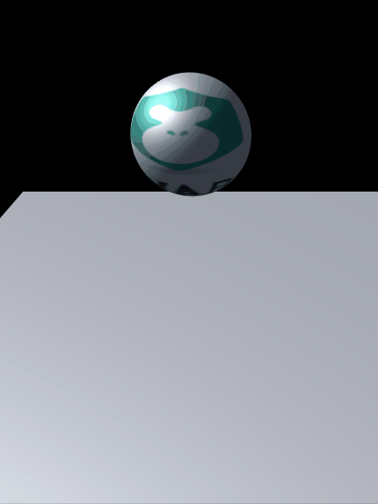

# LayaAir3D之物理入门

####Quickly Open the Journey of 3D Physics

Below we will use the LayaAir engine to start a 3D physics project quickly, and use AS language as a tutorial, a simple demonstration of using engine code to achieve a basic 3D physics application. Let's preview the effect:




In Maine's class, we build a 3D physical world, and add the elements necessary for a simple 3D physical world (rigid body and Collider components). We will introduce these conceptual knowledge in detail in the follow-up tutorial, and gradually lead you to understand the 3D knowledge.


For this simple Demo, we just created the physical effect of a ball falling naturally by gravity and colliding with another ball. We can tap the code manually to experience the effect, or we can copy the code directly, and learn the knowledge points in detail in subsequent documents.

The main class code is as follows:


```typescript

package {

    import laya.display.Stage;
    import laya.utils.Stat;
    import laya.d3.core.scene.Scene3D;
    import script.SceneScript;
  
    public class Main {
        public function Main() {
            //初始化引擎
            Laya3D.init(0, 0);
            //适配模式
            Laya.stage.scaleMode = Stage.SCALE_FULL;
            Laya.stage.screenMode = Stage.SCREEN_NONE;
            //开启统计信息
            Stat.show();
           Laya.loader.load("res/layabox.png",Handler.create(this,loadComplete));
        }        
        private function loadComplete():void{
            var _scene:Scene3D = new Scene3D();
            Laya.stage.addChild(_scene);
            _scene.addComponent(SceneScript);
        }
    }
}
```

Scenario script code:

```typescript

package script
{
    import laya.d3.core.scene.Scene3D;
    import laya.d3.core.material.BlinnPhongMaterial;
    import laya.webgl.resource.Texture2D;
    import laya.d3.resource.models.SphereMesh;
    import laya.d3.resource.models.PlaneMesh;
    import laya.d3.physics.PhysicsCollider;
    import laya.d3.physics.Rigidbody3D;
    import laya.d3.physics.shape.SphereColliderShape;
    import laya.d3.physics.shape.BoxColliderShape;
    import laya.physics.RigidBody;
    import laya.d3.core.Camera;
    import laya.d3.core.MeshSprite3D;
    import laya.d3.core.Sprite3D;
    import laya.d3.core.light.DirectionLight;
    import laya.d3.math.Vector3;
    import laya.d3.component.Script3D;
    import laya.utils.Handler;

    public class SceneScript extends Script3D{
        private var scene:Scene3D
        public function SceneScript(){

        }

        override public function onAwake():void{
            scene = owner as Scene3D;
        }
    
        override public function onStart():void{
            var camera:Camera = (scene.addChild(new Camera( 0, 0.1, 100))) as Camera;

            camera.transform.translate(new Vector3(1, 6, 10));
            camera.transform.rotate(new Vector3( -30, 0, 0), true, false);
            camera.clearColor = null;
            
			var directionLight:DirectionLight = scene.addChild(new DirectionLight()) as DirectionLight;
            directionLight.diffuseColor = new Vector3(0.6, 0.6, 0.6);
            directionLight.transform.worldMatrix.setForward(new Vector3(1, -1, 0));

            //添加自定义模型
            var sphere:MeshSprite3D = scene.addChild(new MeshSprite3D(new SphereMesh(1,100,100))) as MeshSprite3D;
            sphere.transform.rotate(new Vector3(0,90,0),false,false);
			sphere.transform.translate(new Vector3(0,3,0));
            sphere.meshRenderer.material = new BlinnPhongMaterial;
            var material:BlinnPhongMaterial = new BlinnPhongMaterial();
            Texture2D.load("res/layabox.png", Handler.create(null, function(tex:Texture2D):void {
                material.albedoTexture = tex;
            }));
            sphere.meshRenderer.material = material;
            
			//添加物理组件
			sphere.addComponent(PhysicsCollider);
			//给球添加刚体
			var rigid:Rigidbody3D = sphere.addComponent(Rigidbody3D);
			//有刚体的shape要加在刚体上
			rigid.colliderShape = new SphereColliderShape(1);
            
			//添加一个地板
			var floor:MeshSprite3D = scene.addChild(new MeshSprite3D(new PlaneMesh(10,10))) as MeshSprite3D;
			//给地板添加物理组件
			var floorCollicar:PhysicsCollider = floor.addComponent(PhysicsCollider);
			// 添加collidershape
			floorCollicar.colliderShape = new BoxColliderShape(10,0,10);
            //克隆一个球                
            Laya.timer.once(1000,this,function():void{
              //一秒之后复制一个球
                 var cloneSphere:MeshSprite3D = Sprite3D.instantiate(sphere) as MeshSprite3D;
                //设置位置偏移
                 cloneSphere.transform.translate(new Vector3(1,4,0));
                //添加到场景
                scene.addChild(cloneSphere);
            });
        }
    }  

}
```


The prite.instantiate method for object replication can be understood from the API, which is more convenient than clone method. Specific habits can be used according to personal habits and scenarios.

		


​


  **[tip: In this case, it involves adding Physics Collider and Rigid Body3D to objects using code. When an object has a rigidbody, shapes need to be added to the collidershape of the rigidbody, and if not, shapes need to be added to the collidershape of the Physics Collider. ]**

Then we add elasticity and rolling friction to the ball.


```java

.......
  //添加一个重量
  rigid.mass = 10;
  //添加弹力
  rigid.restitution = 1;
  //添加滚动摩擦力
  rigid.rollingFriction = 0.5
.......
```


Look at the effect of the modification:

