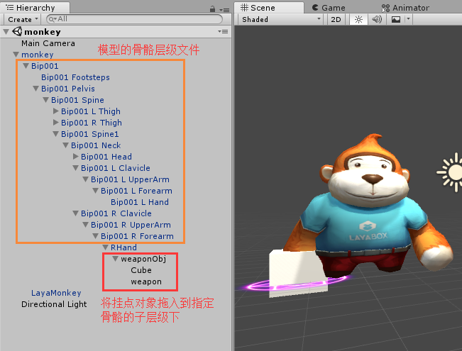

## LayaAir3D之骨骼挂点

### 骨骼挂点概述

骨骼挂点技术在3D游戏中运用非常普遍，比如武器要随着角色的手的动作而变化，那么我们就可以把武器与手上骨骼进行挂点绑定，武器作为手骨骼的子层级，自然就可以跟随手的动作而变化。

当然，绑定后的3D模型也可以通过代码来移除绑定或者更换另外的3D模型，通过这种方式可以实现武器或装备的换装功能。


### 在Unity中设置骨骼挂点

骨骼挂点在Unity中设置非常方便，可以在场景的资源层级中直接操作。如下图（图1）

需要绑定的对象可以是一个3D容器，也可以只是一个3D模型，调整好它们的位置后，把它们拖入到指定骨骼下作为子层级就挂点绑定成功了，播放动画时，我们可以发现它跟随骨骼动画而变化了。

有的时候，我们需要在刚开始的时候无武器，但又需要挂点，为以后换武器作准备，那么我们也可以在骨骼下放入一个空节点容器GameObject，需要的时候再往里添加不同的3D模型或是多个模型。

<br>（图1）

**Tips：当我们的骨骼挂点设置好后，骨骼与挂点对象会自动导出到.ls或.lh文件中，我们可以通过getChildByName()方法获取到它们。不过要特别注意：如果骨骼挂点时只绑定了空的容器对象，用于以后动态添加子对象，那么在导出插件中不能勾选GameObject Setting 中的 Ignore Null Game Objects忽略空节点设置，否则空容器挂点对象不会被导出到.ls或.lh中。**  


### 在代码中实现骨骼挂点

一般情况，我们都是在Unity中去添加骨骼挂点。不过LayaAir引擎也提供了代码的挂点方式，可以灵活的添加和移除骨骼挂点。

Animator动画组件类提供了两个实例方法**linkSprite3DToAvatarNode()**与**unLinkSprite3DToAvatarNode()**可以实现挂点的添加与移除（图2、图3）。

Tips：代码添加骨骼动画之前，需要美术提供需要关联骨骼节点的名字。

<br>（图2）

<br>（图3）

具体使用的代码参考如下：

从场景中获取骨骼动画模型—获取模型的动画组件—创建挂点对象—通过动画组件绑定骨骼与挂点对象。

```typescript
  //从场景中获取动画模型
  var monkey:Sprite3D=scene.getChildByName("monkey") as Sprite3D;
  //获取动画模型中动画组件
  var monkeyAni:Animator=monkey.getComponentByType(Animator) as Animator;

  //需要挂点的3D对象
  var box:MeshSprite3D=new MeshSprite3D(new BoxMesh(1,1,1));
  //将3D对象加载到角色中（一定要加入到角色的Animator模型上）
  monkey.getChildAt(0).addChild(box);
  //将挂点物品添加到某个骨骼上（美术提供骨骼的名称）
  monkeyAni.linkSprite3DToAvatarNode("RHand",box);

  //将挂点物品从骨骼上移除（美术提供骨骼的名称）
  //monkeyAni.unLinkSprite3DToAvatarNode("RHand",box);
```


### 骨骼挂点运用示例

下面我们以一个魔法攻击的简单示例来为大家演示一下骨骼挂点的运用（图4）。

<br>（图4）

首先如图1中，在Unity中设置魔法光圈为右手骨骼的子节点层级，将右手骨骼名字改为“RHand”，魔法光圈为“weapon”，并导出成.ls资源文件。导出后，我们可以发现手骨骼与光圈出现在模型的子层级文件中（图5），需用时可以根据名字去获取到它们。

<br>（图5）

按照图4魔法攻击效果，可以通过两个类来实现，一个是主类Laya3D_BonePoint.as，用于实现动画播放和生成魔法武器，方案为：在攻击动画播放至36帧左右时，克隆出一个与挂点武器相同的新魔法武器，并添加武器脚本用于飞行，原始挂点武器暂时隐藏，动画播放完成后再重新显示，模拟产生魔法并扔出魔法的效果。

武器脚本WeaponScript.as实现魔法飞行和销毁。全部代码如下：

```typescript
package {
  import laya.d3.core.Camera;
  import laya.d3.core.MeshSprite3D;
  import laya.d3.core.Sprite3D;
  import laya.d3.core.light.DirectionLight;
  import laya.d3.math.Vector3;
  import laya.d3.math.Vector4;
  import laya.d3.resource.models.BoxMesh;
  import laya.display.Stage;
  import laya.utils.Stat;
  import laya.d3.core.scene.Scene3D;
  import laya.d3.core.material.BlinnPhongMaterial;
  import laya.webgl.resource.Texture2D;
  import laya.utils.Handler;
  import laya.d3.component.Animator;
  import laya.d3.component.Script3D;
  public class LayaAir3D {
    public var box :MeshSprite3D;
  public var scene:Scene3D;
  public var weaponIsClone:Boolean = false;
  public var heroAni:Animator;
  public function LayaAir3D() {

    //初始化引擎
    Laya3D.init(0, 0);

    //适配模式
    Laya.stage.scaleMode = Stage.SCALE_FULL;
    Laya.stage.screenMode = Stage.SCREEN_NONE;

    //开启统计信息
    Stat.show();

    //添加3D场景
    scene = Laya.stage.addChild(new Scene3D()) as Scene3D;

    //添加照相机
    var camera:Camera = (scene.addChild(new Camera( 0, 0.1, 100))) as Camera;
    camera.transform.translate(new Vector3(0, 3, 3));
    camera.transform.rotate(new Vector3( -30, 0, 0), true, false);
    camera.clearColor = null;

    //添加方向光
    var directionLight:DirectionLight = scene.addChild(new DirectionLight()) as DirectionLight;
    directionLight.color = new Vector3(0.6, 0.6, 0.6);
    directionLight.transform.worldMatrix.setForward(new Vector3(1, -1, 0));

    box = new MeshSprite3D(new BoxMesh(0.3,0.3,0.3));

    Sprite3D.load("h5/LayaScene_monkey/ACG_man.lh",Handler.create(this,function(sp:Sprite3D):void{
      var hero:Sprite3D = scene.addChild(sp)as Sprite3D;
      hero.getChildAt(0).addChild(box);
      heroAni = hero.getChildAt(0).getComponent(Animator)
      heroAni.linkSprite3DToAvatarNode("Dummy002",box);

      Laya.timer.frameLoop(1,this,function():void{
        onFrame();
      })
    }));
  }
  private function onFrame():void{ 
    //当动画播放到百分之五十到六十之间时进行克隆
    if (0.6>(heroAni.getCurrentAnimatorPlayState(0)._normalizedTime-Math.floor(heroAni.getCurrentAnimatorPlayState(0)._normalizedTime))>0.5)
    {
      if(weaponIsClone)return;
      trace("sssssss")
      //克隆模型（位置，矩阵，等信息全被克隆）
      var weaponClone:Sprite3D = Sprite3D.instantiate(this.box);
      //为模型添加在定义脚本
      weaponClone.addComponent(WeaponScript);		
      //把克隆的武器放入场景中
      scene.addChild(weaponClone);
      weaponIsClone = true;
    }
    else if ((heroAni.getCurrentAnimatorPlayState(0)._normalizedTime-Math.floor(heroAni.getCurrentAnimatorPlayState(0)._normalizedTime))>0.98)
    {
      weaponIsClone = false;
    }

  }
}
}
```

```typescript
package {
	import laya.components.Script;
	import laya.d3.core.MeshSprite3D;
	import laya.d3.core.Sprite3D;
	import laya.d3.core.material.RenderState;
	import laya.d3.core.material.PBRStandardMaterial;
	import laya.d3.math.Vector4;
	import laya.d3.math.Vector3;
	import laya.d3.core.material.PBRSpecularMaterial;
	import laya.d3.component.Script3D;

	public class WeaponScript extends Script3D {
		//**************** wq *****************************************
        //被脚本绑定的物体
        private var weapon:MeshSprite3D;
        //武器生命周期
        public var lifeTime:int = 30;
		public function WeaponScript() {

        }
        /**
		 * 复写3D对象组件被激活后执行，此时所有节点和组件均已创建完毕，次方法只执行一次
		 */
        override public function onAwake():void{
            //得到3D对象
            weapon  = this.owner as MeshSprite3D;
        }
        /**
		 * 覆写组件更新方法（相当于帧循环）
		 */	
        override public function onUpdate():void{
            //所属脚本对象旋转更新
            weapon .transform.rotate(new Vector3(0,0.5,0),false,false);
            weapon.transform.translate(new Vector3(0,0,0.2),false);
            lifeTime--;
            if (lifeTime<0)
            {
                lifeTime = 100;
                //直接销毁脚本保定对象会报错（对象销毁后脚本还会在更新一次，找不到绑定对象会错误）
                //因此延迟一帧销毁
                Laya.timer.frameOnce(1,this,function():void{
                    weapon.destroy();
                })
            }
        }
    }
}
```