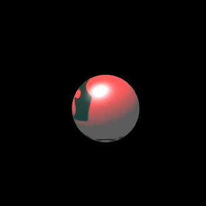

##  LayaAir3D之光源

灯光在3D世界中很重要，三维物体产生立体光影变化、色彩色调变化、投影等可使用于灯光设置方式达到。

## 灯光种类

灯光的种类有多种，不同的光源呈现的效果不同，可以设置不同的参数。在IDE创建的3D项目中我们可以修改代码查看不同类别的灯光效果。 

### 点光(PointLight)

点光是向四面八方发射光线的光源，又称全向光或者球状光，现实中的点光源比如灯泡、蜡烛，可以感觉到点光源是有强度、颜色和衰减半径属性。

```java
	//创建点光
	var light:PointLight = scene.addChild(new PointLight()) as PointLight;
	//移动灯光位置
	light.transform.translate(new Vector3(-3,5,0));
	//设置点光照亮范围
	light.range=6;
```
range为设置点光源的范围，相当于点光的照射范围，数值越大，光照范围越大，图1中因光照范围设置不大，因此没被光照的地方为黑色，图2中光照范围超出了灯光与模型的距离，因此全部被照亮。


  （图1）


### 平行光(DirectionLight)

平行光与点光区别较大，它有固定的一个方向，可通过弧度值设定，并且也没有衰减和光照范围，会对全场景所有模型进行照亮。3D世界中经常用来模拟固定方向的太阳光。

```java
	//创建平行光
	var light:DirectionLight = scene.addChild(new DirectionLight()) as DirectionLight;
	//设置平行光方向
	light2.transform.worldMatrix.setForward(new Vector3(0, -1.0, 0));
```

setForward平行光的方向，分别代表x、y、z轴上的方向，负数为负轴，正数为正轴，值的范围为-1—0—1，超过范围后为-1或1，初学者们可以在这个范围内设值观察方向的变化。


### 聚光(SpotLight)

聚光指的是从特定光源方向射出的光，比如手电筒，舞台筒灯等。光照区域根据距离因素逐渐放大，同时光照区域边缘也有衰减现象。
```java
	//添加聚光
	var light:SpotLight=scene.addChild(new SpotLight()) as SpotLight;
	//设置聚光的位置
	light.transform.position=new Vector3(0,5,0)
	//设置聚光的方向
	light3.transform.worldMatrix.setForward(new Vector3(0,-1,0));
	//设置聚光范围
	light.range=5;
	//设置聚光锥形角度
	light3.spotAngle = 50;
```

attenuation 为聚光的衰减，设置的值越小，聚光光圈的模糊越小，反之光圈越大。

direction为聚光的方向，方向的值设置方式与平行光一致。

range为聚光的照射范围，与点光类似，区别只是聚光有方向，而点光无方向。

（图2）  （图3）


## 光色要素

场景中使用了灯光后，在灯光范围内的所有3D模型都将产生影响，LayaAir 3D引擎中的灯光包括了以下要素，用于调节场景中的亮度、颜色等。

### 环境颜色(ambientColor)

**Tips：引擎1.7.9版后取消了灯光的环境颜色设置，老版本照常可使用。环境颜色可到材质中去设置。**

环境色可以简单的理解场景的气氛颜色。对于场景中的模型，它们的亮面与暗面会同时被环境色影响，环境色越亮模型的整体亮度越高。当然，环境色也常用于色调处理，可以通过环境色调整出红橙黄绿青蓝紫等气氛。

代码设置环境色如下，产生了黄色的环境光照，模型整体罩上了一层黄色（图4）。

在之前的课程中我们介绍了三维向量可以用来设置颜色值，我们再次回顾一下，向量中三个元素分别代表了红、绿、蓝颜色，由它们来组合成千变万化的色彩，每种颜色的最高值为1，超过后将产生曝光效果。

```java
//设置灯光的环境色为纯黄色（计算机中，红+绿=黄）
light.ambientColor = new Vector3(1,1,0);
```

（图4）  


### 漫反射颜色(diffuseColor)

**Tips：引擎1.7.9版后增加了color灯光颜色属性设置，与diffuseColor作用相同。**

也称为光源颜色，是灯光对模型受光面的亮度及色彩影响，比如模拟蜡烛光，可对光源色进行偏黄调整，那么模型受光面会加入黄色的色调。

下列代码中，我们设置了光源颜色为纯红色，那么模型受到光照的部分就会产生红色的影响，因为我们之前设置了环境光（材质环境光色或老版本灯光环境光色）为黄色，所以受光面为红+黄=橙色的颜色混合（图5）。

```java
//设置灯光的漫反射色为纯红色
//light.diffuseColor = new Vector3(1,0,0);
//设置灯光颜色为纯红色(与diffuseColor作用相同)
light.color = new Vector3(1,0,0);
```

（图5） 

关闭环境光，我们可以看到（图6）效果，因为没有黄色的环境色影响，模型的受光面就全部变成了光源色。因此在项目开发过程中，我们得综合考虑灯光的多种光色属性的混合影响。

（图6） 


### 高光颜色(specularColor)

**Tips：引擎1.7.9版后取消了灯光的高光颜色设置，老版本照常可使用。高光颜色可到材质中去设置。**

对于模型来说，正对着光源方向，并且角度较尖锐光滑的地方会产生高光，高光的亮度与颜色可通过灯光的高光颜色进行调整，默认的高光颜色为纯白色。

调整模型的高光色有两种方法，一种是在灯光上设置调光颜色，一种是在材质上设置高光贴图，大多情况是直接在材质上调整高光色，处理起来更方便，效果更真实。

因为box模型无法产生高光，我们用比较光滑的球体模型来观察，图7-1中为代码中未设置高光颜色，引擎默认值为纯白色，因此显示出了白色调光。而下列代码中，我们设置高光颜色为蓝色，图7-2中为可以清晰的看到，球面上产生了蓝色的高光，因为与漫反射红色相加形成了紫色。

```java
//修改材质的高光颜色
 material.specularColor = new Vector4(0.5,0.5,1);
```

（图7-1） （图7-2） 


### 投影(shadow)

投影是灯光照射模型时产生的即时阴影，可随着灯光角度、灯光强度、模型位置等变化而变化。投影是3D世界最重要的因素之一，能产生更加强烈的立体感。

即时阴影非常损耗性能，不能用得太多，特别是游戏场景，模型量较大，一般我们不使用即时投影，而使用静态的光照贴图。

要让场景中产生投影，我们需了解灯光的以下属性：

**shadow：**是否开启投影，布尔值，设置为true后生效。

**shadowDistance：**产生投影的范围，范围是指摄像机到模型的距离，单位为米。大于这个范围模型将不会接受投影与产生投影，开发者可以根据场景大小进行设置。

**shadowPSSMCount：**产生阴影贴图的数量，数量越高，阴影越细腻，性能损耗越大。

**shadowResolution：**投影的质量，投影范围中的阴影大小。通过数值设置质量，数值越大，投影质量越高，性能损耗也会随之加高。投影的质量值是以2的N次幂为单位设置，默认为512，可以设置成1024、2048.....等。

**shadowPCFType：**阴影模糊等级0-3，模糊值越大，阴影越柔和，效果越好，但更耗性能。


只开启和设置灯光的属性还不够，还需在模型上修改投影属性，分别为：

**receiveShadow：**是否接受投影，当模型此属性为true时，计算出的投影会在此模型上显示出来。在游戏中，我们可以把场景的地面，及场景中可走动区域中的模型castShadow属性设置为true。

**castShadow：**是否产生投影，当模型此属性为true时，灯光根据产生阴影的模型位置、模型网格形状大小、与灯光的角度等进行投影计算，然后在接受阴影的模型上产生投影。比如场景中的角色、NPC等活动游戏元素可以开启此属性。

为了能很好的理解投影，我们在下列示例代码中使用平行光，并创建盒子box模型及球体sphere模型加载到场景中，球体用于产生阴影，盒子上接受投影。

```java
package {
	
	import laya.d3.core.BaseCamera;
	import laya.d3.core.Camera;
	import laya.d3.core.MeshSprite3D;
	import laya.d3.core.Sprite3D;
	import laya.d3.core.light.DirectionLight;
	import laya.d3.core.material.StandardMaterial;
	import laya.d3.core.scene.Scene;
	import laya.d3.math.Vector3;
	import laya.d3.math.Vector4;
	import laya.d3.resource.Texture2D;
	import laya.d3.resource.models.BoxMesh;
	import laya.d3.resource.models.SphereMesh;
	import laya.display.Stage;
	import laya.utils.Stat;

	public class LayaAir3D 
    {
		public function LayaAir3D()
        {
			//初始化引擎
			Laya3D.init(1000, 500,true);
			
			//适配模式
			Laya.stage.scaleMode = Stage.SCALE_FULL;
			Laya.stage.screenMode = Stage.SCREEN_NONE;

			//开启统计信息
			Stat.show();
			
			//添加3D场景
			var scene:Scene3D = Laya.stage.addChild(new Scene3D()) as Scene3D;
			 
			//创建摄像机(横纵比，近距裁剪，远距裁剪)
			var camera:Camera = new Camera( 0, 0.1, 100);
			//加载到场景
			scene.addChild(camera);
			//移动摄像机位置
			camera.transform.translate(new Vector3(0, 4, 8));
			//旋转摄像机角度
			camera.transform.rotate(new Vector3( -30, 0, 0), true, false);
			
			//创建方向光
		    var light:DirectionLight = scene.addChild(new DirectionLight()) as DirectionLight;
		    //移动灯光位置
		    light.transform.translate(new Vector3(0,5,0));
			//设置灯光方向
		    light.transform.worldMatrix.setForward(new Vector3(0.3,-1, 0));
			//设置灯光漫反射颜色
			light.diffuseColor = new Vector3(1, 0, 0);
          
          	//设置灯光环境色
//		    scene.ambientColor = new Vector3(1, 1, 0); 
		 
		    //添加灯光投影
		    light.shadow=true;
			//产生投影的范围（如过小将不会产生投影）
		    light.shadowDistance=45;
          	//生成阴影贴图数量
			light.shadowPSSMCount = 1;
			//模糊等级,越大越高,效果更好，更耗性能
          	light.shadowPCFType=1;
			//投影质量
		    light.shadowResolution=2048;

			 
			//创建盒子模型
			var box:MeshSprite3D = scene.addChild(new MeshSprite3D(new BoxMesh(1.5,1.5,1.5))) as MeshSprite3D;
			//自身y座标旋转
			box.transform.rotate(new Vector3(0,45,0),true,false);
			//接收阴影
			box.meshRenderer.receiveShadow=true;
			
			//创建球体模型
			var sphere:MeshSprite3D = scene.addChild(new MeshSprite3D(new SphereMesh())) as MeshSprite3D;
			//按父空间移动球体
			sphere.transform.translate(new Vector3(0,1.5,0),false);
			//产生阴影
			sphere.meshRenderer.castShadow=true;
			//创建材质
			var material:PBRSpecularMaterial = new PBRSpecularMaterial();
			//材质加载漫反射贴图
		Texture2D.load("h5/res/layabox.png",Handler.create(this,function(text:Texture2D):void{
          material.albedoTexture = text;
          //为模型赋材质（单个材质可赋给多个模型）
          sphere.meshRenderer.material = material;
          box.meshRenderer.material = material;
       	 }));
		}		
	}
}
```


（图8）  （图9） 

以上两图为开启投影前与开启投影后的效果，注意：需要在灯光与模型上都设置以上介绍的相关属性，缺了任意环节都无法产生阴影。

