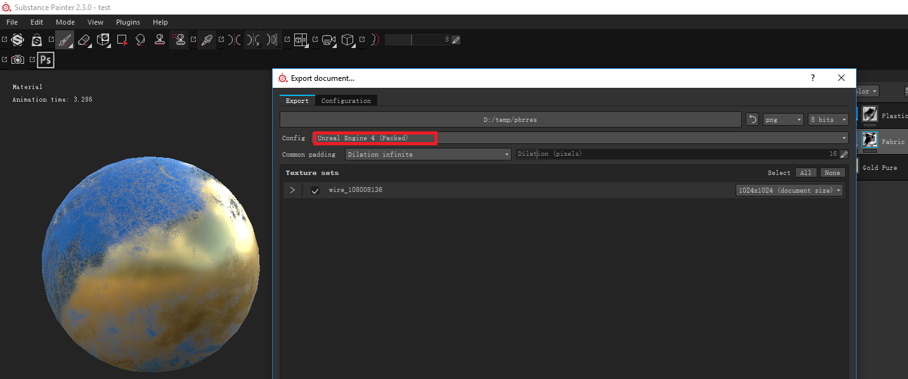
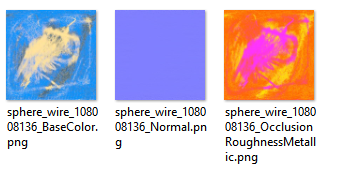

## 介绍
PBR是基于物理的光照。基本思想是所有的光照计算完全按照统一的符合物理的方法来完成，即希望使用一个shader来完成美术的所有要求。基本要做到材质创建好了以后，放到任何环境下都不需要再切换材质和修改参数就能与环境自然融合。美术能修改的材质参数都是有物理意义的，包括材质本身颜色，粗糙度，金属度。
所以PBR需要的东西包括：  
1. 环境信息。用来给pbr材质提供光照信息。这里用一个hdr（最好是hdr的）的[全景图](panorama.md)来描述。
2. 材质。材质建议在SubstancePainter中做，完成后导出成UE4的格式。
## Laya3D实现的PBR的限制
这个目前还只是测试版，所以有如下限制：
1. 目前不支持动态光源。以后要支持动态点、面光源。
2. 自发光还没有实现（这个比较容易，不过需要一个新的通道）
3. 目前一个场景只能有一个环境光照。以后要做成多个。
4. 由于预处理速度和WebGL的功能限制，目前的环境贴图大小必须是512x256

## 工具依赖
需要pbrtools。安装方法：
```bash
npm install -g pbrtools
```
由于使用了预编译的c模块，现在只支持windows版，且不能运行在electron环境中。如果有需要以后可以提供其他版本。

## 怎么制作和使用PBR材质
1. 制作环境贴图。
这个可以通过下载免费的全景图；自己通过相机和软件制作全景图；在3dsmax、unity中渲染全景图的方法来获得。格式最好是hdr的，这样能保留更广泛的光照信息。
2. 处理环境贴图，生成各个粗糙度的反射数据和diffuse数据。  
    注意环境贴图大小必须是512x256，格式是png，tga，或者hdr，必须是全景图，不能用cubemap。  
    通过命令 pbrtools 来处理环境贴图：
```bash
    pbrtools handleenvmap img
```    
img是要处理的全景图片。这个命令会在img所在目录下生成一个预处理图片 env.mipmaps，一个用于天空球贴图的env.png, 和一个jsong文件，json文件介绍如下：
```json
{
    "skytex":"env.png",
    "prefiltedEnv":"env.mipmaps",
    "IrradianceMat":[
        0.28129690885543823,0,0,0,-0.3282267153263092,-0.1073296070098877,0,0,-0.29809144139289856,0.13647188246250153,-0.17396731674671173,0,-0.5436494946479797,0.18786616623401642,0.2717423141002655,0.5554966926574707,0.2510770261287689,0,0,0,-0.295642226934433,-0.08785344660282135,0,0,-0.2755483090877533,0.12092982232570648,-0.16322359442710876,0,-0.5187899470329285,0.1655164659023285,0.3213203251361847,0.5639563798904419,0.17064285278320312,0,0,0,-0.22071118652820587,-0.04934860020875931,0,0,-0.21280556917190552,0.08689119666814804,-0.12129425257444382,0,-0.40946751832962036,0.11174142360687256,0.36054936051368713,0.5101194381713867
    ],
    "sunpos":[0,0,0],
    "ev":0.0
}
```
*skytex* 是给天空球的贴图  
*prefilterdEnv* 是预处理的不同粗糙度的反射信息。  
*IrradianceMat*  是diffuse参数，用来实现全景图的diffuse光照。  
*ev* 是曝光值，-3到3，类似相机的ev参数：0不变，-1变成一半，1变成两倍。  

使用示例：  
（目前只有使用 SkyDome 类才可以加载PBR环境信息。）  
```javascript
    var skyDome:SkyDome = new SkyDome();
    camera.sky = skyDome;
    skyDome.loadEnvInfo('res/env/def/envinfo.json');   //加载envinfo文件指定的环境光照信息。
```

3. 制作模型。
4. 制作pbr材质。  
在Substance Painter 中创建和修改材质，导出成UE4格式。  
  
这会导出三张图片：  
  
这三张图片分别是：  
*BaseColor*  基本颜色，不包含光照，阴影等信息，只表示材质的原本颜色。  
*Normal*  法线贴图  
*OcclusionRoughnessMetallic*  遮挡信息（红色通道），粗糙度信息（绿色通道）金属度信息（蓝色通道）  

5. 创建 PBRMaterial
例如创建一个pbr材质：
```javascript
    mtl = new PBRMaterial();
    mtl.diffuseTexture = Texture2D.load('copper.png');
    mtl.normalTexture = Texture2D.load('normal.png');
    //mtl.pbrInfoTexture = Texture2D.load('orm.png'); 这个可有可无。
    mtl.roughness = 0.5;
    mtl.metaless =  1.0;
```
*diffuseTexture*: 材质的diffuse贴图。他的alpha通道表示透明度或者金属度。  
*normalTexture*： 材质的法线贴图。他的alpha通道表示粗糙度。  
*pbrInfoTexture*： 材质的PBR相关信息，如果设置了这个贴图，就会优先使用这个贴图中的金属度、粗糙度信息。其中 R表示AO信息；G表示粗糙度，越大越粗糙；B表示金属度，越大越金属。可以直接使用UE的贴图。  
*roughness*： 粗糙度。可选。如果设置了这个，就会忽略贴图中设置的粗糙度信息，表示整个材质的粗糙度都是相同的，一般仅仅用来演示或者程序控制粗糙度。  
*metaless*： 金属度。可选。如果设置了这个，就会忽略贴图中设置的金属度信息，表示整个材质的金属度都是相同的，一般仅仅用来演示或者程序控制金属度。  

6. 在模型资源上使用PBR材质  
这个有两种方法，一个是在lh中指定，一个是通过程序创建PBRMaterial然后赋值给MeshRender的方法来指定。  
例如通过 lh来指定的：  
```json
        ...
        "meshPath":"dude-him.lm",
        "materials":[
            {
                "type":"Laya.PBRMaterial",
                "path":"Materials/head.lmat"
            },
            {
                "type":"Laya.PBRMaterial",
                "path":"Materials/jacket.lmat"
            },
            {
                "type":"Laya.PBRMaterial",
                "path":"Materials/pants.lmat"
            },
            {
                "type":"Laya.PBRMaterial",
                "path":"Materials/upBodyC.lmat"
            }
        ]
        ...
```
每一个lmat的内容
```json
{
    "version":"LAYAMATERIAL:01",
    "type": "PBRMaterial",
    "props": {
        "name": "head",
        "renderMode": 1,
        "has_tangent":true,
        "textures":[
            {"name":"diffuseTexture","path":"../headC.png"},
            {"name":"normalTexture","path":"../headN.png"}
        ]
    }
}
```

通过程序指定的
```javascript
    //手工设置材质
    var mtl:PBRMaterial = new PBRMaterial();
    mtl.diffuseTexture = Texture2D.load('../../../../res/threeDimen/pbr/basecolor.png');
    mtl.normalTexture = Texture2D.load('../../../../res/threeDimen/pbr/normal.png');
    mtl.pbrInfoTexture = Texture2D.load('../../../../res/threeDimen/pbr/orm.png');
    var sphere:MeshSprite3D = scene.addChild( new MeshSprite3D(new SphereMesh(0.1, 32, 32))) as MeshSprite3D;
    sphere.meshRender.sharedMaterial = mtl;

```

上面的例子有的使用两张贴图，有的使用三张贴图，这里解释一下。为了提高效率，如果不需要遮挡信息，可以把这三张图合并成两张，即把第三张图的剩余两个通道放到前面两张图的alpha通道。
这个可以通过pbrtools命令来处理：
```bash
pbrtools handle_ue4_texture expPath
```
这个命令会把把expPath目录下的所有导出的图片都合并一下，三张变两张，并且输出到expPath下的layaout目录中。
所以以后如果需要支持自发光的话，无论如何都要三张贴图了。

## 其他问题
1. pbrlut.js  
这是一个处理BRDF的预计算的查找表，由于引擎不便于发布二进制数据，所以把pbr需要的查找表数据放到了一个独立的js文件中，需要在项目脚本之前加载这个脚本，例如
```html
<script src='pbrlut.js' ></script>
<script src='myGame.js' ></script>
```

5. tangent信息
现在的lm中只有法线信息，通过修改导出参数也可以增加tangent信息，但是有时候只有有完整的normal,binormal,tangent信息才能正确的显示出法线贴图的结果，计算binormal的方法可以等以后的导出插件或者使用pbrtools。用法略
