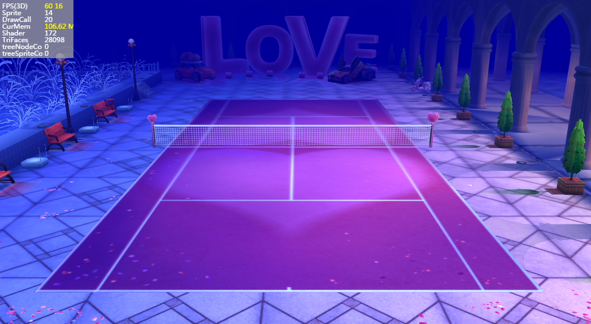
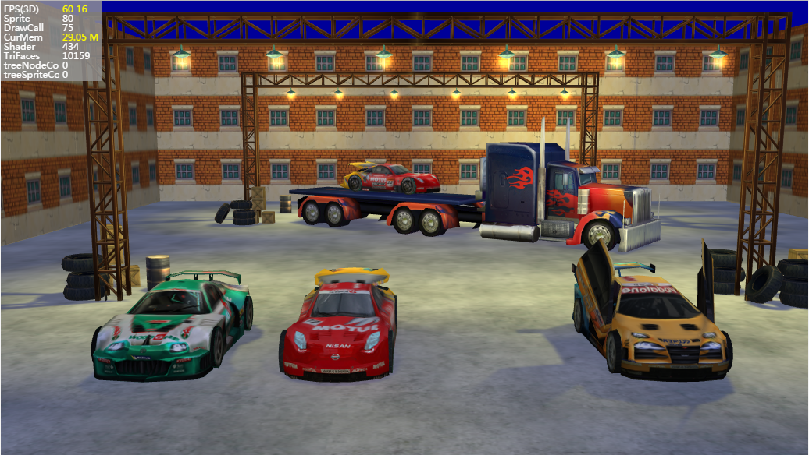

##Scene of LayaAir3D Scene

Scene is the 3D World Container of LayaAir Engine. It is used to present the 3D picture of the game and load various 3D elements. Cameras, lights, characters and objects in the game need to be placed in the scene to display the picture, which is equivalent to a game 3D player or a 3D view.

From Scene's inheritance relationship we can see that it inherits from the Sprite class. So we can simply treat it as a display object in 2D.

In the LayaAir engine, 3D and 2D can be mixed, and the Scene 3D scene created and the Prite 2D container or element can be loaded onto the stage at the same time.

In the course of Quick Open 3D Travel, we have built a basic 3D application and added the main elements. In this lesson, we will introduce the fog effect function of the scene and the loading method of the scene file generated by LayaAir export tool in Unity.


###Loading scenario resources

The "LayaScene_01/loveScene.ls" file in the following code is the class generation of layaAir export plug-in selection export "Scene" in unity3D, with the extension of. LS (understood as Laya scene abbreviation). The interior stores the illumination maps needed for the scene, including multiple or single model files, and so on. Scene3D. load () method can be directly loaded into the scene and displayed.


```java

package {
	import laya.d3.core.Camera;
	import laya.d3.core.scene.Scene;
	import laya.d3.math.Vector3;
	import laya.display.Stage;
	import laya.utils.Stat;
	
	public class LayaAir3D {
		public var scene:Scene3D;
		public function LayaAir3D() {
			
			//初始化引擎
			Laya3D.init(0, 0,true);
			Laya.stage.scaleMode = Stage.SCALE_FULL;
			Laya.stage.screenMode = Stage.SCREEN_NONE;
			Stat.show();
          
        //加载插件导出的场景。
        Scene3D.load("LayaScene_test/test.ls",Handler.create(null,function(sprite:Scene3D):void{
		scene = Laya.stage.addChild(sprite) as Scene3D; 
		}));
          
            //创建摄像机(横纵比，近距裁剪，远距裁剪)
			var camera:Camera = new Camera( 0, 0.1, 1000);
			//加载到场景
			scene.addChild(camera);
			//移动摄像机位置
			camera.transform.position=new Vector3(0, 5, 23);
			//旋转摄像机角度
			camera.transform.rotate(new Vector3( -17, 0, 0), true, false);
			//设置摄像机视野范围（角度）
			camera.fieldOfView=35;
			//设置背景颜色
			camera.clearColor = new Vector4(0,0,0.6,1);			
			//加入摄像机移动控制脚本
			camera.addComponent(CameraMoveScript);
			
			//创建方向光 -------------------
			var light:DirectionLight = scene.addChild(new DirectionLight()) as DirectionLight;
			//移动灯光位置
			light.transform.translate(new Vector3(0,2,5));
			//调整灯光方向
			light.transform.worldMatrix.setForward(new Vector3(0, -5, 1));
			//设置灯光漫反射颜色
			light.diffuseColor = new Vector3(0.3, 0.3, 0.3);
          
          	//设置灯光环境色
			scene.ambientColor = new Vector3(2.5, 2.5, 2.5); 
		}		
	}
}
```


Compiling and debugging the sample code shows a beautiful scene on the screen (Figure 1).

<br> (Fig. 1)


###Scenario resource preloading

The above example Scene3D. load () method is an asynchronous loading of resources. Sometimes the resources of 3D are large and need to be preloaded to improve the experience of the first screen. At this point, we can preload with a loader. 2D game resources are preloaded by Laya. loader. load (), while 3D resources must be pre-loaded by Laya. loader. create (), please refer to the relevant AP description.


```java

//单个资源
Laya.loader.create("res/Cube.ls",Handler.create(this,this.completeHandler));
//批量加载
Laya.loader.create(["res/Cube1.ls","res/Cube2.ls","res/Cube3.ls"],Handler.create(this,this.completeHandler));
//批量加载 并创建不同的类型；
Laya.loader.create([{url:"res/Cube1.ls"},{url:"res/Cube2.lh"},{url:"res/Cube3.lm"}],Handler.create(this,this.completeHandler));
```

In the project, we usually use the loader, which can manage the resources well.

The code is as follows:


  
```java

  package {
  	import laya.d3.core.Camera;
  	import laya.d3.core.scene.Scene;
  	import laya.d3.math.Vector3;
  	import laya.display.Stage;
  	import laya.utils.Handler;
  	import laya.utils.Stat;
  	
  	public class LayaAir3D {
  		
  		public function LayaAir3D() {
  			
  			//初始化引擎
  			Laya3D.init(0, 0,true);
  			Laya.stage.scaleMode = Stage.SCALE_FULL;
  			Laya.stage.screenMode = Stage.SCREEN_NONE;
  			Stat.show();
            //因为只有一个资源 所以我们传进去字符串就可以，队列的话可以传递一个数组队列。
  			Laya.loader.create("LayaScene_01/loveScene.ls",
                               Handler.create(this,this.completeHandler),null,Laya3D.HIERARCHY);

  		}
  		private function completeHandler():void
  		{
  			var scene:Scene3D = Laya.loader.getRes("LayaScene_01/loveScene.ls");
            Laya.stage.addChild(scene);
          
  			......
  		}
  	}
  }
  ```


###Atomization of Scene

The atomization effect plays an important role in the project. The atomization effect is equivalent to the effect of opening the atmosphere. It looks hazy and makes the scene more real. LayaAir 3D engine can set Fog Visibility Distance (equivalent to concentration) and fog color of the scene. Proper use of atomization can not only improve the performance of the game, but also increase the experience of the game.


```java

//开启雾化效果
scene.enableFog = true;
//设置雾化的颜色
scene.fogColor = new Vector3(0,0,0.6);
//设置雾化的起始位置，相对于相机的距离
scene.fogStart = 10;
//设置雾化最浓处的距离。
scene.fogRange = 40;
```


Add the above logic code to the above example to compile and run, and find that the scene is covered with a layer of blue fog effect (Figure 2), the farther the thicker, to 40 meters away from the camera will be all covered by fog.



<br> (Figure 2)


###Scene Illumination Mapping

Illumination mapping refers to the projection, shadow transition, lighting atmosphere, color influence between model material and material produced by 3D model in scene.

There are very few 3D game scenarios that rely on lighting and model rendering instantly to produce projection and color effects. This is a very expensive way of performance, especially mobile games. The function of the video card of mobile phones is not strong. All of them will become Caton very quickly with real-time video and shadow games.

Scene illumination mapping is to solve this problem. It simulates the light, shadow and color of game scenes in the way of mapping, and reduces a lot of real-time operations.

Illumination mapping is proposed to render illumination mapping and export it through unity3D editor. When loading the scene, the engine will automatically load the illumination mapping to achieve better results. The illumination mapping derived from unit is used in Figures 1 and 2.

If the lighting map is not rendered in Unity, the engine will not load the error after exporting, but the effect of the game will be discounted. Figure 3 shows the effect of unused illumination mapping, and Figure 4 shows the effect of illumination mapping. Illumination mapping is also often used to simulate the effects of sunshine, night scenery and game atmosphere, which enhances the experience of the game.


<br> (Figure 3)



<br> (Figure 4)

The rendering method of illumination mapping is not explained much here. Mature 3D game art designers will basically make illumination mapping.

Let's open the resource tree directory exported by the sample code above (Figure 5).

**The name of the loveScene folder is created in Unity and generated according to the scene name. The resource is the scene light map. The original light map is in EXR format. It needs to be converted into JPG or PNG format used in layaAir engine. It is best to manually convert it into 8-bit color in photoShop and store it in PNG format, which can effectively reduce the size of resources and reduce games. Time of resource loading.**

If the illumination map is not created in unit, no folder is generated.

<br> （图5）


If you need to use a smaller JPG image format to convert it into jpg format, you need to modify the path of the illumination map in the. LS configuration file. For example, in Figure 6, open the data file "loveScene. ls" exported from the scene and modify the. EXR lattice to. jpg. Otherwise, the compiler engine will automatically find the png-format image loading, instead of loading the jpg-format image.

<br> (Fig. 6)

