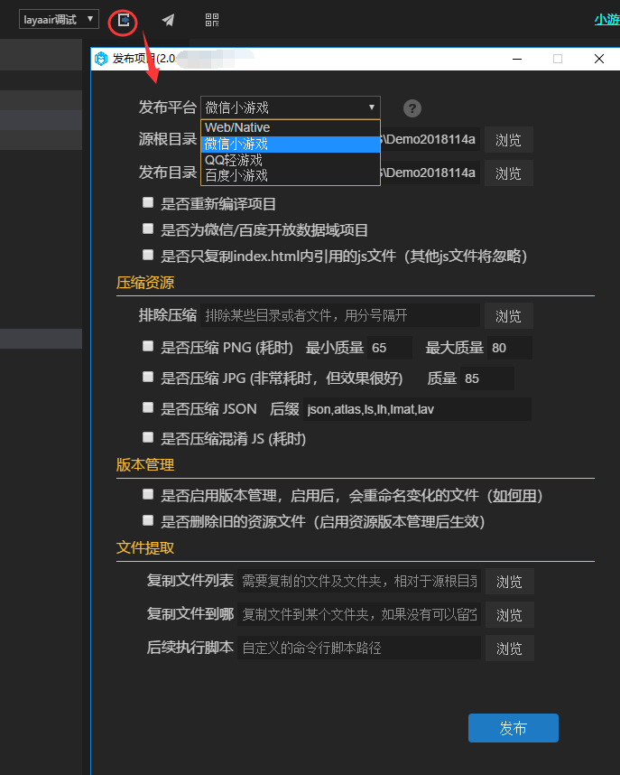

# 项目发布2.0详解

> author: charley      version: LayaAir IDE 2.0.0 正式版      update：2019-1-16

项目菜单的发布功能是非常核心的功能，通常是用于游戏的JS合并、JS压缩与混淆、图片压缩、版本管理、游戏不同平台的适配等。在项目完成开发，或阶段性完成开发，准备提交到生产环境中进行测试时，通常会用到项目发布的功能。

   

（图1）

在项目菜单里，打开项目发布功能的界面如图1所示，下面将逐一进行介绍：

### 1、发布平台

发布平台中目前有四种选择选项，分别为web/Native，微信小游戏、QQ轻游戏、百度小游戏。如图1所示。

`web/Native` 是指发布为HTML5版本，运行于浏览器环境或者是LayaNative的APP环境中。

`微信小游戏` 是指发布为已适配微信小游戏的项目，发布后的项目可以运行于微信开发者工具内（关于微信小游戏可阅读相关的文档）。

`QQ轻游戏`是指发布为手机QQ的轻游戏项目（曾称为玩一玩），运行于手机QQ的轻游戏平台中。

`百度小游戏` 是指发布为已适配百度小游戏的项目，发布后的项目可以运行于百度开发者工具内（关于百度小游戏可阅读相关的文档）。

### 2、源根目录

源根目录是指发布的版本文件**来源目录**，默认在bin目录下，这个目录不要改。

### 3、发布目录

发布目录是指要发布到的**目标目录**，默认在release目录下，可以在项目所在的目标，也可以是与项目无关的目录。

### 4、是否重新编译项目

如果开发者担心因为遗忘了编译，导致发布的代码并非最近代码的话，可以勾选`是否重新编译项目`，勾选后会在每次发布时先编译项目再执行发布流程。可以避免因遗忘编译导致的项目发布后报错。

### 5、是否为微信/百度开放数据域项目

微信和百度等小游戏开放域项目默认的入口文件和主域的入口文件并不一样，所以勾选`是否为微信/百度开放数据域项目`后，会自动将入口的问题处理好，不用开发者每次在发布后，手工处理。极大的增加了开发者的小游戏发布易用性。

#### 是否合并index.html内的所有js文件（web版）

勾选后，会分析index.html内的js，将所有index.html内的JS合并为一个JS。

> 基于微信小游戏的特殊机制，小游戏必须选择，所以该项不在小游戏发布中显示。
>

### 6、是否只复制index.html内引用的js文件

勾选后，只复制index.html内引用的js引擎库文件到release的libs目录。否则会将libs下用到的没用到的全都复制过去。

### 7、压缩资源

#### 排除压缩

用于排除源根目录下的，一些目录或文件，有多个的话，用分号`;`隔开。
注意：排除压缩这个功能只用于排除压缩相关的目录

#### 是否压缩PNG

勾选后，会压缩PNG资源，可以通过参数控制质量，发布时的默认值，如果开发者觉得效果未达到目标，可以自行调整尝试。

#### 是否压缩JPG

勾选后，会压缩JPG资源，可以通过参数控制质量，发布时的默认值，如果开发者觉得效果未达到目标，可以自行调整尝试。

#### 是否压缩JSON

勾选后，并不仅仅是JSON后缀的文件，默认列出了一些常用的可能需要压缩的json文件格式（例如：json、atlas、ls、lh、lmat、lav），如果符合这些范围的后缀就会开始压缩。如果有不需要压缩的后缀格式，直接去掉后缀就可以。

#### 是否混淆压缩JS

勾选后，会对JS进行压缩和混淆。

### 8、版本管理

#### 是否启用版本管理

勾选这个选项后，会启用版本管理。

当开发者启用版本管理之后，发布时将会自动生成带hash字符串的文件名，同时生成一个version.json的文件名映射文件。通过版本管理类ResourceVersion自动关联代码中的实际文件名和重命名后的版本管理控制的文件。开发者启用版本管理的文件只要发生改变，就会在发布时自动更新改变文件名中的hash字符串，这于运行环境而言，这相当于调用了新的文件，自然就不会存在缓存引起的问题。

而开发者在开发的过程中，无需关注版本管理最终生成的文件名是什么。甚至，由于LayaAirIDE 2.0在创建项目的时候，已经自动在代码里集成了版本管理类ResourceVersion，开发者连怎么去使用ResourceVersion类都无须关注，只需要在打算启用版本管理时，在项目发布界面，勾选是否启用版本管理的选项即可。

#### 是否删除旧的资源文件

当启用版本管理后，即使某个文件产生了变化，生成了新版本文件，但默认会保留旧版本文件。

`勾选是否删除旧的资源文件`选项后，当某个文件产生了变动，在生成新的版本文件的同时，会将旧的版本文件删除。

### 9、文件提取

文件提取功能主要是为了方便小游戏本地包的提取。

#### 复制选择列表

点击`复制选择列表`右则的浏览会弹出bin目录的结构树。开发者勾选本地包中要使用的代码或者资源。点击**确定**后，会保存已选择的目录和文件，以便于发布工具筛选和复制指定的本地包内容。

#### 复制文件到哪

点击`复制文件到哪`右则的浏览可以指定一个目录，作为小游戏的项目目录，刚刚`复制选择列表`中提取的本地包内容会复制到这里指定的目录中。

#### 后续执行脚本

这里指定一个可以在命令行中直接执行的文件（例如，windows下的 exe或bat），那将在发布的时候调用这里指定的可执行文件。

具体用于哪里呢？比如：有开发者认为IDE自带的压缩功能不好用。那可以自己写一个，或者从网上找一个命令行中可执行的程序。直接在发布的时候调用。而不用再勾选使用IDE自带的压缩功能。