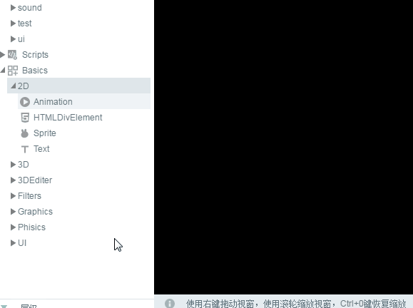
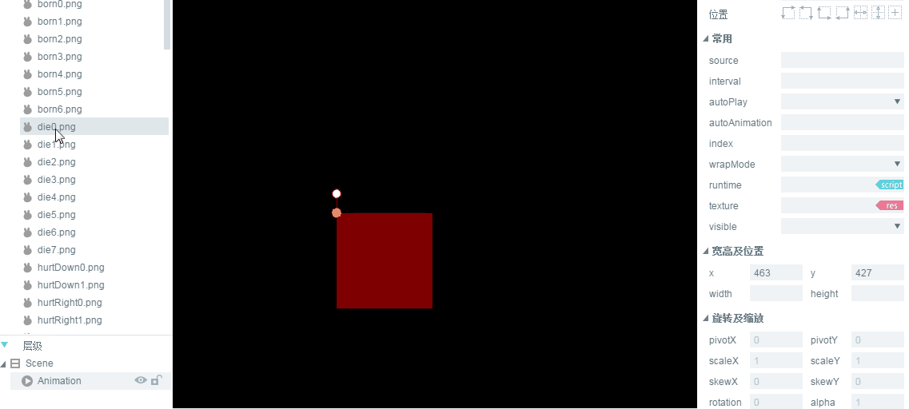
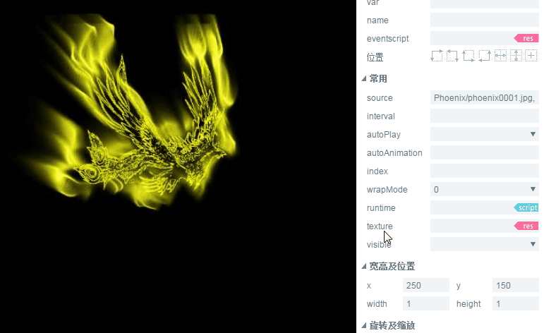

#Detailed description of Animation component attributes

> Since many component attributes are generic, common and generic component attributes are`属性设置器`This is described in the document. Read the Property Setter document before reading this article.

##1. Preliminary Cognitive Animation Components

Animation component is an animation component, which can easily create atlas animation or animation created by LayaAirIDE. As shown in Figure 1.

 

(Fig. 1)

For an introduction to the API of Animation, please refer to[https://layaair.ldc.layabox.com/api/?category=Core&class=laya.display.Animation](https://layaair.ldc.layabox.com/api/?category=Core&class=laya.display.Animation)

##2. Creating Animation Components through LayaAirIDE

###2.1 Create Animation

Animation is neither a common UI component nor a container component. So when you create an Animation component, you need to start with`组件库`Drag the Animation component directly into the IDE`场景编辑器`Medium. As shown in Figure 2.

 

(Motion 2)

###2.2 Receiving Animation Data Source through Source Attribute

After creating the Animation component in LayaAirIDE, it must receive the animation data source through the source attribute before it can be used. Sorce attributes can receive three kinds of image collections (multiple pictures, usually sequential frames), Atlas or. JSON suffixes, and animation files (ani suffixes).

####2.2.1 Creation with Sequential Frame Pictures

open`资源管理器`We will have more art resources`同时选中`,`拖拽`reach`source`Property bar, then select the animation you just created in the scene and press`回车`Key, you can preview the animation playback effect. As shown in Figure 3.

 

(Figure 3)

**Tips**Animations created with this type will not be cached into the animation template cache pool. If caching is required, use the loadImages () method.

####2.2.2 Create with Atlas File

If we put the atlas file in`资源管理器`Catalog, or you can directly file the atlas`拖拽`reach`source`Property bar, then select the animation you just created in the scene and press`回车`Key, you can preview the animation playback effect. As shown in Figure 4.

 

(Motion 4)

**Tips**Animation templates created with this type will not be cached into the animation template cache pool. If you need to cache or create callbacks, use the loadAtlas () method.

####2.2.3 Create with Animation Files

The created timeline animation file (suffix. ani) can also be used as a data source for the Animation animation component, as shown in Figure 5, directly.`拖拽`reach`source`Property bar, then select the animation you just created in the scene and press`回车`Key, you can preview the animation playback effect.

 

(Fig. 5)

###2.3 Controlling the Play Mode of Animation

The animation playback mode attribute wrapMode has three optional values, the default value is 0, playback in positive order. Choose 1 and play in reverse order. Choose 2, pingpong (table tennis) mode, straightforward is to play back and forth. Next, we select a set of sequence diagram resources to demonstrate the playback differences in different modes.

####2.3.1 Play in Positive Order Mode

By default, the wrapMode attribute is not set or the value of the wrapMode attribute is set to 0, which is the order playback mode. That is to say, sequence diagrams are played from front to back.

As shown in Figure 6, the sequence diagram Phoenix 0001 to Phoenix 0025 is played sequentially. After playback, from Phoenix 0001 to Phoenix 0025, playback cycle.

 

(Fig. 6)

####2.3.2 Play in Inverse Mode

When the wrapmode property value is set to 1, the playback mode is reversed. That is, the sequence diagram is played from the back to the front. Contrary to the playback mode in positive order.

As shown in Figure 7, the sequence diagram Phoenix 0025 to Phoenix 0001 is played sequentially. After playback, from Phoenix 0025 to Phoenix 0001, playback cycle.

 

(Fig. 7)

####2.3.3 Pingpong mode playback

Looking carefully, we can find that neither positive nor reverse order is possible, and the movements of these phoenixes are not smooth. The reason is that when designing this group of drawings, the art only designed the wings to fly from top to bottom, so the lack of action frames, resulting in the movement does not look smooth.

The problem can be solved by setting the wrapMode attribute value to pingpong mode at 2:00. The same set of actions are played out from Phoenix 0001 to Phoenix 0025, not directly back to Phoenix 0001, but from Phoenix 0024 to Phoenix 0001 in reverse order. So that the movement is smoother and more complete. Therefore, pingpong mode is also one of the most frequently used modes in the game. On the premise of guaranteeing the effect, it can also greatly reduce the amount of art resources. The effect is shown in Figure 8.

 

(Fig. 8)

####2.4 Interval of animation playing

`interval`Property can set the frame interval time (in milliseconds) for animation playback, with the default value of 50 milliseconds. For example, we set the Phoenix animation we just played to 100 milliseconds, double the speed. The effect is shown in Figure 9.

 

(Fig. 9)

**Tips**:*If the animation is playing, the starting time of the frame cycle timer will be reset to the current time after setting. That is to say, if the interval is set frequently, the time interval of the animation frame update will be slower than expected, or even not updated.*

####2.5 Set AutoPlay

The autoPlay property can set whether to play automatically, default to false, not automatically. If set to true, the animation is created and added to the stage for automatic playback. This property setting cannot be previewed in the IDE immediately. You need to view the effect of the property setting when publishing.

####2.6 AutoAnimation by Active Name

There may be multiple animations in the timeline animation file (. ani suffix) created in LayaAir IDE. Through the autoAnimation attribute, one of the animation names can be selected for playback.

**Tips**:

##- In LayaAirIDE,`autoAnimation`Attributes can only be used for data sources（`source`) Attribute to the timeline animation file (. ani suffix) can be set. `autoAnimation`Attribute values should correspond`时间轴动画`Editors`帧属性`panel`动效名称`Name set in.

####2.7 Set the starting position of playback (index)

The index attribute can specify the frame index of the animation. The default index is 0, which can be set to any frame in the animation. After setting, it will jump to the set animation frame.

Tips: This property is only used for static specifications, such as manual switching of animated frames by code or clicking on events. If set to autoplay, it will still play from frame 0, which has nothing to do with the setting of the index.

####2.8 Set blend mode

Mixed mode`blendMode`Property is not turned on by default, and mixed mode is turned on when set to the lighter option. The effect after opening is shown in Figure 10.

 

(FIG. 10)

**Tips**:*The background of the hybrid mode must be in the stage canvas. For example, only Laya. stage. bgColor is not a hybrid mode. Graphics rectangle is used in Motion 10.*

