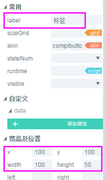

#Button Component Details

##1. Creating Button Components

Button component is one of the most commonly used components, which can display text labels, icons or both. The name of the button image resource (button skin) in LayaAirIDE is usually prefixed with btn, as shown in Figure 1.

 （图1）


###1.1 Create Button Components directly with Engine

Using the LayaAir engine to create a Button component is relatively simple and usually takes only a few steps to introduce`laya.ui.Button`Packet path, load resources, create a Button instance, add Button to the stage, and set the properties of the Button component. Specific implementation refers to the following code and comments.

**Create an entry class ComponentDemo. as and write the following code:**


```java

package
{
	import laya.ui.Button;
	import laya.utils.Handler;
	import laya.webgl.WebGL;
	
	public class ComponentDemo
	{
      	//按钮资源路径
		private var skin:String = "./res/img/btn_test.png";
		
		public function ComponentDemo()
		{
          	//初始化引擎，设置宽高并开启WebGL渲染模式
			Laya.init(1334,750, WebGL);
			//设置舞台背景颜色
			Laya.stage.bgColor = "#ffffff";
			//加载资源成功后，执行onLoaded回调方法			
			Laya.loader.load(skin, Handler.create(this, onLoaded));
		}
		
		private function onLoaded():void {
			
			//创建一个Button实例
			var btn:Button = new Button(skin);
			//将Button添加到舞台
			Laya.stage.addChild(btn);
			//设置Button相关的属性
			btn.width = 100;
			btn.height = 50; 
			btn.pos(100,100);
			btn.label = "按钮";
			
		}
	}
}
```


The above code runs as shown in Figure 2.

<br/> (Motion 2)

**Tips:**For an introduction to the property interface of Button components, please refer to[Button API](http://layaair.ldc.layabox.com/api/index.html?category=Core&class=laya.ui.Button)。


###1.2. Create Button with LayaAirIDE

Using LayaAirIDE to create Button is simpler. Through the visualization operation of IDE, component creation and layout can be realized without any program foundation. It is also a recommended method of component creation. Next, we use LayaAirIDE to create a motion figure to achieve the effect.

Step 1: Create a UI DEMO page and drag a button component resource into the Scene Editor in Resource Manager, as shown in Figure 3.

<br / > (Fig. 3)

Step 2: Set component properties, as shown in Figure 3

<br / > (Fig. 4)

After setting up the above two steps, you can directly see the effect of Figure 2 in the IDE. In this process, no coding is required, and it can be handed over to art or planning. This reduces the cost of communication with programmers and speeds up the efficiency of game development.


##2. Introduction of Button Component's Attributes

The following document highlights the basic common properties of Button components and properties that are difficult to understand through text. As for the easy-to-understand attributes, this article will not mention that developers can hover over the attribute name of IDE Attribute Manager, and there will be Tips Chinese description of the attributes.

###2.1 Button Skin

The skin of the button is divided into three states, two states and one state because of the different ways of cutting. The state here refers to the state of the button skin.

Three-state is to divide the skin image into three parts in the form of equal ratio segmentation in vertical direction, as shown in Figure 1.**From top to bottom**In turn`弹起或离开状态`Skin,`经过状态`Skin,`按下和选中`(* Keep pressing *) state skin, tristate is often used in PC browsers.

On mobile devices, usually only two states are used, and the image is cut into two parts in a vertical direction by equal ratio. The upper part is as follows`弹起或离开状态状态`Skin, the lower part is`经过和按下以及选中状态`(* Keep pressing *) Skin.

The singlet button does not cut the picture. No matter what the state, the skin of the button has only one kind and remains unchanged.

###2.2 Specify the state Num of the button skin

The attributes of stateNum determine how skin resource images are cut. The default value is 3, that is to say, the default is to press the 3-state button to cut, and the equivalence is divided into three parts. If it is a two-state button, it is necessary to set the stateNum attribute value to 2 and cut the equivalence ratio to 2 parts. The singlet button is set to 1 and no cutting is done.

It is important to note that the button state should be specified in accordance with the skin of the button. If it is a three-state button skin, the stateNum is set to 2, which is wrong after cutting as shown in Figure 5.

<br / > (Fig. 5)


###2.3 Specify Button Selection

The selected attribute defaults to the unselected false state. Once we set the selected property to true. The button will remain unchecked (pressed) and will not change other states (unless the state changes in the code).

###2.4 Whether to switch the display status of the button (toggle)

The toggle attribute defaults to the unselected false state. Once we set the toggle property to true. When the button component is clicked, the button will remain in the selected (continuously pressed) state. Click again to restore.

###2.5 Set Button's Stroke Color based on status

Label StrokeColor can set a uniform color for Button's text margin (the same color for different states). The StrokeColor attribute can set the edge text color of Button according to different states.

The order of StrokeColor color is formatted: upColor (color of pop-up or leave state), overColor (color of pass state), downColor (color of press and select state), disableColor (color of forbidden use). As shown in Figure 6.

<br / > (Fig. 6)

*Tips: If you want to feel the change of the edge color more clearly, you can set the labelStroke attribute value of the edge width a little larger.*


