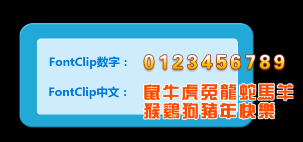

#Fontclip component reference


##1. Understanding FontClip components

###1.1 Demonstration of FontClip's Function and Effect

The new FontClip feature of LayaAir engine is more powerful, which is used to quickly switch a set of custom icons, text, numbers, etc. It is a functional combination of Clip slices and BitmapFont bitmap fonts.

Clip components can only display one slice of content, if they encounter more complex content, they need multiple Clip splicing, such as display countdown "50:46", we need five Clip combinations and add logical code to them respectively to achieve the effect. If you use a FontClip component, you only need one component and assign it a value of "50:46", and the amount of code will be much less.

BitmapFont bitmap font making is relatively troublesome and requires the use of third-party software, while the font style of third-party software is basically unable to produce, the font appears to be relatively single, rarely to achieve the desired effect of art. With FontClip, font style, size and color can be modified and made freely in image processing software, which is rich and changeable.

The following image is made by FontClip (Fig. 1). It can be assigned by switching between numbers and Chinese, and their font styles can be modified at will.

​<br/>（图1） 


​

###1.2 Skin Specification for FontClip Components

FontClip resource naming rule is fontClip_prefix name. Its resource is a resource group graph composed of a group of single graphs with the same width and height. As shown below, if the picture is too long, it can be arranged in multiple rows.


​	  <br/>
(Figure 2)

* The skin of FontClip component can't use the Nine-palace property, so it is necessary to determine the actual application size when designing resources. Or scaling control through scaleX, scaleY*

###1.3 Introduction to API of FontClip Component

For an introduction to FontClip's API, please refer to[http://layaair.ldc.layabox.com/api/index.html?category=Core&class=laya.ui.FontClip](http://layaair.ldc.layabox.com/api/index.html?category=Core&class=laya.ui.FontClip)。


##2. Creating FontClip Components through LayaAirIDE

###2.1 Create FontClip

(Figure 2) According to the FontClip component naming rules, the resources in Figure 2 are named fontClip_num.png and fontClip_year.png respectively. Because the resource width in Figure 2 is too long, we modify it into two rows. In the IDE resource folder, drag and drop them into the scene editor, and add background resources and label components to achieve the following effect (Figure 3).


​        <br/>
(Figure 3)


###2.1 Adjust the sheet and value attributes of FontClipx components

When you drag and drop from Explorer and generate two FontClip components, select one of them and you can see that the sheet and value attributes have default values, but they are not entirely correct and need to be modified.

​<br/>

(Figure 4)

**Sheet:** 
The common attribute of sheet is the "bitmap content range" of components, which is the summary of the content we need to display. The content can be numbers, punctuation, symbols or Chinese. The default value is 0-9. However, its input content must correspond to the bitmap resources one by one, with the same order and total number, otherwise an error will occur.

If the bitmap resource of FontClip component is two or more rows, then the sheet content should add a "space" at the newline of the corresponding resource map, otherwise the value value will be set incorrectly. As for the Chinese bitmap resources in Figure 3, the contents in the sheet should be as follows: "Happy Year of Pigs, Dogs, Dogs, Monkeys, Snakes, Tigers, Rabbits, Dragons, Snakes, Horses, Monkeys and Pigs". The blanks should be added after "sheep".

**Value:**
Value is commonly used as the actual display content of components, which is part of the sheet summary content. It can be arbitrarily combined and matched by the sub-items in the summary content. If the input value is not found in the sheet content, it will not be displayed.


​        <br/>
(Fig. 5)


##3. Controlling FontClip Component Switching Display by Code

In the above steps, we completed the component creation and combination in IDE, defined the variable fontClip_num for the digital year and the variable fontClip_year for the zodiac year. Next, we change FontClip through program code.

Save the page and press F12 to publish the page. After publishing, the TestPageUI.as class is generated in the project UI folder. We use it directly.

Running the following sample code, we can see that the effect is exactly the same as that shown in Figure 1.

**Sample code:**


```javascript

package {
	import laya.display.Stage;
	import laya.net.Loader;
	import laya.ui.RadioGroup;
	import laya.utils.Handler;
	import laya.webgl.WebGL;
	
	import ui.test.TestPageUI;
	
	import view.TestView;
	
	public class LayaUISample {
		
		/**包含FontClip组件的测试页面**/
		private var testView:TestPageUI;
  		/**公历年数**/
		private var year:int=2017;
		/**12生肖数组**/
		private var yearArr:Array=["鼠","牛","虎","兔","龙","蛇","马","羊","猴","鸡","狗","猪"];
		private var yearIndex:int=9;
		
		public function LayaUISample() 
		{
			// 不支持WebGL时自动切换至Canvas
			Laya.init(1024, 720, WebGL);
			//画布垂直居中对齐
			Laya.stage.alignV = Stage.ALIGN_MIDDLE;
			//画布水平居中对齐
			Laya.stage.alignH = Stage.ALIGN_CENTER;
			//等比缩放
			Laya.stage.scaleMode = Stage.SCALE_SHOWALL;
			//背景颜色
			Laya.stage.bgColor = "#232628";
			//加载引擎需要的资源
			Laya.loader.load("res/atlas/comp.atlas", Handler.create(this, onLoaded));
		}
		
		private function onLoaded():void {
			//实例UI界面
			testView = new TestPageUI();
			//加载到舞台
			Laya.stage.addChild(testView);

          	//年增加帧循环
			Laya.timer.loop(1000,this,onLoop);
		}
		private function onLoop():void
		{
			//公元年增加
			year++;
			
			//“位图字体切片”年更新
			testView.fontClip_num.value=year.toString();
			//农历生肖年增加
			yearIndex++;
			//12年生肖一轮回
			if(yearIndex>11) yearIndex=0;
			//文本切片更新，新年快乐更新
			testView.fontClip_year.value=yearArr[yearIndex]+"年快乐";
			
			//大于2500年时间停止
			if(year>2500)
			{
				Laya.timer.clearAll(this);
			}
		}
	}
}
```


