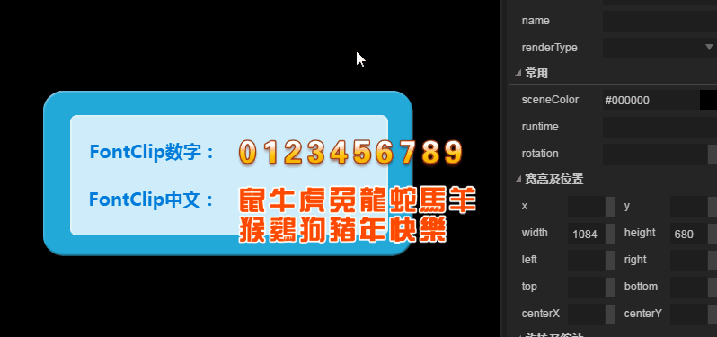

# FontClip 组件参考


## 1、了解FontClip 组件

### 1.1 FontClip 作用与效果演示        

​       LayaAir引擎新增加的FontClip功能较为强大，用于快速切换一组自定义的图标、文本、数字等。它算是Clip切片与BitmapFont位图字体的功能结合体。

​	Clip组件中只能显示一个切片内容，如遇到较复杂的内容，需要多个Clip拼接，比如显示倒计时“50:46”，我们需要5个Clip组合并对它们分别添加逻辑代码才能达到效果。而如果用了FontClip组件，我们只需要一个组件并对它value赋值为“50:46”即可，代码量也会少很多。

​	BitmapFont位图字体制作相对较麻烦，需要使用第三方软件，而第三方软件的字体样式基本无法制作，字体显得较为单一，很少能达到美术所需要效果。而使用FontClip，字体样式、大小、颜色上可以在图像处理软件中随意修改制作，丰富多变。

​	下图效果为FontClip 制作（图1），可以用数字和中文切换赋值，它们的字体样式也可任意修改。

​        <br/>（图1） 

​    

### 1.2 FontClip组件的皮肤（skin）规范

​	FontClip资源命名规为fontClip_为前缀名，它的资源是由一组宽高相同的单图组成的资源组图，如下所示，如图片过长也可以多排。

​	  <br/>
​       （图2）  

*FontClip组件的皮肤无法使用九宫格属性，所以要在资源设计的时候就确定好实际应用时的大小。或者通过scaleX、scaleY进行缩放控制*     

### 1.3 FontClip组件的API介绍

FontClip的API介绍请参考 [http://layaair.ldc.layabox.com/api/index.html?category=Core&class=laya.ui.FontClip](http://layaair.ldc.layabox.com/api/index.html?category=Core&class=laya.ui.FontClip)。


## 2.通过LayaAirIDE创建FontClip组件

### 2.1 创建FontClip  

​	（图2）中资源根据FontClip组件命名规则分别命名为fontClip_num.png，fontClip_year.png，因图2中资源宽度过长，所以我们修改成两排。在IDE资源文件夹中分别选择它们拖拽入场景编辑器中，并加上背景资源及label组件，达到以下效果（图3）。

​        <br/>
​      （图3）


### 2.1调整FontClipx组件sheet、value属性

​	当从资源管理器中拖拽完成并生成两个FontClip组件后，选择其中一个，我们可以看到sheet属性与value属性产生了默认值，但它们并不完全正确，需重新修改。

​        <br/>
​      （图4）

**sheet：** 
sheet常用属性是组件的"位图内容范围"，是我们需要展示内容的总汇，内容可以是数字、标点、符号也可以是中文，默认为数字0—9，但它的输入的内容需与位图资源一一对应，顺序需相同，总数也需相同，否则会发生错误。

如果FontClip组件的位图资源为双排或多排，那么sheet内容在对应资源图中换行处应当加入“空格”，否则设置value值时会出错。如图3中的中文位图资源，在sheet中填入的内容需为：“鼠牛虎兔龙蛇马羊 猴鸡狗猪年快乐”，在“羊”后需加入空格。

**value：**
value常用属性为组件的实际显示内容，是sheet总汇内容中的一部分，可以由总汇内容中的子项随意组合搭配。如果输入的值在sheet内容中找不到，将不会有显示。


​        <br/>
​      （图5）


## 3、通过代码控制FontClip组件切换显示

​	在上面几个制作步骤中，我们完成了在IDE里的组件创建与组合，并为数字年份定义变量名为fontClip_num，为生肖年定义变量名为fontClip_year。下面我们通过程序代码把使FontClip变化起来。

​	保存页面，按F12发布页面，发布后在项目ui文件夹中生成了TestPageUI.as类，我们直接使用它。

​	运行下列示例代码，我们可以看到与（图1）中的效果完全一致。

**示例代码：**

```javascript
package {
	import laya.display.Stage;
	import laya.net.Loader;
	import laya.ui.RadioGroup;
	import laya.utils.Handler;
	import laya.webgl.WebGL;
	
	import ui.test.TestPageUI;
	
	import view.TestView;
	
	public class LayaUISample {
		
		/**包含FontClip组件的测试页面**/
		private var testView:TestPageUI;
  		/**公历年数**/
		private var year:int=2017;
		/**12生肖数组**/
		private var yearArr:Array=["鼠","牛","虎","兔","龙","蛇","马","羊","猴","鸡","狗","猪"];
		private var yearIndex:int=9;
		
		public function LayaUISample() 
		{
			// 不支持WebGL时自动切换至Canvas
			Laya.init(1024, 720, WebGL);
			//画布垂直居中对齐
			Laya.stage.alignV = Stage.ALIGN_MIDDLE;
			//画布水平居中对齐
			Laya.stage.alignH = Stage.ALIGN_CENTER;
			//等比缩放
			Laya.stage.scaleMode = Stage.SCALE_SHOWALL;
			//背景颜色
			Laya.stage.bgColor = "#232628";
			//加载引擎需要的资源
			Laya.loader.load("res/atlas/comp.atlas", Handler.create(this, onLoaded));
		}
		
		private function onLoaded():void {
			//实例UI界面
			testView = new TestPageUI();
			//加载到舞台
			Laya.stage.addChild(testView);

          	//年增加帧循环
			Laya.timer.loop(1000,this,onLoop);
		}
		private function onLoop():void
		{
			//公元年增加
			year++;
			
			//“位图字体切片”年更新
			testView.fontClip_num.value=year.toString();
			//农历生肖年增加
			yearIndex++;
			//12年生肖一轮回
			if(yearIndex>11) yearIndex=0;
			//文本切片更新，新年快乐更新
			testView.fontClip_year.value=yearArr[yearIndex]+"年快乐";
			
			//大于2500年时间停止
			if(year>2500)
			{
				Laya.timer.clearAll(this);
			}
		}
	}
}
```

