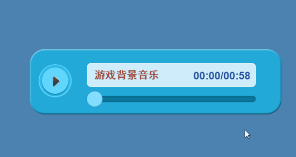
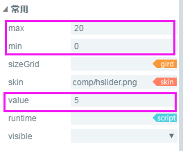

# HSlider 组件参考

##1. Understanding HSlider components

###1.1 Demonstration of the Role and Effect of HSlider

HSlider and VSlider components are subclasses of Slider components, which represent horizontal slider and vertical slider respectively. Users can select values by moving sliders between slider tracks. Usually used for player progress control, volume control, some UI value adjustment, etc.

HSlider components are horizontal. The slider track extends from left to right, and the label showing the position value of the slider is located at the upper part of the track and can be hidden.

​       
(Fig. 1)

###1.2 Skin Specification for HSlider Components

HSlider Resource Naming Rule is prefixed by hsliser. Its default resources are three, namely, slider resources.`hslider$bar.png`Progress bar resources`hslider$progress.png`And base map resources`hslider.png`。

There should be at least two resources, one base map resource and one slider resource, otherwise the sliding function can not be realized. Without the progress bar resource component, no error will be reported, just no progress will be displayed.

Tips: progress bar resources`hslider$progress.png`Can be used with base map resources`hslider.png`Exchange, the progress after interchange can be displayed in reverse.

 
(Figure 2)

###1.3 Introduction to the API of HSlider Components

Refer to HSlider's API introduction[http://layaair.ldc.layabox.com/api/index.html?category=Core&class=laya.ui.HSlider](http://layaair.ldc.layabox.com/api/index.html?category=Core&class=laya.ui.HSlider)。

##2. Creating HSlider Components through LayaAirIDE

###1.1 create hslider

Click on the HSlider component resource in the Resource Panel and drag it into the page editing area to add the HSlider component to the page.

After dragging and dropping HSlider into the editor area, set the nine-grid property of sizeGrid so that it will not stretch after zooming. The zooming effect is as follows:

​ 
(Figure 2)

###1.2 Common attributes of HSlider components

After setting the value of attribute max of HSlider to 20, the value of attribute min to 0, and the value of attribute value to 5, the display effect is as follows:

​ 
(Figure 3)

**Max:**The maximum value of the HSlider slider when dragged to the rightmost side is 100 by default.

**Min:**The minimum value of the HSlider slider when dragged to the leftmost side is 0 by default.

**Value:**The current value of the slider should be equal to or between Max or min.

​ 
(Figure 4)

Compile and run after publication. The effect is as follows. You can drag the slider to select the value:

​ 
(Fig. 5)

###1.3 Special other attributes of HSlider components

Other generic attributes are described in detail in the Property Setter. The following are special attributes related to HSlider components.

A kind of**attribute**A kind of**Function description**A kind of
| -------------------------------------------------------------------------------------------------------------------------------------------------------------|
| AllowClickBack | A Boolean value that specifies whether the value attribute value is allowed to be changed by clicking on the slider. A kind of
| ShowLabel | A Boolean value that specifies whether a label that hides the value value above the slider is displayed. A kind of
| The tick | slider's scale value refers to the value change of the slider each time it is dragged. The default value is 1. A kind of

 
