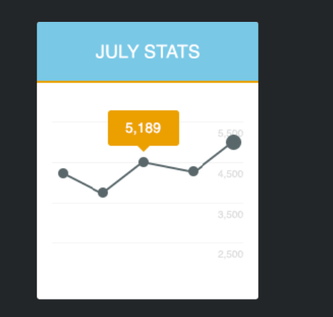

#Image Component Reference


## 一、通过LayaAirIDE创建Image组件

###1.1 Create image

Image is the most common component for displaying images in UI, which is used to display bitmap images. The skin property of the Image component can be set to change the image rendered by the Image component. The image component supports the setting of nine-grid data, which is used to achieve the effect of undistorted image display after image enlargement.

Click on the Image component in the resource panel and drag it into the page editing area to add the Image component to the page. By clicking on Image, you can set the values of common properties of Image in the Properties Panel.
Refer to the script interface of the Image component[Image API](http://layaair.ldc.layabox.com/api/index.html?category=Core&class=laya.ui.Image)。

​**Examples of resources for an Image component:**

​<br/>
(Fig. 1)

​**Drag and drop the Image component into the edit area to display the effect:**

​<br/>
(Figure 2)

###1.2 Common attributes of Image components

​<br/>
(Figure 3)

A kind of**attribute**A kind of**Function description**A kind of
| -----------------------------------------------------------------------------------------------------------------------------------------|
| SizeGrid | Bitmap effectively scales grid data (nine-grid data). A kind of
| Skin | bitmap resources. A kind of

After adding the Image component, you can modify the display resource image of the Image component by dragging and dropping the image resource from the resource panel to the skin property box of the Image.

##II. Creating Image Components through Code

When we write code, we inevitably control the UI through code and create it.`UI_Image`Class, imported in code`laya.ui.Image`Packet, and set the image-related properties through the code.

**Run the example effect:**
​<br/>
(Figure 5) creating image by code

Other properties of Image can also be set by code. The following sample code demonstrates how to create different skin (style) images through code.

Interested readers can set up their own images through code, creating pictures that meet their needs.

**Sample code:**


```javascript

package
 {
	import laya.display.Stage;
	import laya.ui.Image;
	import laya.webgl.WebGL;
	
	public class UI_Image
	{
		public function UI_Image()
		{
			// 不支持WebGL时自动切换至Canvas
			Laya.init(800, 600, WebGL);
			//画布垂直居中对齐
			Laya.stage.alignV = Stage.ALIGN_MIDDLE;
			//画布水平居中对齐
			Laya.stage.alignH = Stage.ALIGN_CENTER;
			//等比缩放
			Laya.stage.scaleMode = Stage.SCALE_SHOWALL;
			//背景颜色
			Laya.stage.bgColor = "#232628";

			//创建图片
			createImage();			
		}

		/***创建图片***/
		private function createImage():void
		{
			//实例化图片
			var img:Image = new Image("../../../../res/ui/dialog (3).png");
			//设置位置
			img.pos(165, 62.5);
			//加载到舞台
			Laya.stage.addChild(img);
		}
	}
 }
```


