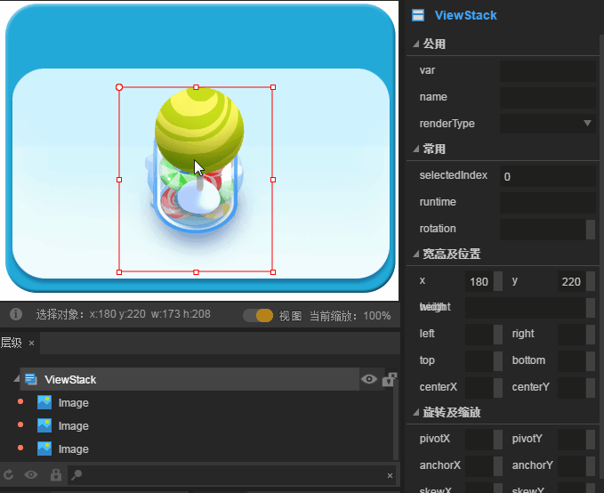

#ViewStack Component Details

> Since many component attributes are generic, common and generic component attributes are`属性设置器`This is described in the document. Read the Property Setter document before reading this article. In addition, this article will cover some knowledge of Tab components, please read the detailed documentation of Tab components first.

##1. Understanding ViewStack components

###1.1 Role of ViewStack Components

ViewStack components are mainly used for multi-page view switching. It contains multiple sub-pages, but only one is displayed by default, which can be switched by sub-page index. Generally, we use it to make tag switching pages with Tab tags. As shown in Figure 1.

<br/> (Fig. 1)

###1.2 ViewStack component resource (skin) specification

The ViewStack component is through`Ctrl+B`Converted container class components, there is no independent component resource specification. In this case, image component resources are used directly. In actual game development, various UI components can be used according to actual development requirements.

###1.3 Introduction to API of ViewStack Component

Refer to the API for ViewStack components[http://layaair.ldc.layabox.com/api/index.html?category=Core&class=laya.ui.ViewStack](http://layaair.ldc.layabox.com/api/index.html?category=Core&class=laya.ui.ViewStack)。


##2. Creating ViewStack Components through LayaAirIDE

###2.1 Create ViewStack page

####2.1.1 Preparation of Art Resources

Prepare the background map of the page and the art resources that need to be switched, and put them in the corresponding project directory of LayaAirIDE resource manager.

####2.1.2 Set up nine palaces for the background picture of the page

The background of pop-up boxes is usually nine-palace. Here we set the Nine-palace attributes of the background first. As shown in Figure 2-1.

<br/> (Motion 2-1)

####2.1.3 Create Page Background

Drag the background image that has just been set to Jiugong grid to the scene editor. As shown in Figure 2-2.

<br/> (Motion 2-2)

####2.1.4 Create ViewStack page

Drag and drop the UI infrastructure component involved in the page to the UI file`场景编辑器`And then the shortcut key`Ctrl+B`convert to`ViewStack`Container components. As shown in Figure 3-1.

<br/> (Figure 3-1)


####2.1.5 Setting the name attribute of the subpage of the ViewStack component

The naming rules of name attributes of ViewStack sub-pages are item0, item1, item2.... "If there are more pages like this, as shown in Figure 3-2, without adding name attributes according to this rule, the generated ViewStack component will be invalid and will not work properly.

<br/> (Figure 3-2)

**Tips**:*The character in the name attribute must be item, not something else. When you exit the ViewStack sub-page after modification, it is normal to display item0 by default, otherwise the ViewStack component will not take effect.*


####2.1.6 Adjust the UI layout of the page

After setting the name attribute, you can double-click into the veiwStack component and adjust the UI layout of the sub-pages. In this example, we only adjust the size and location of resources used by different pages, and align the three sub-pages in the middle. The effect is shown in Figure 3-3.

​<br/> (Figure 3-3)


###2.2 Set the page index selectedIndex of ViewStack

The ViewStack component defaults to a picture whose name attribute is item 0, because the default value of the property selectedIndex that controls the default index is 0. We can change the default display page of the ViewStack component by adjusting the value of the selectedIndex attribute. The effect is shown in Figure 4.

<br/> (Motion 4)

**Tips**:

**The Var value of the ViewStack component must be set. When writing code, it is necessary to control the ViewStack component through the global variable of Var name, so as to change the properties of selectedIndex and realize page switching. In this case, viewStack is used. As shown in the upper right corner of Motion 4, the developer can also choose another name.**


###2.3 Creating Tab Tags for Control

Usually, the ViewStack component needs a corresponding control label, so we create a Tab label to control the switch display of the sub-pages of ViewStack.

Click on the Tab component in the Resource Panel and drag the scene editor to the UI page to generate the Tab component. The art resources of the Tab component are shown in Figure 5, which matches the background style in the figure above.

​<br/>
(Fig. 5)

After dragging the Tab component to the editor, adjust the position to match the background image. Set the common property VaR to tab for program call control. Set the commonly used properties labels to "Snowman, Sugar Cans, Green Tree", and select the button index selectedIndex of 0. Then set the font size, bold type, font state color and so on in other attributes.

The display effect is shown in Figure 6.

​<br/>
(Fig. 6)


##3. Control ViewStack Component Switching Display by Code

In the above steps, we have completed the component creation and combination in IDE. Next, we associate the Tab tag with the sub-page switching display of ViewStack through the program code.

Save the page and press F12 to publish the page. After publishing, ComponentDemoUI.as class is generated in the project UI folder. We use it directly.


Create ComponentDemo. as and set the default program, write the following code:


```java

package
{
	import laya.utils.Handler;
	import laya.webgl.WebGL;	
	//导入UI发布生成的类
	import ui.ComponentDemoUI;

	public class ComponentDemo
	{
		/**包含tab与viewStack组件的测试页面**/
		private var comp:ComponentDemoUI;		
		public function ComponentDemo()
		{
			Laya.init(1334,750, WebGL);
			
			Laya.stage.scaleMode = "full";
			Laya.stage.bgColor = "#ffffff";
			//加载图集成功后，执行onLoaded回调方法
			Laya.loader.load("./res/atlas/ui.atlas", Handler.create(this, onLoaded));

		}
		
		private function onLoaded():void {
			//创建一个UI实例
			comp = new ComponentDemoUI();
						
			//添加到舞台上显示
			Laya.stage.addChild(comp);
			
			//点击Tab选择按钮的处理
			comp.tab.selectHandler=new Handler(this,onSelecte);	
			
		}
		/**根据选择tab的索引切换页面**/
		private function onSelecte(index:int):void
		{
			//切换ViewStack子页面
			comp.viewStack.selectedIndex=index;
		}
	}
}
```


Run the sample code as shown in Figure 10.

<br/> (Figure 10)